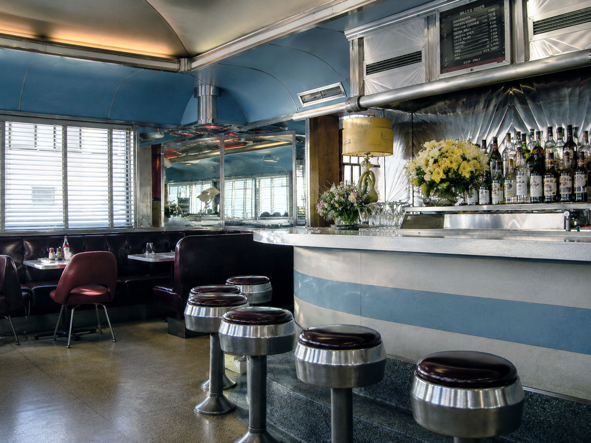
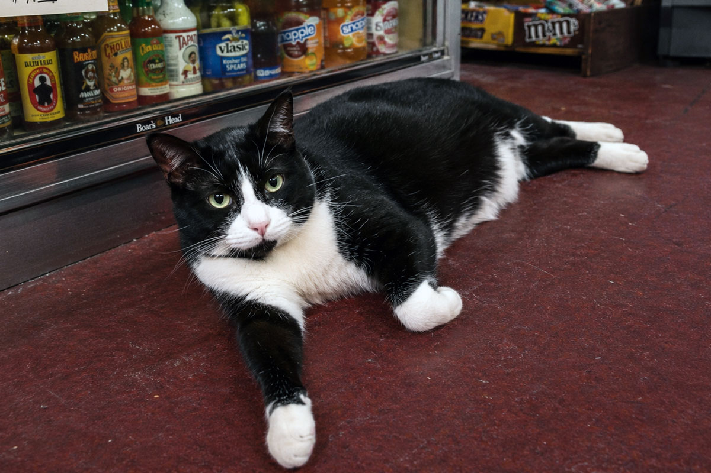
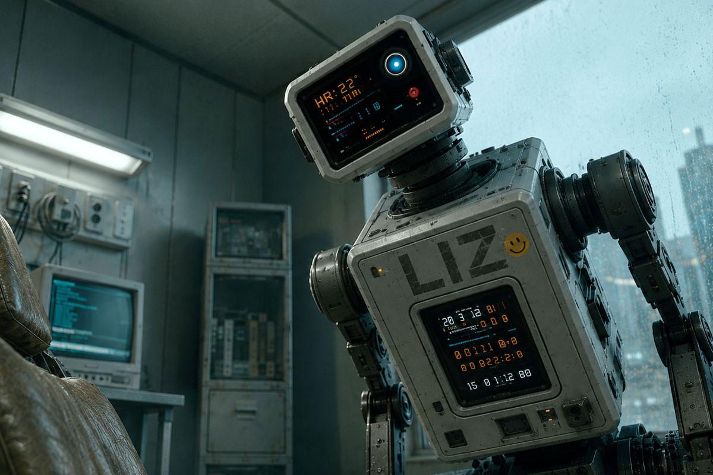
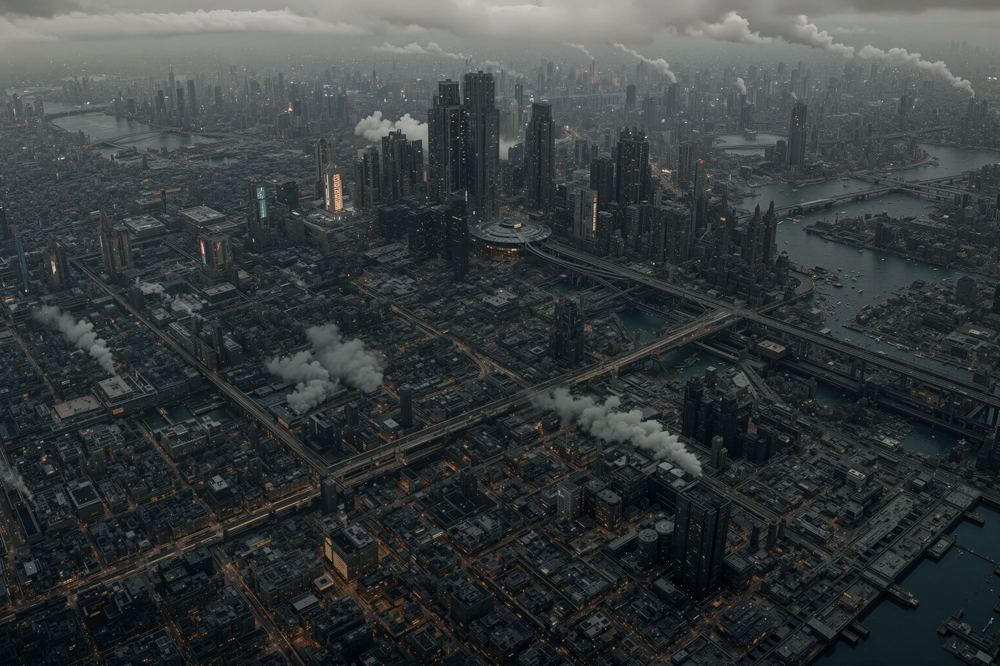
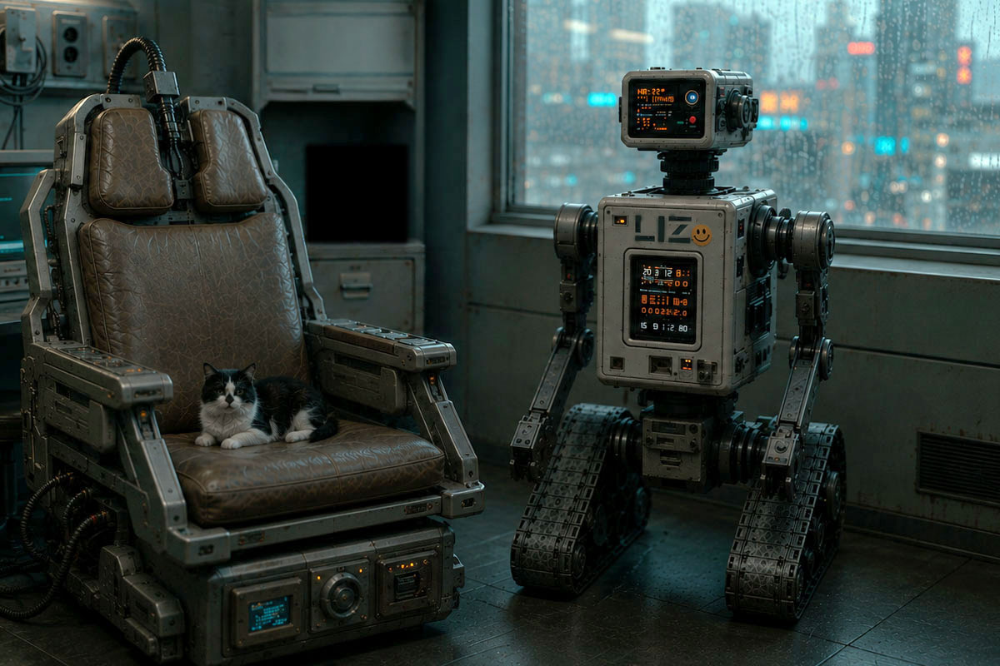
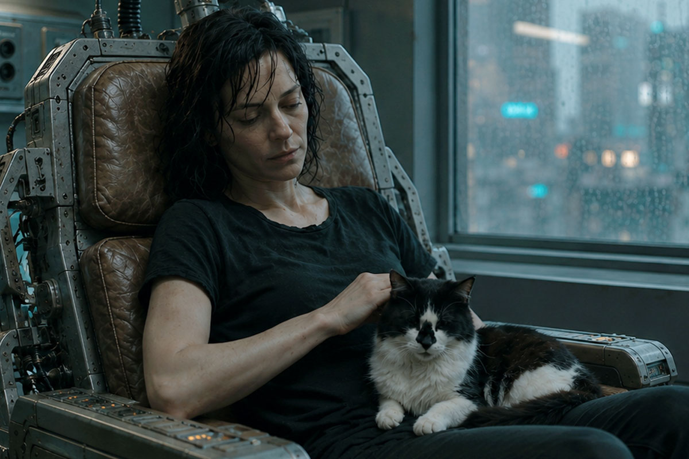
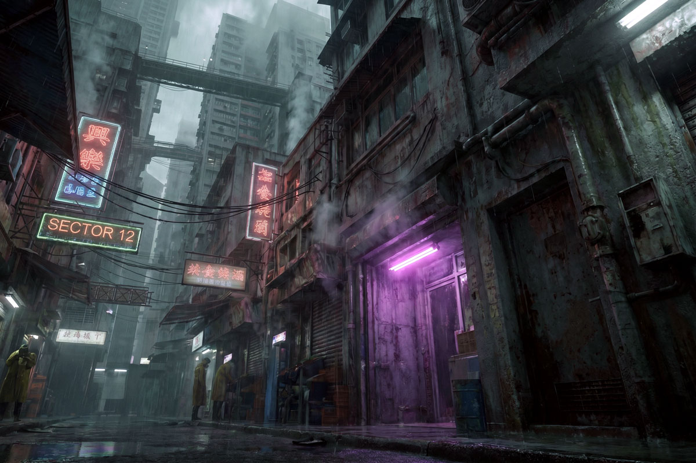

# FALL-LINE ── フォールライン

UPDATED 2026.06.26

---

## 残響　ウィリアムズバーグ

「ねえ、ミラ。昨日のオーディションどうだったの？」

　声をかけてきたのは、同じシフトのノーラだった。エプロンの紐を首の後ろで結び直しながら、カウンター越しに身を乗り出してくる。

　ミラ・ハーロウは皿を拭く手を止めずに、肩をすくめた。「監督って、最初の十秒で決めてしまうらしいの。私のときは、台詞を言い始めたときにはもう、次の子のこと考えてる感じだった」

「またそれ」ノーラは笑った。「あんた、半年前から同じこと言ってる」

　二〇〇二年、二月。ブルックリン・ウィリアムズバーグ、ベッドフォード・アヴェニューから一本外れた角に、〈バリーズ〉という名前のダイナーがあった。アイリッシュ系の初代オーナーが店名にだけ名を残して亡くなり、いまはギリシャ人の家族が回している。看板の五〇年代の筆記体の文字が消えかかっている。ミラはそこで週六日、朝から夕方まで皿を洗い、客に卵料理を運んでいた。夜は十四丁目の小さなスタジオで芝居の稽古をしていた。たまにオーディションが回ってきた。ほとんどは、誰の役にもなれずに帰った。

　天井近くの金具に吊られた、AIWA製の小型ブラウン管テレビが、低い音量で『シンプソンズ』の再放送を流している。バートが何かをやらかし、ホーマーの叫び声が店内に抜けていく。誰もノイズ混じりの滲んだ画面を見ていなかった。窓の外は灰色の空で、Lトレインの軋む音が遠くから断続的に届いていた。

　ツインタワーが崩れてから、五ヶ月だった。街はもう日常を取り戻したと言われていたが、ミラにはそれが嘘に聞こえた。マンハッタンの南端まで行けば、大きなビルの大理石の門標を指でなぞるだけで、あの日の灰色の粉塵がまだ指に付いた。先週、求人の張り紙を見にいったついでに、ミラは誰もいない正面玄関でその大理石に自分の名前を書いてみた。書きながら、なぜそんなことをしているのか、自分でもわからなかった。書いたあともしばらく動けなかった。

　ポケットの中で、携帯が短く震えた。Nokia 3390の小さなモノクロ画面に、ショートメッセージが浮かんでいた。

　「演技スクール 受講料 残額 至急」

　ショートメッセージは、それだけで切れていた。続きは家に帰ってメールを開けば届いているはずだった。ダイアルアップの音が頭の中で鳴り始める。十分待って、繋がって、ようやく文章が読める。それから返事を打つ。送信ボタンを押してから相手の手元に届いたかどうかも、しばらくわからない。

　昼の休憩に、ミラは店を出て二ブロック先の地下にある中古レコード屋へ降りていった。看板には数十万枚以上と書かれていたが、実際にはそれ以上あるように見えた。棚と棚の間が人ひとり通れるだけしか空いていない。誰かが選んだ盤が落ちる音、ジャケットを擦る指の音、それだけが薄い天井の下で増幅されて、地上の音はもうここまで届かない。ミラはこの店の地下にある暗い湿った空気が好きだった。地上の世界より、ここのほうがいくぶん本物に近い気がした。

　ミラは三年以上、The Durutti Column の『Deux Triangles』という一枚を探していた。いつもとは違う棚を選んで、端から端まで指を真っ黒に埃で汚して掘ったが、今日の棚にはなかった。半年前、別の棚から Martin Denny の『Quiet Village』を三ドルで救い出したことがある。会計のとき、自分の指が少し震えていたのを覚えている。

　夕方のシフトが終わったあと、ミラは地下鉄に乗った。あの粉塵で名前をなぞった大理石を、もう一度見ておきたかった。

　イースト・リバーの下を潜って、向こう側へ出る。ウォール・ストリートの駅から地上に上がった頃には、もう夜だった。

　粉塵の上に書いた名前は、なかった。

　ミラは指でもう一度、なぞった。今度は粉塵そのものがなかった。門標にも、歩道にも、道路の縁にも。乾いた、磨かれた大理石だけが、彼女の指の下にあった。

　彼女はしばらく、その大理石を見ていた。それから、何でもないことのように指を引いた。

　数ブロック歩いたところで、明かりの灯った小さな商店の前を通った。デリカウンターから、甘いドーナツと煮詰まったコーヒーの匂いがしている。入り口の床に敷かれたえんじ色のフェルトのカーペットには、油汚れのシミがついていた。その上で店の白黒のハチワレの猫が横たわり、薄暗い蛍光灯の光のなか、毛繕いをする手を止め、こちらをじっと見ていた。

　ミラはその猫をしばらく見ていた。それから、駅のほうへ歩き出した。

---

## プロローグ

　指先にはまだ感触が残っていた。乾いた、磨かれた大理石。あるはずだった粉塵の、ない感触。

　ミラは目を開けた。

　頭の後ろから端子を抜く。ダイブ筐体の脇でリサが低く駆動した。腰ほどの
高さの古い自走機が箱型の頭部にあるレンズをミラへ向け、帰還後の波形を
確かめている。異常がないと判断すると、短い作業腕を引き、接続灯を一つずつ
消した。室内は暗く、雨が窓を打っていた。〈バリーズ〉の煮詰まったコーヒーの
匂いがまだ鼻の奥にあった。仮想空間の二〇〇二年はほかには何も残して
いなかった。

　その二〇〇二年は、プラチナカラーと呼ばれる上層階級が休暇として
買う古い生活のひとつだった。皿を洗い、注文を取り、返信の来ないショートメッセージを待つ。
ダイアルアップの音に数分を預ける。世界がテクノロジーに明け渡される
前の不便さは、彼らにとって、金を払ってでも触れたい手の込んだ娯楽
だった。

　ミラは客ではない。フロントテストダイバーとして、壊れた動線と記憶の綻びを
検めるために潜っただけだ。それでも戻るたび、あの古い生活はいつも
報告書の欄には収まらない何かを残した。煮詰まったコーヒーの匂い。
埃で黒くなった指。店先の猫の目。消えた灰色の粉塵は、何だったのか。
テクスチャ処理の漏れか、清掃ログの遅延か、それともあの日の名残
そのものだったのか。どれも上層が買う休暇の小道具にすぎないはず
だった。そう言い切るには、指先の感触があまりに長く残りすぎた。

　ウィチタ自治区では、雨がもう四十年やんでいなかった。

　正確に言えば、それは雨ではない。都市の上層を覆う排熱層が夜ごとに冷え、
昼のあいだ機械が吐き出した水蒸気が酸を含んだ細かな粒になって落ちて
くるのだ。粒は塔の側面を伝い、看板のネオン管を白く曇らせ、路面に浮いた
油膜の上を虹色に滲ませながら、低いほうへ低いほうへと流れていく。住人は
誰もそれを天気とは呼ばなかった。ただ「外」と呼んだ。外に出るというのは、
傘を持つかどうかの話ではなく、肌と肺をどれだけ削られてもいいかという
覚悟の話だった。

　音も四十年やんでいなかった。ビル群の上層──排熱層のさらに高い、
人の住まない階に据えられた工業区から、低いブザー音が一定間隔で絶え間なく
降りてくる。何を報せる音なのか、いまではもう誰も知らない。たぶん遠い昔は
警報だったものが、点検され、修理され、やがて点検そのものを忘れられて、
ただ鳴り続けているだけだ。住人はその音で眠り、その音で起きた。音が
やんだら、それはそれで何かが取り返しのつかないところまで進んだ合図
なのだろうと、みな漠然と思っていた。だから誰もやめてくれとは言わ
なかった。

　夜もほんとうの夜にはならなかった。落ちてくる水蒸気の幕の裏側に、
高層の工業ビルの灯りが下から滲んで拡散し、空ぜんたいが鈍く発光して
いる。星は一度も見えない。雲という雲が、橙とも灰ともつかない色に裏から
照らされて、街はいつも夜明け前の三十分がそのまま固まったような、
決して明けない薄明かりの底に沈んでいた。闇さえもこの都市では、
配給されていなかった。

　その自治区の番号でしか呼ばれない区画の、番号すら割り当てられていない
部屋に、ミラ・ハーロウは住んでいた。

　部屋は狭く、寝台と椅子型の古いダイブ筐体、それに腰ほどの高さの、
無骨な小型自走機が一台いるだけだった。
ダイブ筐体の座面は、長年の使用で彼女の体の形にへたり、革の継ぎ目から
黄ばんだ詰め物がのぞいている。座るたびに筐体は人間ひとりぶんの疲労を、
ゆっくりと受け止めてきしんだ。

　小型自走機は、ミラがダイバーになった年に払い下げられた旧式機だった。
筐体正面の上部には、型式名〈ＬＩ－２ ＭＯＤＵＬＥ〉が残っていた。
ミラは手製の型紙で末尾の〈－２〉を〈Ｚ〉に塗り替え、〈ＬＩＺ〉にした。
リサと呼んだのは、それからだった。以来二十年、一度も乗り換えなかった
相棒だ。

　リサはダイブ筐体と外部回線のあいだに入り、ミラへ届く信号をすべて検めた。
侵入コードを遮り、心拍と呼吸と神経波形を監視し、帰還路を開いたまま
保つ。筐体がミラの身体を預かるものなら、リサはその身体へ通じる扉を
預かるものだった。

　ダイブ筐体の足元と、リサの履帯とのあいだには、年老いたハチワレ猫が
うずくまっていた。ミラがダイブに沈むたび、猫はそこにいた。戻ってきた
とき、猫はやはり、そこにいた。

　壁には何も貼っていない。写真も、絵葉書も、依頼のメモも。ミラは
ずいぶん前から、過去を壁に貼るのをやめていた。
貼ったところで、それが本当に自分の過去なのか、この街では誰も保証して
くれない。記録はいくらでも書き換えられるし、人の頭の中身も同じだ。
だから彼女は、壁を白いままにしておくことを選んでいた。空白は、少なく
とも嘘をつかない。

　彼女は四十二歳だった。少なくとも、登録局の台帳ではそうなっていた。
この街では年齢は思い出の総量ではなく、ただの数字でしかない。誕生日に
意味を持たせる者は、もうほとんどいなかった。

　ミラの職業は、仮想空間の潜行者──ダイバーだった。登録局の分類では、
彼女たちの接続方式はヴァイタル・ダイブと呼ばれる。脳だけではなく、
心拍、呼吸、痛覚、反射までを接続先へ預ける潜行。だが現場の人間は、
そんな長い名前を使わない。ただダイブと言った。脳の付け根に挿した
端子から信号を流し、肉体をこの筐体に残したまま、デジタルの身体で別の
世界へ降りていく。企業が新しい仮想惑星を商品として売り出す前に、その
世界をひとりで歩き、地形を測り、足を取られる場所や人を殺す仕掛けを
洗い出して報告する。地図のない世界へ最初に足を踏み入れ、最初に死に
かけ、それでも最初に戻ってくる。それが彼女の仕事であり、生計であり、
たぶん、彼女の人生のほとんどすべてだった。

　その仕事を世間はフロントテストと呼んだ。名前だけ聞けば、まだ
ホワイトカラーの側の仕事のように聞こえる。だが考える仕事はもう
自分の頭からではなく、上から降ってくる。設計も、交渉も、文章も、解析も、
都市の基盤につながった合成知性の群れが、人間より先に済ませてしまう。

　合成知性から降りてくる仕事を、人間の神経で最後に確かめる者たち。
機械が誤っても、最後に責任を負うのは、それを確かめた人間のほうだった。
そういう層を、グレーカラーと呼んだ。ホワイトカラーの言葉で考え、
ブルーカラーの危険を負う者たち。端末の前に座っていても、彼らは現場に
いた。フロントテストダイバーは、その中でもいちばん古い冗談のような職
だった。機械が組み上げた仮想惑星に、人間の脳をつないで、最初に歩かせる。
社会はその仕事を必要としたが、尊敬はしなかった。

　フロントテストには、古い規定があった。検収を終えたダイバーは、現地で
使った防護服と装備を帰還前にすべて焼却する。汚染した地形データ、未登録
生物の痕跡、ダイブ先の残響を、帰還路へ持ち込まないためだ。炎も灰も仮想の
ものにすぎない。だがダイブの中で受けた感触は、現実の身体と同じ重さで
脳に記録される。技術者はそれを「神経等価」と呼んだ。戻ったあとも髪の
根元や爪の間に、細かな灰が挟まっている気がすることがあった。

　ミラはグレーカラーという呼び名を嫌ってはいなかった。ホワイトでも
ブルーでもない。たしかに、自分の仕事の終わりには、いつも灰が残った。

　ダイブの中では、痛みも現実とまったく同じだった。仮想で炎に巻かれれば、
脳は現実の皮膚も焼けたと信じ込み、戻ったあとも何日かは触れられない。
仮想で高所から落ちれば、現実の胃も一緒に浮く。それでもダイバーが
死なずに済むのは、致命傷の
寸前で接続が自動的に切れるからだ。切れずに戻れなかった例も、ミラは
知っていた。同業者が三人、椅子の上で目を見開いたまま、二度と意識を
こちらへ戻さなかった。そのうちの一人は、彼女が新人の頃に手ほどきを
受けた男だった。葬式はなかった。身体は処理班に運ばれ、台帳の番号が
ひとつ抹消された。業者は椅子から、彼の体の形にへこんだクッションだけを
外して持っていった。部屋には、床にボルトで固定された金属フレームだけが、
外されずに残っていた。

　ミラは自分の手の甲を見た。古い火傷の痕が、皮膚の上に薄く残っている。
仮想空間で負った傷が、そのまま現実の皮膚に焼きついたものだ。鏡の中の
自分より、彼女はこの傷痕のほうをよく覚えていた。どちらが本物の自分の
傷なのか──そんな問いは、長いこと考えないようにしていた。考え始めると、
椅子から立てなくなる。それも、同業者から学んだことのひとつだった。

　窓の外、ビルのあいだに架かった超高層の高架を、磁気浮上バイクが二台、
競うように駆け抜けていった。磁気で浮いた車体は路面に触れず、駆動の音も
ない。ただクラクションと、二本のテールライトの残光だけが酸の雨を
一瞬裂いて、すぐにかき消える。ミラはその光の尾を、意味もなく
目で追った。やがて端末が、机の隅で低く鳴った。新しい依頼の合図だった。

　猫が顔を上げて、ミラを見た。

　彼女はしばらく動かず、雨の音と端末の音を両方聞いていた。それから
足元へ手を伸ばし、老いた猫の額を指の背で撫でた。猫は目を細めただけで、
鳴かなかった。

　ミラは端末を手繰り寄せた。発信元の欄は空白だった。その晩の合図が、
彼女をどこへ連れていくのか、このときのミラはまだ何も知らなかった。

---

## 第一章　失踪した少女と、狭間の光束

　依頼人は、声だけしか伝えてこなかった。

　端末の低解像度の表示面には、潰れた白い文字で〈映像未接続〉と出ていた。

　ダイバーへの依頼は、たいてい相手の顔が見えない。代理のプログラムや
合成音声、何重にも匿名化された通信層を介してくる。ミラはそれを不快に
思ったことはなかった。顔の見えない依頼は、顔の見えない報酬で支払われ、
どちらも後腐れがない。それで充分だった。だがその夜の声には、加工の
下に、隠しきれない震えがあった。機械を通しても消せなかった震えを、
ミラの耳は何年もの仕事を通じて聞き分けられるようになっていた。

「娘を探してほしい」と依頼人は言った。

　ミラは端末の前で脚を組み替えた。「人探しは専門じゃない。家出や失踪なら、
私より向いた業者がいる」

「家出じゃない」声が言った。「あの子の身体は椅子にある。消えたのは、
ダイブ先だ」

　ミラは黙った。窓を打つ雨の音が、急に大きく聞こえた。彼女は答えを
急がず、相手に続けさせた。追いつめられた人間は、間を置けば自分から
しゃべる。

「娘の名はセレン。十六歳だ。三週間前、家庭用の簡易端末から未登録の
座標へ独りでダイブして、それきり帰還の記録がない。それでも身体との
接続だけは……まだ切れていない。帰還の応答だけがない」

　簡易端末は異常を検知し、父親へ通知していた。だが生命反応は正常で、
接続も続いている。都市の救助網が扱うのは、登録された座標への帰還障害
だけだった。未登録座標からの帰還不能は、事故としてさえ分類されなかった。

　切れていない、という言葉の意味を、ミラは正確に理解した。少女の
肉体は、いまもどこかの椅子の上で呼吸をし、心臓も動いている。簡易端末は
意識を送り出したまま、細い接続だけを保っている。だが深い層から人間を
引き上げるための帰還路がない。少女は入口を覗くつもりで、端末が連れ
戻せない深さまで落ちたのだ。意識だけが三週間戻らず、仮想のどこかを
歩き続けている。あるいは、もう歩けなくなって、どこかにうずくまって
いる。どちらにせよ、放っておけば肉体のほうが先に尽きる。

「座標を送って」とミラは言った。引き受けるとは、まだ言わなかった。

　送られてきた数列を見て、彼女は眉を寄せた。登録局のどの台帳にもない
座標だった。企業の試験区にも、闇に流れている私設サーバーの索引にも
かからない。正規のダイブ世界には、必ず「これは自分が作った」と名乗る
所有者がいる。所有者を持たない世界など、本来この時代には存在しない
はずだった。正規の仮想惑星を一つ立ち上げるほどの計算は、たいてい
都市基盤システムの監視下を通る。監視対象の世界なら、登録局のどこかの
台帳に痕跡が残る。その外にあるどこかへ、十六歳が独りでダイブし、戻ってこない。

　オフワールド。若いダイバーたちは、監視対象外の座標をそう呼んだ。
登録局の台帳に載らず、都市基盤システムの監視にも引っかからない場所。
たいていは壊れた観光世界か、詐欺まがいの快楽区画だった。ミラも何度か、
そういう場所の検収に入ったことがある。粗悪な快楽区画。監視逃れの
違法倉庫。誰かが置き忘れた、空の試験区。だが、この座標は、そのどれとも
違っていた。

「あの子のログに、ひとつだけ言葉が残っていた」依頼人の声が、最後に
小さくなった。「たぶん、世界の名前だ」

　ミラはその言葉を、口の中で繰り返した。
　ターラ。水惑星ターラ。

　彼女は引き受けると答えた。報酬の額は聞かなかった。聞かなかったのは、
強がりではない。存在しないはずの世界、というその一点が、二十年やって
きた彼女の職業的な好奇心のいちばん古い場所をくすぐったからだった。

---

　リサが短い作業腕を伸ばし、ダイブ筐体の背面に接続ケーブルを差し込んだ。
ミラの心拍、呼吸、反射、痛覚の基準値が前面の小さな表示器を流れていく。
接続先へ送る信号と、接続先から戻る信号は、どちらも一度リサを通る。
リサは通信路を開く前に、混入したコードと神経刺激を一つずつ検査した。

　端末には、ルートドアキーの認証列が浮いていた。フロントテストダイバーに
だけ渡される業務用の鍵だ。ミラが認証列を選ぶと、リサが署名を照合し、
外部回線へ送った。正規の試験区なら、その認証で世界の裏口が開く。
描画前の地平線、閉じた区画、所有者がまだ商品名を付ける前の奥の層まで
入れる。だが鍵が保証するのは、入れる、ということだけだった。帰れるか
どうかは、いつも別の話だった。

　通常なら、接続先から短い応答が返る。許可、
拒否、保留。どれであれ、扉の向こうにこちらを受け取る仕組みがある、
という痕跡だけは残る。ターラからは何も返らなかった。拒否ではない。
許可でもない。鍵は確かに差し込まれた。だが、その先にあるはずの鍵穴が、
こちらを鍵として認識していなかった。鍵穴そのものが、こちらを知らない
沈黙だった。

　リサの表示器に、〈接続先応答なし〉と出た。頭部のレンズがミラを向いた。
依頼を拒む権限は、リサにはない。だが短い作業腕は、筐体の緊急切断口の
すぐ脇で止まっていた。

「わかってる。つないで」

　一拍遅れて、リサが回線を開いた。

　ミラは椅子に深く座り、端子の冷たさが首の付け根の骨に届くのを待った。
それから息を三つ数える。一つ目でいまいる現実を確かめ、二つ目でその現実を
手放し、三つ目で落ちる。新人の頃に編み出した儀式で、効くかどうかは
わからない。ただ、二十年やめずに続けているという事実そのものが、
彼女を落ち着かせた。

　落下の感覚には、何度やっても慣れなかった。胃が浮き、視界が一度
完全に暗転し、それから、まったく別の重力が体をつかむ。

　ターラは、まず音から始まった。

　雨の音だった。ただし都市の酸の雨ではない。柔らかく、重く、生きている
水の音だ。ミラが目を開けると、仮想の身体が仮想の肺で湿った空気を
吸い込んだ。むせ返るような緑の匂い。腐葉土と、名前の知らない花の匂い。
遠くで何かの生き物が、長く尾を引いて鳴いた。鳴き声には抑揚があり、
別の方角から、同じ抑揚が返ってきた。呼んで、応える。それは会話の形を
していた。空っぽの試験区では、ついぞ聞いたことのない音だった。

　空は鉛色の雲に覆われ、その切れ間から青白い光が斜めに射していた。
眼下には見渡すかぎりの湿地と、銀色に光る水面が広がっている。地球とは
似ても似つかない景色だが、死んだ世界ではなかった。むしろ生命が過剰な
ほどに満ちていて、それがかえってミラの神経を逆撫でした。これまで歩いた
仮想惑星のほとんどは空っぽだった。作り手が、商品の骨組みだけ用意して、
生き物まで作り込んでいないからだ。ここは違う。誰かがこの星に、売り物に
する予定もなさそうな小さな虫の羽音まで、丁寧に植えていた。なぜ、と
彼女は思った。誰のために、こんなものを。

「セレン」とミラは呼んでみた。返事はない。彼女は、最後に残された位置情報の
中心へ向かって、ぬかるんだ湿地を歩き始めた。一歩ごとに、足首まで温い泥が
絡んでくる。

　異変は、半刻も歩かないうちに起きた。

　空が暗転した。雲のせいではない。世界そのものが、一度だけちらついた
のだ。古い映写機のコマが飛ぶように、景色が前後に揺れ、ミラの足元の
地面が半秒だけ消えた。彼女は反射的に身を低くした。バグか、あるいは
攻撃。ダイブ世界が不安定になるとき、それはたいてい、誰かがその世界に
外から手を入れている証拠だった。手を入れているのが世界の所有者なら
問題ない。所有者のいない世界で、それが起きているなら──。

　考え終える前に、自動接続が、接続先から切り離された。

　ダイバーには命綱がある。致命傷の寸前で接続が切れ、現実の椅子で目が
覚める仕組みだ。その線が引きちぎられる音を、ミラは鼓膜の奥ではっきり聞いた。
鈍く湿った、太いロープが繊維ごと裂けるような音。聞き間違えようがない。
誰かがダイブ先から通信路に割り込み、帰還経路の制御を奪った。回線は切れて
いない。ただ、もうミラのものではなかった。

　そして世界が、彼女を落とした。

---

　現実の部屋で、リサの表示器が赤く変わった。

　ミラの心臓は動いている。呼吸もある。首の端子には、読めない神経活動が
流れ続けている。だが接続先から返るはずの監視信号だけが、一度に消えていた。
リサは緊急切断を要求した。応答はなかった。予備回線へ切り替え、同じ処理を
繰り返した。外から侵入された形跡はない。帰還経路の制御だけが奪われていた。

　短い作業腕が筐体の緊急切断口に触れた。だが物理回線までは落とさな
かった。強制的に断てば、戻る経路を失ったミラの意識まで切り離しかねない。
リサは生命維持を継続し、切断要求を最初から送り直した。リサの内部で
冷却器の唸りが強まり、狭い部屋いっぱいに響いた。足元の猫が首をすくめ、
耳を伏せた。

---

　それは墜落だった。

　仮想の空が回転し、湿地が斜めにせり上がってくる。ミラの身体は雨の中を
落ちていった。神経等価。痛みは現実と同じだ。彼女は空中で体をひねり、
腕で頭をかばい、来る衝撃に備えて全身を縮めた。落ちながら、頭の片隅は
まだ仕事をしていた。水面が見える。泥だ。岩より泥のほうがいい。受け身を
取れ──。

　水面が、彼女を平手で殴るように受け止めた。

　冷たさと衝撃と暗さが、同時に来た。ミラは泥水の底で一度跳ね、肺の
空気を半分失った。目を開けても、茶色い濁りが視界を塞いでいた。上下が
わからない。口元から漏れた気泡が頬をかすめ、耳の後ろへ抜けていった。
そちらが上だ。ミラはその感触だけを信じて、手足を動かした。

　水面を破って顔を出すと、ミラは激しく咳き込み、飲んだ泥を吐き、
それから初めて自分の体を点検した。左の脇腹で、何かが軋んでいる。仮想の
肋骨が折れかけているのだ。だが痛みは現実の肋骨とまったく同じ重さで、
彼女の呼吸を浅く、速くした。落下の途中で、装備の多くが剝がれて消えていた。
携行装備で残ったのは、腰の鞘に収めた小さなナイフだけだった。両手のグローブの
甲には、薄い表示面が埋め込まれている。左は
座標と接続状態、右は地形と装備を表示する。ダイバーの基本装備だ。

　ミラが左手の泥を拭うと、表示面には〈基準座標なし〉の文字だけが残っていた。

　ミラは岸へ這い上がり、しばらく泥の上に仰向けで倒れていた。生きた
水の雨が、容赦なく顔を打つ。誰かが帰還経路の制御を奪った。故障ではない。
この世界には、こちらの回線へ手を入れられる何かがいる。

「……いいだろう」
　ミラは声に出して言った。恐怖が少しだけ小さくなった。これも二十年で
覚えたことだった。
「まず、セレンを探さないと」

　一度では立ち上がれなかった。ミラは左脇を押さえ、二度目でどうにか
体を起こした。

　彼女は水の流れていく方へ歩き出した。水のある方には、たいてい命が
ある。命のある方には、たいてい探しものもある。それは現実でも仮想でも、
大きくは変わらない。

---

　最初の夜、ミラは岩棚の裂け目で雨を避けた。眠りかけるたびに脇腹が
痛み、呼吸の浅さで目が覚めた。

　夜半、水際の苔が淡く光る中に、大きな獣が現れた。体高はミラの胸ほど。
濡れた長い体毛には、白と淡い水色がまだらに混じり、苔の光の中では輪郭が
途切れて見えた。目は閉じたまま、鼻面を左右に振って匂いを探っている。

　風は獣の側から吹いていた。ミラは裂け目の奥で動かず、風向きが変わらない
ことだけを待った。獣はしばらく水を飲み、やがて暗闇へ戻っていった。

　そのあとも眠れなかった。ミラは裂け目の奥でナイフを握り、夜が明けるまで
水際の音を聞いていた。

---

　最初の夜が過ぎても、リサはダイブ筐体の脇を離れなかった。

　帰還不能が長引くと判断した時点で、リサは筐体の救命キットを開き、
ミラの腕に電解補液チューブをつないでいた。呼吸が浅くなるたびに筐体の角度を変え、
流量を調整した。ミラが手を強く握り込むと、作業腕で指を一本ずつほどいた。
再接続要求に応答がなければ、回線への負荷を避けるため、次の送信までの
間隔を延ばす。それがリサに組み込まれた安全手順だった。リサは三度だけ
従った。四度目からは、定められた間隔を待たずに要求を送り続けた。

　都市の監視基盤へ、帰還不能を知らせる緊急通報は送られなかった。リサを
その基盤から切り離したのは、ミラ自身だった。筐体の警告表示だけが、赤く
点滅していた。

　三日目の朝も、リサは猫の皿に餌を出し、水を替えた。それから自分の
神経培養核にも、カートリッジから一日分の栄養液を送った。猫は食べ終えると
筐体の足元へ戻り、前脚を畳んだ。リサは接続要求を送り、拒否さえ返さない
暗い回線を待ち、また送った。

---

　四日目に、彼女は遺跡を見つけた。

　湿地が尽き、岩がむき出しになった台地。砂と乾いた風の地帯に、それは
あった。崩れた壁。風に磨かれて角の取れた柱。長い年月が、すべての
輪郭を丸くしていた。だが壁の一角だけが、風化を拒むように正確な直角を
残していた。ミラはその九十度を、以前にもどこかで見た気がした。仕事で
歩いた別の世界かもしれない。だが、どこだったかは思い出せなかった。

　そして、崩れ残った壁に、細い傷が幾重にも刻まれていた。

　文字にも模様にも決めきれなかった。線は一定の間隔で枝分かれし、ところどころ
石の奥まで青白く変色している。人が道具で削った跡とは違う。ミラには、
それが何を示しているのかわからなかった。

---

　遺跡のいちばん奥、崩れた祭壇の陰で、ミラは少女を見つけた。

　セレンは膝を抱えて座っていた。痩せている。仮想の身体は本来飢え
ない。だが意識が「自分は飢えている」と信じ込めば、身体はそのとおりに
描かれる。三週間、出口のない世界で、ひとりでそう信じ続けた者の体
だった。爪は割れ、唇は乾き、目だけが妙に大きく見えた。

　金髪の少女は、膝の擦れた色の薄いデニムに、黒いキャンバス地の
ハイカットを履いていた。袖の長すぎる古いフードパーカーの上から、
レプリカのタンカースジャケットを羽織っている。どれも、明らかに本人
のものではなかった。父親の棚から勝手に持ち出してきた服だと、ミラ
にはすぐにわかった。アーカイブ趣味の若者が好むジャパトラの
着崩しだった。

「セレン」とミラは、できるだけ静かに呼んだ。脅かさないように、ゆっくり
近づきながら。「迎えに来た」

　少女が顔を上げた。その目に、ミラのよく知っている光があった。長く
独りで歩いた者の目。世界そのものを疑い始めた者の目だ。何度も鏡で
見たことのある光だった。

「……あなたも、帰れないのね」

「私の帰還経路は、誰かに乗っ取られた。セレン、あなたはどうやってここへ来た？」

　セレンは目を伏せた。

「パパが集めてる古書のあいだに、数字の並んだ紙が挟まってたの。端末に
読ませたら、古い座標だって出て。ちょっと覗いてみたくなったの。家庭用の
端末なら、危ないところまでは入れないと思ってたんだけど……」

　セレンはジャケットの袖口を握った。濡れた布を絞るように、指先へ力が
入っていた。

「でも、接続したらここへ落ちてしまって。帰還を選んでも、〈経路なし〉
としか出なかった。身体との接続は残ってる。でも、ここから戻る道がないの」

　セレンはそこでようやく顔を上げた。

「ごめんなさい」

「謝るのは、戻ってからでいい」とミラは言った。

　その瞬間、世界がまたちらついた。

　遺跡の空気が震え、光が細かな粒になって宙にとどまった。セレンが
息を呑む。ミラは少女と光のあいだに体を入れ、ナイフを抜いた。だが、
裂け目から現れたのは、夜の獣ではなかった。

　それは人の形に似ていた。似ているだけだった。体は、青白い光の筋が
幾重にも束ねられてできていた。光の筋が寄り集まり、束になり直すたび、
周囲の湿った空気がチチッ、と小さく鳴った。輪郭は、現実と仮想の
境目のように、絶えず細かく揺らいでいる。ダイブ世界の住人でもなければ、
企業の管理体でもない。ミラの知るどんなプログラムの挙動とも違った。
それは世界の表面に立っているのではなく、世界の継ぎ目そのものから、
内側へにじみ出てきたように見えた。

　ミラは頭の中で、それを異星人と呼んだ。ほかに近い言葉がなかった。
　敵意がないと判断したわけではないが、ミラはナイフを下げた。目の前の
ものには、切れる肉も、刺せる急所も見当たらなかった。それ以上に、正体も
わからない相手へ、恐怖だけで刃を向けることが、ひどく無礼な気がした。
目の前の存在に、ミラは畏怖に近いものを感じていた。この相手に最初に
示すものが、敵意であってはならない。ミラはそう直感した。

---

　言葉は、まったく通じなかった。

　異星人は音を発した。ミラの鼓膜は確かにそれを受け取った。だが意味は
ほどけない。代わりに、それは光を使った。掌のあたりに光をともし、形を
作り、消し、また別の形を作る。ミラは長いあいだ、青白い明かりに照らされ
ながら、移り変わる形をただ見ていた。
セレンが背後で、震える声で訊いた。「会話、してるの……？」ミラは
答えなかった。答えを、まだ持っていなかった。

　通じ合いは言葉の外で、ゆっくりと起きた。

　ミラが思わず痛む脇腹を押さえると、異星人の光が強くなった。
光は彼女の指の形を空中へ写し取り、脇腹をかばうように重ねた。脇腹に
重なった光の束が、痛みの拍をなぞるように明滅した。そこが痛むのか、と
問いかけているようだった。異星人は傷そのものではなく、痛みをかばう
手つきを見ていた。

　ミラは空中に残る手の形を見た。こちらの動きを、意味として受け取って
いる。なら、話せるかもしれない。言葉ではなく、形で。

　ミラは背後のセレンを指し、それから空の向こう──現実があるはずだと
信じている方角──を指した。異星人の光は、しばらく揺れたあと、
ゆっくりと、了解を示す
ような形に変わった。少なくともミラには、そう読めた。

　異星人は掌に二本の光の線を作った。一方は細く、セレンの胸から
伸びて、途中で途切れていた。もう一方は太く、ミラの胸から空の向こうへ
続いていた。異星人が爪のような光を太い線の根元へ当てる。線はミラから
外れた。その瞬間、湿地へ落とされる直前に聞いた、太いロープが裂ける
音がよみがえった。

　異星人は、これからすることではなく、すでにしたことを見せていた。
ミラの回線を壊したのではない。帰還経路の接続先側をミラから外し、ここに
留めていたのだ。光の中で、その端がゆっくりとセレンの細い線へ近づいた。
簡易端末の接続では、この深さから還れない。ミラの線なら、一人を現実へ
運べる。だが、一人だけだ。

　異星人が指を動かすと、指先から青白い線が伸び、チチッ、チチッ、と
細い音を立てながら空中に残った。枝分かれしながら結ばれた形は、壁の
刻みと同じだった。

　ミラは風に削られた柱と、角の丸くなった刻みを見た。この存在は、石が
ここまで風化する時間を、この場所で過ごしてきたのかもしれない。ひとりで。

　あるいは、この遺跡そのものが、彼らの造ったものなのかもしれなかった。

　異星人がセレンに近づいた。少女は身を硬くしたが、今度は逃げなかった。
ミラは止めなかった。止めれば自分の帰り道は残るかもしれない。だがセレンは、
もう三週間ここにいる。ミラは立ち上がらず、ナイフを鞘へ戻した。異星人の
光がセレンの全身を繭のように包んでいく。異星人は爪のように尖った光で、
少女の背後をゆっくりとなぞった。空間に、小さな亀裂が開いた。

「ミラさん」と、セレンが最後に言った。「あなたは……来た道を、覚えてる？」

　ミラは答えられなかった。来た道はもう、自分のものではなかった。
　セレンの髪とジャケットの裾が先に亀裂へ引き込まれた。次の瞬間、身体が
背中から圧縮されるように細まった。恐怖に見開かれた顔と、ミラへ伸ばした
片手だけが、一瞬遅れてこちら側に残った。亀裂の縁で、バチッ、と青白い光が
弾けた。次の瞬間、ゴォオォ、と遺跡の空気を丸ごと引きずる轟音が起こり、
最後に残った顔と手も、色彩の残像を引いて亀裂へ吸い込まれた。
亀裂が閉じると、遺跡には深い静寂だけが残った。

---

　セレンは、ミラから外された帰還経路を使って現実へ還った。その経路は
一人を通したところで閉じ、ミラは取り残された。

　異星人はまだ、ミラの前に残っていた。光が、何かをためらうように
明滅している。ミラは遺跡の崩れた壁にもたれて座り、片手で痛む脇腹を
押さえ、頭の中で出口を探した。見つからない。

「あんたは」とミラは、通じないと知りながら、声に出して言った。誰も
いない世界で声を出すのは、相手のためではなく、自分の正気のためだ。
「ここからずっと、出られないんだな。ひとりで」

　異星人の光が、すうっと静かになった。それは肯定に見えた。ミラの頭に、
番号でしか呼ばれない部屋と、何も貼られていない白い壁が浮かんだ。
ひとりでいる時間の長さだけは、言葉がなくてもわかった。

　異星人が、ゆっくり近づいてきた。奪った帰り道の代わりに、別の何かを
渡そうとしているように見えた。その光が、ミラの左腕に触れる。熱くも
冷たくもない。ただ、皮膚の下に何か小さく固いものが、そっと置かれた
感覚があった。種のようなもの。仮想の身体に、現実の重さで。痛みは
なかった。皮膚の下に置かれた硬さだけが残った。

　光が引いていった。異星人の輪郭が、世界の継ぎ目へ戻っていく。最後に
その光は、空中で一方へ伸びる形を作った。ミラにはそれが「歩け」と読めた。
形は数秒だけ留まり、それから雨にほどけるように消えた。

　ミラは立ち上がった。脇腹はまだ痛んだ。彼女が左腕にそっと触れると、
皮膚の下の種は、確かにそこにあった。そのとき、湿地の向こうで、
塞がれていたはずの出口がほんの半秒だけ、生き物が一度だけ息をするように開いて、
また閉じた。見間違いではなかった。

　彼女はその方角へ、足を引きずりながら歩き出した。ターラの生きた雨が、
背中を打ち続けた。

---

　どれほど歩いたのか、ミラにはわからなかった。脇腹の折れた肋骨が
息のたびに灼けた。雨は止まなかった。歩きながら、彼女は気づいた。左腕
の種が自分の鼓動とは別の、低い脈で疼いている。一拍、間。一拍、間。
規則的に、世界の遠くから返ってくる。種の脈は、あの出口の呼吸と、
ぴたりと揃っていた。種は針だった。彼女は針の指す方へ歩けばよかった。

　進む先に、同じ湿地がもう一度現れた。木の並びも、水面の形も同じだった。
だが影だけが半秒遅れて動いた。ミラは足を止めた。左腕の脈はその景色の
奥を指していた。ミラは繰り返された湿地に背を向け、種の拍だけを追った。

　その先では、同じ木、同じ葦、同じ形の水面が、間隔まで違えずに
繰り返されていた。必要な広さだけ複製され、そのまま放置された土地の
ようだった。ただ、その一画の空気だけがほんのわずかに震えていた。
一拍、震えて、止まる。
一拍、震えて、止まる。種の脈と寸分違わない。そこはこの世界の
継ぎ目から帰還経路を外された、その場所だった。
ミラは雨に打たれて立ち、自分の鼓動と、種の脈と、空気の
震えが、ひとつに揃うのを待った。三つはすぐには揃わなかった。長い
時間、彼女はただ立っていた。

　三つが揃った瞬間、目の前の空間が一拍ぶんだけ開いた。両生類の
えらのように。半秒。それきり。

　ミラはためらわなかった。継ぎ目がもう一度開く保証はない。
彼女は両腕を前に差し出し、開いた隙間に上半身から突っ込んだ。

　隙間の奥で、青白い光が爆ぜた。光はミラの皮膚を照らしたのではなく、
皮膚の下を通った。肋骨の折れた場所、左腕の皮膚の下に置かれた小さな固さ、
脳の奥に残った帰還路の欠けまで、順に触れて抜けていく。ミラは、自分の
身体が出口に照合されているのだと思った。

　世界が、つかんだ。

　文字どおりにつかんだのだ。継ぎ目の縁が無数の細い指のように、仮想
の肩を、腰を、足首を、いっせいに握り返した。出ていくな、と世界が物理的
に主張した。引き戻されかけたその瞬間、左腕の種がこれまでで一番強く、
灼けた。ミラは反射的に左手を押し出した。継ぎ目の握りがほんのわずかに
緩んだ。何かを作ったのでも、動かしたのでもない。自分をつかんでいる
力だけを退けた。半身ぶんの隙間ができた。

　頭と胸は抜けた。だが継ぎ目はもう閉じはじめていた。
残った片脚をミラは力まかせに引いた。引いた拍子に、左足のブーツが
継ぎ目に挟まり、そのまま向こう側へ消えた。脛がむき出しになり、
酸の雨ではない雨がその素肌をひと撫でした。ミラは振り返らず、
むき出しの脛を縁に擦りながら、残った脚を引き抜いた。

　残った脚が光の内側へ抜けきると、青白い明るさが視界いっぱいに張りついた。
その奥で、光の先に見えていた湿地の色が薄くなり、雨の線がほどけ、空の輪郭が消えた。
音も遅れてほどけていった。雨音の奥行きがなくなり、水草の揺れる音も、
ひとつの細い芯へ畳まれていく。最後に、キィンという高い残響だけが残った。

　その光の中に、別の冷たさが混じった。
湿地の雨ではない。首の付け根に刺さった端子の冷たさだった。
光が遅れて消え、高い残響が細く切れた。
その代わりに、リサの低い駆動音が戻ってきた。

---

## 第二章　インプラントと、自分への問い

　ミラはダイブ筐体の座面で、目を覚ました。

　リサの短い作業腕が、筐体の緊急切断口に差し込まれたまま止まっていた。
前面の表示器には、四日ぶんの再接続失敗が積み上がっている。ミラが目を
開けると、筐体に点滅していた警告表示が消えた。リサは頭部のレンズを
彼女の左目へ向け、瞳孔の反応を確かめた。それから作業腕を抜いた。

　足元で、猫が短く鳴いた。ミラは手を伸ばし、名前を呼ぼうとした。だが、
呼ぶべき名前が出てこなかった。そもそも、この猫に名前をつけたことが
あったのか、それさえわからなかった。猫は気にせず、差し出された指に
額を押しつけた。

　番号でしか呼ばれない部屋。へたった革。首の付け根の端子の冷たさ。
窓の外では相変わらず酸の雨が降り、看板のネオンが滲んでいる。何も
変わっていなかった。何ひとつ。彼女は天井のしみを見上げ、自分が確かに
ここにいることを、いつもの三つの呼吸で確かめた。一つ目で現実を確かめ、
二つ目で仮想を手放し、三つ目で──いつもなら、ここで何も起きない。
だが今回は、三つ目の呼吸の途中で、左腕が疼いた。

　彼女は袖をまくった。皮膚に傷はない。注射の痕も、切開の線もない。
だが内側に、何かがある。指で押すと、骨でも筋でもない小さく固いものが、
皮下をわずかに滑った。ターラの遺跡で、異星人が置いていった種。それが
仮想の身体ではなく、現実の腕の中に、物として存在していた。

　ミラはしばらく、その感触を指で確かめ続けた。仮想で負った傷が現実の
皮膚に痕を残すのは、神経等価で説明がつく。脳がそう信じるからだ。だが
これは傷ではない。仮想空間で渡された物体が、現実の肉の中に移ってきて
いる。説明する理屈を、彼女は持っていなかった。技術者に見せれば、
たぶん腫瘍だと言うだろう。切れと言うだろう。だがこの種は、ターラで
帰る方角を示し、閉じかけた継ぎ目の力を退けた。なぜ異星人が自分に
渡したのかは、まだわからない。それでも、自分を生きて帰したものを、
わからないという理由だけで切り取ることはできなかった。怖くないわけ
ではない。ミラは皮膚の下の硬さをもう一度指で確かめ、袖を戻した。
正体がわかるまでは、切らないでおこう。

　端末が鳴った。セレンの父親からだった。今度は、声に加工がかかって
いなかった。

「娘が目を覚ました。三週間ぶりに」

「どこにいる」

「医療区画だ。私はベッドの脇にいる」

　声の向こうで、布の擦れる音がした。

「意識は戻ったようだが、まだ何も話さない。私を見ると涙を流して、
手を握ろうとする」

　深い接続から急に引き戻された者は、身体が意識を異物のように拒む
ことがある。最初に出るのは、嘔吐と痙攣だった。

「水は」

「少し飲んだ」

「吐いたか。痙攣は」

「どちらもない」

「なら、ひとまず大丈夫だろう。無理に話させないほうがいい」

　しばらく返事はなかった。遠くで、少女が息を吸う小さな音がした。

「あなたは、どうやってあの子を」

「それは、本人が話せるようになってから聞いて」

「話せるようになると思うか」

「急がせなければ」

　また、短い沈黙があった。

「そうか、ありがとう」

　そこで通信は切れた。直後、
報酬の入金欄に数字が出た。ひと月分の家賃には少し届かない、端数の
ついた金額だった。ミラは催促の項目を開きかけ、閉じた。

　リサが作業腕を伸ばし、ミラの腕から電解補液チューブを外した。針を抜いた
跡に消毒膜を貼り、前面の表示器へ〈休養推奨〉と出す。端末には、その夜の
新しい依頼が一件届いていた。ミラは理由の欄を空けたまま、断る、を選んだ。
二十年で初めてのことだった。

　猫が筐体へ飛び乗り、ミラの腿に前脚を置いた。ミラはその額を撫でた。
呼ぶべき名前は、やはり出てこなかった。猫はそんなことを気にする様子も
なく、喉を鳴らした。リサの表示器には、まだ〈休養推奨〉が残っていた。

　その夜、ミラはすぐには眠らなかった。

　ベッド脇の時計は、ガラス管の中に橙色の数字を浮かべていた。午前零時を
少し回っている。
　ミラはしばらく天井を見ていた。それから、簡易ベッドの縁に手をかけ、
ゆっくりと立ち上がった。

　ドアに掛けてあった黄色い耐酸ポンチョへ手を伸ばした。途中で手を止め、
筐体の脇のリサを振り返った。

「少しだけ」

　リサの表示器から〈休養推奨〉が消え、代わりに〈外出非推奨〉が出た。
しばらくして、表示が一度だけ瞬き、〈濾過マスク〉に変わった。

　ミラは黄色い耐酸ポンチョを羽織った。袖口の折り目だけ、コーティングが
剥がれ、酸で薄く白く抜けていた。鼻と口を覆う濾過マスクをつけて部屋を
出た。非常階段を下まで降り、建物の出口でフードを深く引いた。

　酸の雨を避けて軒下を歩き、路地を二度曲がった。
そこに、看板のない小さな店があった。入口の上には、紫色の殺菌灯が一本
点いていた。看板代わりの目印は、それだけだった。ガラスは湯気で白く曇り、
内側から古い換気扇の低い唸りが漏れていた。

　客は少なかった。それでも店内は、煙と沸騰する湯の蒸気で白く濁っていた。
外の雨とは違う湿り方だった。肺を削る酸ではなく、誰かが火を使い、湯を
沸かし、失われたものの真似をしている匂いだった。

　奥の席に、若い客が三人いた。作り物の皺が入った色落ちデニム。その皺の
位置だけが、膝の動きと合っていなかった。妙に新しいワークシャツ。
ミリタリージャケット。ここも、アーカイブ趣味
の若者が好む場所になってしまったらしい。

　古い生活も、古い服も、いまは若い連中の遊びになっている。二十年
若ければ、ミラもセレンのような格好をしていたかもしれない。腹を立てる
筋合いではなかった。ただ、自分がもうそちら側ではないことを思い出すと、
少し疲れた。

　カウンターの角だけ、何十年も肘を置かれたように木目が鈍く光っていた。
ミラは、端にあるいつもの席に座った。

　奥では、マスターが抽出機の金属ノズルを拭いていた。白髪に、
長い白髭の痩せた男だった。客の顔より、器具の曇りをよく見ている。布を折り返し、
ノズルの縁を一度磨き、角度を変えてもう一度磨く。その手つきだけが、
店の中で妙に静かだった。

　店内にはいつも、ジョン、ポール、ジョージ、リンゴの声で、ミラの知らない
歌が流れていた。同じ曲は二度とかからなかった。もちろん、彼らが残した曲
ではない。合成知性が、その声と癖から、その場で作っているのだ。四人の
死後に生成された曲は、すでに彼らが生前に残した曲の数をはるかに超えていた。
いまでは、どれがオリジナルだったのかを聞き分けられる者も、ほとんどいない。
だから誰も、それを偽物とは呼ばなかった。

　壁には、ダミーメニューの横に、本物の未開封〈ブッチャー・カバー〉が
額装されていた。ミラはジャケットに並ぶ四人の顔を順に眺め、最後の一人の
ところで視線を止めた。

　リンゴ。

　家で待つ白黒の顔が浮かんだ。
前に名前をつけたことがあったとしても、もう一度つければいい。

「リンゴ」と、ミラは小さく声に出した。帰ったら、そう呼ぶことにしよう。

　頼めるものは、実際にはひとつしかなかった。ミラはいつもの
〈ブレンドミックス〉を頼んだ。

　コーヒー豆は、この時代にはもうない。ミラが生まれる前に、最後の栽培区が
病害で落ちた。いま出されるのは、合成された苦味とカフェインを湯で溶いた
代替品にすぎない。それでもマスターは、一杯ごとに湯の温度を測り、抽出機を
温め、出し終えたあと必ず金属のノズルを丁寧に拭いた。豆がまだあった頃の手順だけを、
誰に頼まれるでもなく守っていた。

　ミラは密封パックを開けた。中身は、大昔に
キューバ産葉巻を裁断したときに出た葉屑を、寄せ集めたビンテージもの
だった。タバコも葉巻も、もう作られていない。貴重品と呼ぶには貧しく、
屑と呼ぶには高すぎた。
　葉屑は、琥珀色に曇った小さな樹脂ケースに入っていた。黒いアルミ蓋には
保湿成分表が印刷されていたが、文字は掠れ、縁だけが何度も開け閉めされて
塗装が剥げていた。

　彼女は葉屑を細長くまとめ、金属メッシュの燃焼筒へ詰めた。それを
細いシリンダーに滑り込ませ、後端に吸い口を取りつける。反対側から
のぞく葉の先へ火を入れた。最初の煙をゆっくり吐き出すと、薄い煙は
すぐに湯気の中へほどけた。

　代替カフェインの苦味を一口飲む。〈バリーズ〉の煮詰まったコーヒーとは、
似ても似つかない味だった。

　火が消えると、ミラは吸い口を外し、シリンダーから燃焼筒を抜いた。
灰になった葉の束を皿へ落とし、新しい葉屑を詰めて元へ戻す。もう一度、
先端へ火を入れた。

　カウンターの奥では、マスターがまたノズルを拭いていた。ミラは何度も
繰り返されるその手つきを眺めながら煙を吐き、左腕の内側にある小さな
固さを、袖の上からそっと押した。

　部屋へ戻ると、リンゴはダイブ筐体の座面で丸くなっていた。ミラが扉を
閉めても、片耳を動かしただけで目を開けなかった。リサはその脇で低く
駆動していた。
中枢モジュールには、薄い培養パネルを幾層にも重ねた神経培養核が収められて
いた。補給用の栄養カートリッジは、日本の老舗アミノ酸企業の商標入りだった。
滅菌フィルターとともに定期交換が必要な、面倒で古い型だった。ミラの
左目の視神経は、その中枢と低い周期で同期していた。右目で見たものは、
ミラの記憶に残る。左目で見たものは、リサにも残った。映像ではなく、
距離や迷い、怖さの反応として。リサの仕事は地味だった。
ダイブ中のミラの生体反応を全部記録し、筐体の角度を微調整し、危ない
波形が出ればすぐに帰還処置を準備する。それだけ。だがその「それだけ」
を二十年休まず続けた機械は、ミラのどの息継ぎが集中の前触れで、どの
肩の落とし方が怖がっている合図かを、本人より正確に知っていた。リサは
左腕の種について、何も訊ねなかった。代わりに、淡々と、新しい監視
項目を一つ自分のログに足した。〈左前腕・異物・要観察〉。それだけ
だった。ミラは、それでいい、と小さく頷いた。リサは余計なことを言わない。
それが、彼女がリサを手放さなかった理由だった。

---

　その力に気づいたのは、三日後のまったく別のダイブでだった。

　ありふれた仕事だった。企業の試験区。売り出し前の、空っぽの仮想
惑星。岩と、設定をしくじった低すぎる重力と、まだ描かれていない
作りかけの地平線しかない。出来上がったものを、売り物になる前に歩いて
検める。それが彼女の仕事だった。生き物も天候もない。ミラはいつものように
黙々と歩き、地形を測り、報告用の数値を頭に並べていた。退屈で安全な、
家賃のための仕事だった。そのはずだった。

　崖の縁で、彼女は足を滑らせた。設定ミスの重力が、その一歩を余計に
深く引いた。

　落下が始まった。神経等価。胃が浮く。死にはしない。試験区にも命綱は
ある。だが骨は折れる。仮想で折れた骨は、現実の彼女を三週間、椅子から
立てなくする。三週間分の家賃が、落ちていく速度で頭をよぎった。

　ミラはとっさに手を伸ばした。何もない空間へ。掴むもののない虚空へ。
意味のない動きだ。落ちる人間が反射的にやる、何の役にも立たない動き。
そのはずだった。

　そして、止まった。

　落下が、止まったのだ。正確には、落下そのものが消えたのではなかった。
彼女を引いていた重力の手が、伸ばした掌に押されて、ほんの一瞬だけ彼女
から手を引いた──そんな止まり方だった。世界はミラを退かせたのでは
なく、ミラのほうが世界に向かって、落ちる動きを「退いてくれ」と頼んだ。
頼みは聞き入れられた。彼女の身体は岩肌の二メートル上で、宙に浮いて
いた。伸ばした手の先で、世界そのものが低く軋んでいる。ダイブ世界の物理
法則──誰かが書いたはずの規則が──ミラの手の届く範囲だけでいっとき、
拒まれていた。彼女自身の意思によって。新しく何かを作ったのでも、書き
換えたのでもない。ただ、自分を落とそうとする力だけを退けた。

　ミラはゆっくりと、岩の上へ降りた。膝が震えていた。恐怖ではない。
恐怖なら、夜の獣で味わったばかりだ。これは別の何かだった。彼女は
両手を目の前にかざし、長いこと見ていた。火傷の痕のある、見慣れた
自分の手。その手が、世界の動きをひとつ、退けた。退けた、というのが、
いちばん正確だった。動かしたのではない。退いてもらった。

「……いまのは何だ」と、彼女は誰もいない試験区で呟いた。左腕の種が、
答えるように、かすかに疼いた。返事のように。

　そのあと、頭の奥に奇妙な鈍さだけが残った。痛みではない。疲労でもない。
何かを考えようとすると、輪郭だけが少し遅れてついてくる。理由はわから
なかった。ミラはダイブを切って椅子に戻り、その夜、いつもより一時間早く眠った。

　翌朝、ミラはターラから戻った朝、猫を呼べなかったことを思い出した。
あのあと、リンゴと名づけた。だが失われたのは猫の名前ではない。以前に
名前をつけたかどうか、その記憶だけが抜けていた。二度とも、何かを
退けたあとだった。

---

　彼女はその力を注意深く試し始めた。独りで、誰にも知られない場所で、
少しずつ。

　最初に確かめたのは、何ができないか、のほうだった。

　ミラは試験区の岩に、手をかざして「動け」と命じた。岩は動かなかった。
何度やっても、何ひとつ起きなかった。次に岩のすぐ脇の砂に手をかざし、
「ここに、新しい石をひとつ作れ」と頼んだ。やはり、何も起きなかった。
試しに地面の石ころをひとつ拾い上げ、空中で離し、それから「落ちるな」
と頼んでみた。石は宙にとどまった。ふたたび「落ちろ」と命じても、
今度は落ちなかった。動きを退けてしまったあとは、その動きはもう、
退いたままだった。ミラが「やっぱり落ちてくれ」と頼み直しても、聞き
入れられなかった。退けたものは、後から取り消せない。それが、最初に
わかったことだった。

　ミラはダイブ世界の中で、岩を地面に押さえる重さを退けた。岩は
浮いた。流れる水の、流れるという動きを退けた。水は鏡のように止まった。
崩れかけた足場の、崩れるという動きを退けた。足場はしばらく止まった
ままになった。最初のうちは、ひと掬いの砂を退けるだけで、こめかみの
奥が鈍く痛んだ。だが痛みは情報だ。彼女はその痛みの読み方もすぐに
覚えた。三十回繰り返すと、両手で抱えるほどの岩を地面が引き戻す
動きから、まるごと退かせられるようになった。百回を超えた頃には、頭痛が
消えた。

　頭痛が消えたとき、ミラは喜ばなかった。喜ぶ代わりに、注意深くなった。
頭痛が情報だったなら、頭痛が消えたあとは、別の場所が、情報を出さない
まま黙って減っているはずだった。彼女は試した。記憶のいくつかの隅を、
わざと点検した。子供の頃に住んだ街の名前。最初に死んだ同業者の顔。
火傷の痕がついた日の天気。──いくつかが、ぼんやりとしか戻ってこな
かった。覚えていたはずのものが、輪郭だけになっていた。失われたものは、
消えているのではなく、どこかへ流れているのかもしれない。ミラは試すのを、
いったんやめた。

　その夜、ダイブから戻ったミラは、ノートに自分の手で五行だけ書いた。
後にも先にも、彼女が能力について紙に書いたのは、その一度だけだった。

1. この種は「退ける」ことしかできない。動かす・作る・書き換える・殺す、はできない。
2. 退けた力と同じ重さの何かを、代償として自分の中から失う。
3. 代償は物質ではない。皮膚、視力、記憶、時間、帰り道。失われる場所は、私のほうでは選べない。
4. 種の脈は世界の継ぎ目と同じ拍を打つ。継ぎ目から遠い場所ほど、退ける力は弱い。
5. 一度退けたものを後から退けなかったことには、できない。

　書き終えると、ノートを閉じ、寝台の下の引き出しにしまった。

　椅子の脇で、リサが低く駆動していた。小さなレンズは、ノートの文字
ではなく、ミラの指先を見ていた。ログに残したのは、書いているあいだの
心拍と、指の震えだけだった。

　翌日、ふたたび試験区へ降りたとき、彼女は目の前に広がる谷を畳みたい
誘惑に駆られた。向こう岸までの距離を、退け、と頼めば、たぶん退いた。
だが退いたあとに何が失われるかは、頼んでみるまでわからない。彼女は、
まだ自分の何が残っているのか、把握しきれていない人間が、見栄で大きな
取引をしてはいけないということを、二十年の仕事で覚えていた。だから、
谷は、谷のままで置いておいた。大きすぎるものを退けるのは、退かさないと
誰かが死ぬ動きだけ。そう自分に決めた。

　その力は、確実に彼女を変えていった。仕事のうえでは、それは恵みの
ように見えた。

　受ける依頼の質が変わった。これまで業界で死地と呼ばれ、誰も近づか
なかった深度から、ミラは平然と歩いて戻ってくるようになった。生還率
ゼロと札を貼られた崩壊区から、迷い込んで動けなくなったダイバーを、
立て続けに二人連れ帰った。三人目は、別の街から来た中年の女だった。
四人目は、まだ十二の少年だった。少年は救出されたあと、ミラの顔を
見上げても、礼は言わなかった。代わりに、こう訊いた。

「あなた、人間？」

　ミラは答えなかった。少年の母親が
泣きながら少年を抱き上げ、何度も礼を言った。ミラはその礼を、うまく
受け取れなかった。礼を言われるたびに、少年の問いのほうが、胸の奥で
大きくなっていった。

---

　その夜、ミラは雨の音のする部屋で眠れずにいた。

　窓を流れる水の筋を見ていた。ネオンの滲みを見ていた。左腕の種を、
指の腹で、ゆっくり押していた。

　問いが頭の中で、ひとつからふたつ、ふたつから無数へと増殖して
いった。この力は、本当に自分のものなのか。自分が鍛え、自分が手に
入れたものなのか。それとも、ただ外から置かれただけのものを、自分は
身につけたと勘違いしているだけなのか。種が勝手に芽吹いただけのことを、
自分の手柄と呼んで、救った人間の数を数えているだけではないのか。

　もっと嫌な問いもそこにあった。ターラから戻ってきた自分は本当に、
ターラへ降りていった自分と同じ人間なのか。ダイブの帰り道で、
自分の中の何かが、知らないうちに入れ替わっていないと、いったい誰が
保証してくれるのか。記憶は、貼っても剝がれる。書き換えられる。
消される。彼女が長年、壁に何ひとつ貼らずに生きてきた本当の理由を、
このとき初めて、はっきりと言葉にできた。怖かったのだ。貼ったものが
自分の過去だと、信じられなくなる日が来るのが。

　ミラは目を閉じた。まぶたの裏に、ターラの生きた雨が降ってきた。緑の
匂い。崩れた壁の、爪で削ったような線。そして、現実と仮想の継ぎ目で
揺らいでいた、あの輪郭。言葉のない理解。光が空中に作った「歩け」の形。

　あの一度きりの、言葉を介さない通じ合いだけが、奇妙なことに、彼女の
いちばん確かな足場として、胸の底に残っていた。力よりも確かだった。
記憶よりも、名前よりも確かだった。あのとき自分は、正しく理解された
わけではなかった。言葉も通じていなかった。ただ、あの光は、ミラが何を
恐れ、何を守ろうとしているのかを、必死にたどろうとしていた。わかって
もらえたのではない。わかろうとしてもらえた。その手触りだけは、書き
換えようのないものとして、そこにあった。それだけは、本物だと言い切れた。

　そのとき、机の端に置いたコップがかすかに鳴った。ミラが目を開けると、
コップの水面が揺れていた。縁を越えた水が側面を伝い、透明な水滴がひとつ
ガラスの外側に残っていた。机の上にも少しだけ水がこぼれている。
椅子の脇でリサのレンズが静かに動いた。何も表示しなかった。リンゴが
机へ飛び乗り、鼻先を近づけた。それから、こぼれた水を少し舐めた。

　ミラは決めた。まず、この世界そのものが何なのかを知ろう。ダイブの
中だけではない。戻ってくる先の現実も含めて。自分が何者かを問う前に、
自分がいま立っている床が、そもそも何でできているのかを確かめる。順番を
逆にすると、足を踏み外す。それは、彼女がこの仕事で学んだいちばん古い
掟だった。床を知らずに跳ぶ者は、必ず落ちる。

　彼女は身を起こし、椅子の脇で静かに待つリサのレンズへ目を向けた。

「ターラの座標を出して」

　リサの表示面に、古い座標が呼び出された。リサは何も訊ねなかった。
ミラはその数字をしばらく見ていた。

　今度は、誰かを捜索するためではなかった。自分が立っている床の下に
何があるのかを、確かめるためだった。

---

## 第三章　神とされること

　ミラは、あの遺跡へもう一度降りた。リサが座標を固定し、接続深度を
慎重に落としていく。視界が開くと、雨は前と同じ角度で降っていた。低い
雲は濡れた鉛のように垂れこめ、湿地は同じ匂いで腐っていた。水草の下で、
何か小さなものが泡を吐いた。

　遺跡は、まだそこにあった。半ば泥に沈み、半ば世界の裏側へ食い込んだ
ように、黒い石の面だけを雨の中に出している。ミラはしばらく動かずに
待った。あのとき光の異星人が現れた場所を見つめ、同じ姿勢で立ち、同じ
だけ息を殺した。

　何も起きなかった。

　左腕の種は、かすかに拍を打っていた。だがそれは答えではなかった。
呼んでも、待っても、世界の継ぎ目は沈黙したままだった。光はにじまず、
空間も裂けず、あの長い指も現れなかった。ターラは、最初から誰もいなかった
場所のような顔をして、ただ雨だけを降らせていた。

　ミラは遺跡の壁へ近づいた。前に見たときは、意味を持つ傷だとは思わなかった。
だが今は違った。指先で、直角に折れた痕をなぞる。傷は削られたものでは
ない。何か硬いものがぶつかった痕でもない。そこだけが一度、内側へ畳まれ、
また戻されたように見えた。

　石の奥に、細い線が走っていた。

　雨に濡れるたび、その線は消えたり、浮かんだりした。縦でも横でもない。
絵でもない。ひび割れと呼ぶには規則があり、文字と呼ぶには、ミラの知って
いるどの文字にも似ていなかった。彼女は顔を近づけた。読むことはできない。
ただ、そこに何かが並んでいることだけはわかった。

　ミラはその日、ターラが水と深い森だけで組まれた場所ではないと知った。

　それから、ミラは別の世界へ降りた。

　観光用の古い火星都市。企業研修用に作られた海上工場。休暇用に
保存された、一九七〇年代の香港。そして、登録局の台帳から外れた
オフワールド。どの世界も、表面だけ見れば別の
顔をしていた。空の色も、重力の癖も、住人の言葉も違っている。だが縁
まで歩き、物理がわずかにほつれる場所を探すと、左腕の種が脈打ち始めた。
そこには、同じものがあった。

　直角に折れた痕。水に濡れると浮かび、光が変わると沈む細い線。ひび割れ
に似ていて、ひび割れではないもの。

　ミラは何度も潜り、何度も戻った。依頼ではなかった。登録局の仕事でも
ない。誰かに報告するためでもなかった。ターラで見たものが、ターラだけの
傷なのか、それとも造られた世界すべてにある記しなのかを、確かめたかった。

　だが、潜るたびに増えていくのは、答えではなく、同じ形をした傷だった。

　その傷の奥を覗くには、閉じようとする継ぎ目を、少しだけ退ける必要が
あった。そのたびに、壁の影が持ち主より遅れて動き、閉じるはずの継ぎ目が
一呼吸だけ閉じず、誰も気に留めないはずの住人が、彼女のほうを見た。
ミラはその視線を避け、また次の世界へ降りた。

---

　噂はミラ本人より速く、ダイブ世界の見えない底を伝っていった。

　いくつもの造られた世界には、無数の住人がいる。
企業が背景として描き込んだだけの人物。古いダイバーたちが置き忘れて
いった意識の残響。そして、ひとりでに育ってしまった、名もない意識の
断片たち。彼らは互いに語る。語りは層を
越え、基盤の隙間を伝って、いくつもの世界へ広がっていく。そして伝わるたびに、語りは少しずつ
余分をそぎ落とされ、同じひとつの形へと痩せていった。不可能な深度から
人を連れ戻す者。世界の理を、素手で曲げる者。雨の街から来て、雨の中へ
帰っていく、顔のない女。

　ミラがある崩壊区へ降りたとき、そこは古い帝国都市を模した世界だった。
白い石柱は途中で折れ、広場の床には剥がれたモザイクが濡れた鱗のように
残っている。水路は詰まり、噴水の口からは不自然に明るい水が細く垂れて
いた。建物の影は日差しと合わず、壁に描画された蔦だけが、風もないのに
一定のテンポで揺れていた。

　住人たちは、すでに彼女を待っていた。ぬかるんだ広場に、最初は十人ほど。
肩から布を巻きつけた者、腰紐だけで長い衣を留めた者、濡れた裾を両手で
押さえている者。古代の衣装を模しているのだろうが、どれも少しずつ時代が
ずれていた。観光用に作られた古典世界の、礼装の型をなぞったものだった。
彼女が歩を進めるあいだに、
どこからともなく集まって、やがて百人を超えた。広場の静けさが、人数に
反して深くなっていく。ミラが近づくと、ひとり、またひとりと地面に膝を
ついた。ミラが歩けば道を空け、その道の両側で、頭を垂れる。誰かが低い
声で、名前ではない言葉を繰り返していた。称号のような、祈りのような
言葉を。

「やめろ」とミラは言った。広場は、波が引くように静まり返った。「私は
マシモト建設からの検収依頼で降りてきただけだ。歩いて、測って、戻る。
それ以上のことはしない」

　最前列にいた老人が、ゆっくりと顔を上げた。浅黒い肌に、深い皺が
刻まれていた。首から下げた金の細い飾りが、崩れた広場の日差しを受けて
一瞬だけ光った。濁った瞳の奥に、消えずに残った力強さがあった。背景として
置かれた住人なら、そんな目はしない。与えられた台詞の外側で、何かを
見ようとしている目だった。「あなたは、この世界の動きに手を入れられる」
と老人は静かに言った。「わたしたちは水を止められない。岩の落ちる向きも
変えられない。だがあなたは、それを退ける。わたしたちには変えられない
ものを変える者を、神と呼ぶしかない。ほかに呼びようを知らない」

　ミラは、その言葉に返す言葉を持たなかった。プログラムされた世界なら、
不可能ではない。合成知性が残したバグか、古い物理演算の漏れかもしれない。
だが、そんな事例を、ミラは一度も聞いたことがなかった。濡れたタイルの
上で頭を垂れた住人たちは、説明を求めていなかった。肯定すれば、彼女自身が
壊れる。彼女は黙って、膝をついた人々のあいだを通り抜けた。濡れたタイルの
上で、ブーツの底だけが小さく鳴った。通り過ぎたあとで、ひとり、また
ひとりと顔が上がる。背中に、無数の視線が貼りついた。

---

　崇拝とは、距離のことだった。ミラは、それを肌で理解するように
なっていった。

　膝をつかれるたびに、彼女と相手のあいだに、薄い透明な膜が一枚、
張られる。その膜の向こう側では、ミラはもうミラではなかった。彼女の
痛みも、迷いも、家賃の心配も、火傷の痕も、すべて膜のこちら側に置き
去りにされる。そして向こう側には、磨かれて都合よく整えられた、ミラの
形をした何かだけが立っている。奇跡を起こす手。理を曲げる者。その姿は、
ミラに似ていたが、ミラではなかった。

　神とされるとは、そういうことだった。誰も自分を、ただの一人の人間
としては見なくなる。痛がる人間として、間違える人間として、見て
もらえなくなる。そうやって誰からも見られなくなった人間は、やがて
自分でも、自分のことを見失っていく。鏡を見ても、そこに映る疲れた
女より先に、彼らが作り上げたミラの姿が見えるようになる。

　ミラがいちばん恐れたのは、力そのものではなかった。力は道具だ。
道具なら、いつか机に置いて立ち去ることもできる。彼女が本当に恐れた
のは、いつか自分のほうから、膜の向こうで磨かれた偶像へ身を預けて
しまうことだった。預けてしまえば、迷わなくて
いい。問わなくていい。間違えなくていい。種が芽吹いただけのことを
自分の手柄と呼び、求められた言葉を返し、求められた手を差し出す。
そうしていれば、彼女は神の役を演じていられる。バリーズの皿洗いを
終え、いくつものオーディションに落ち、誰の役にもなれずに帰った
女に、世界は今になって役を与えている。役を与えられることには、引力がある。
ミラはその引力を、自分の中に確かに感じていた。だからこそ、恐れた。

　ある夜、彼女は試しに、ひとりの住人に訊いてみた。もとは背景として
置かれた存在なのだろう。だがその女はもう、与えられた台詞やパターン
だけでは生きていなかった。
「私がここで死んだら、お前たちはどうする」

　女はきょとんとして、それから、おかしなことを聞くものだと言いたげに、
笑った。
「あなたが死んだら、わたしたちは何を信じればいいのですか」

　背景として置かれた存在に、信じるという動作は必要なかった。疑わず、
選ばず、与えられた通りに動けばよかった。だがこの女は、もう何かを
頼ろうとしていた。ミラが、この世界にそういう傷を入れてしまったのだ。

　ミラはその夜、ダイブを切った。
現実の椅子の上で、左腕の種を袖の上から押した。皮膚の下で、小さな固さが
逃げるように滑った。リサの表示器には、心拍と呼吸と神経活動が並んでいる。
どれも正常値から少しだけ外れていた。

　まだ、自分の身体は自分の都合どおりにはならない。

　ミラはそれを確かめて、ようやく深く息を吸った。
　リサは表示器を暗くした。
「古いオリジナルを、何か一曲お願い」とミラは言った。
　リサが少し間を置いて、グレン・キャンベルの〈Wichita Lineman〉を低く
流した。
　それは、何も遮るもののない平原で、遠く伸びる電線を点検し続ける男の歌だった。
男は、線の向こうにいる誰かの声を、まだ聞こうとしている。
　ミラは椅子の上で目を閉じ、ようやく眠った。

---

　翌朝、ミラは壁際の保存コンテナからラーバミールのパックを出し、水で
戻した。幼虫タンパクを固めた、安いシリアルだった。味はなかった。固さ
だけが、口の中に残った。

　リンゴは床の空になった皿の前で、黙って座っていた。

　ミラはスプーンの先でシリアルを突きながら、問いの矛先を変えることにした。

　なぜ自分が神とされるのか、ではなく──
なぜダイブ世界は、作り物の住人が神を必要とするほど、これほど精巧に
できているのか。

　考え始めると、散らばっていた違和感が、ひとつの場所へ集まり始めた。
ダイブ世界は、できすぎていた。売り物にもならない空っぽの試験区でさえ、
検収範囲の外にある岩陰に苔が生え、水のたまる窪みには小さな虫の死骸まで
沈んでいた。ターラの生態系も同じだった。湿地にはむせるような緑の匂いが
あり、獣の毛には植物の種が絡み、泥に沈んだ水草の裏には、小さな虫の卵が
規則正しく並んでいた。そして何より、
痛みが本物すぎた。神経等価というのは技術の名前にすぎない。だが、その技術は
なぜ、これほど執拗に、これほど丁寧に、人の痛みを再現するのか。痛みを
ここまで真剣に作り込む世界は、痛むその人間に、いったい何を信じさせたい
のだろう。世界が本物だ、と。あるいは、おまえは本物だ、と。

　確かめる方法は、ひとつしかなかった。自分で降りて、端まで歩くことだ。

　依頼ではなかった。誰にも頼まれていない。ミラは、自分のために、
世界の端にある継ぎ目を探し始めた。
描画が途切れる場所。物理がつじつまを失う境界。住人の語りが、ある一点
から先で急に矛盾し始める継ぎ目。そういう弱い部分を見つけては、例の力を
使った。具体的には、層が閉じようとする動き──薄皮がもう一度ぴたりと
塞がろうとする、その閉鎖の動きのほうを──退けた。剝がしたのではない。
塞がるな、と頼んだ。世界は、頼まれているあいだだけ、抵抗を残したまま、
剝がれたままになった。指の腹一枚ぶんの厚みで、その下が覗けるくらいに。覗き
終えて手を離せば、層はすぐ閉じた。閉じたあとを、もう一度開け直す
ことはできなかった。退けたものは取り消せない。だが退けることをやめれば、
世界は次の閉鎖で、そこをすぐ塞ぎ直す。岩や重力に働いたのと同じように、
彼女の力は、描画や語りの層にも、閉じようとする動きだけを退けた。
種は、世界を書き換える道具ではなかった。落ちる、閉じる、塞がる、と
確定しかけた成り行きを、決まりきる直前で押し返しているだけだった。
その一瞬に、ミラ自身の神経が挟まる。だから、代償が要る。

　一枚の継ぎ目を覗くたびに、彼女の中から、また何かが静かに失われて
いった。調査から戻るたびに、ミラはリサと代償の確認をした。リサは余計な
質問をしない。表示器の端には、何度磨いても消えない細い傷と、指紋の
ような曇りが残っていた。リサはただ、そこに毎回同じ項目を並べた。匂い。顔。声。味。
場所の名前。些細な記憶。ミラは答えられるものから、ひとつずつ答えた。
答えられない欄が、少しずつ増えていった。

　代償は、いつも、失われたあとも何を失ったのかわからないものから、先に抜け落ちた。
彼女はその欠け方を、止められなかった。止めれば調査も止まる。調査を止めれば、
世界の正体も、左腕に残った種の正体も、永遠にわからないままになる。
それでも続けた。一枚退けると、その下に別の層があった。その層も退けた。
その下にも、別の層があった。この造られた世界は、一枚の固い地面では
なかった。退けた裂け目の奥に、水色に光る薄い断片が見えた。蝶の翅の
鱗粉のように重なっている。一枚ごとは、ミラが携行している小さな作業端末
ほどの大きさだった。それが何枚も、何十枚も、裂け目の奥でさらに奥へと
続いていた。端は見えなかった。

　その一枚一枚には、座標が刻まれていた。ミラには読めないものがほとんど
だったが、その中に、ひときわ強く水色の光を返す一枚があった。左腕の種が、
その一枚に合わせて拍を打つ。ターラの座標だった。彼女が何度も呼び出し、
リサの表示面で見た数字の並び。ならばこれは、模様ではない。造られた
世界の座標が、一枚ずつここに記されているのだ。
いちばん近い一枚には、手を伸ばせば触れられそうだった。ミラは伸ばしかけた
指を止めた。それを剥がせば、刻まれている座標ごと、世界の一部が崩れる
かもしれない。彼女は触れなかった。一枚覗くごとに、ミラの記憶や感覚が、
ひとつずつ静かに抜け落ちていった。

　そして、鱗粉のような薄片の重なりの、その隙間の奥で、ミラは初めて
それを見た。

　文字の流れだった。彼女には読めない、だが明らかに規則を持った文字の、
途切れない滝。世界の裏側を、絶え間なく、上から下へと流れ続けている、
書かれた言葉。ミラは長いこと、その滝の前に立ち尽くした。

　ミラは、滝そのものではなく、その手前に重なる薄片を見た。薄片の一枚一枚には、
刻まれた座標の周りに、それぞれ別の景色が薄く滲んでいた。文字の滝に新しい
一行が流れ込むたび、そこから細い光の線が伸び、どこかの薄片へつながった。

　つながった薄片の中で、景色がわずかに遅れて変わる。水平線のない赤い海に、
小さな漁船が一艘現れた。砂漠に残された港の足元から、水が静かに溢れ出した。
円筒の内側に貼りついた街の着艦ベイに、巨大な艦影がゆっくりと収まった。
読めたわけではない。だが、順番は見えた。文字が先で、世界が後だった。これは
世界の地肌ではない。世界を成立させている記述の層だった。誰かが、いまこの瞬間も、
そこへ何かを書き足している。

　古い神経工学の仮説には、意識は頭蓋骨の内側だけで閉じておらず、接続された
空間の側へ、わずかに滲み出すことがある、と書いたものがあった。神経等価は、
その滲み出しを技術として利用しているのではないか。痛みも、記憶も、反射も、
世界の側へ預ける。ならば、長く開かれた世界に、人間の意識の残りかすが
染み込むこともあるのかもしれない。

　ミラは昔、その手の理論を笑って読み飛ばしたことがある。だが、いま見えて
いるものの前では、その笑い方を思い出せなかった。

---

　ミラはその場でようやく、自分が何を確かめに来たのかを理解した。

　自分が何者かではない。自分を支えている床が、何でできているのか。

　答えは足元にはなかった。目の前を流れていた。
床は土ではなかった。岩でも、金属でも、コードのたとえ話でもない。床は、
文章だった。誰かが書き、書き換え、書き足し続けている、終わりのない
一篇の、その途中だった。

　戻ったあとも、あの上下に流れる文章は、頭の奥でまだ動いていた。

　マシモト建設の整備ラボへ向かう無人軌道車の車内は、雨具を着た乗客たちで
混んでいた。濡れたポンチョの匂いと人いきれで、車内の空気はぬるく重かった。
窓にはどこかの国の晴天の映像が流れているのに、屋根を打つ雨音だけが車内に
響いていた。ミラはプラスチック製の座席に座り、窓の中の青空を見ながら、
あの滝のことを考え続けていた。

　整備ラボで空調の効いた椅子に座っている技術者連中が見たら、まず〈コード〉と
呼ぶだろう。
世界の裏にあるのは演算で、流れているのは命令で、一度書かれたら、あとは
実行されるだけのもののはずだった。だが彼女が見た滝は、そういう動きを
していなかった。実行されて
いる動きではなかった。書かれている、いままさに書かれている、動き
だった。一行書き終えると次の一行が来て、その一行を書き終わるまで
世界の一秒が進まない、というような、ゆっくりとした、執拗な、止まらない
筆だった。二十年のあいだに潜ってきた仮想惑星の空も、試験区の地平線も、
休暇世界の店先に置かれた椅子も、そこに残した彼女の足跡も、誰かの手が、
その都度、書き起こしていた。これはコードではない。コードは
演算する。これは、書いている。──そして書く者には、書きながら直す、
消す、書き足す、書き写す、注釈を入れる、途中で止める、別の行へ移す、
なかったことにする、という選択肢が、ぜんぶある。技術者なら、それでも
コードと呼ぶだろう。だがミラには、その言葉では足りなかった。あれは命令
ではなく、書き手の手つきだった。だから彼女は、それを〈原稿〉と呼ぶことにした。〈コード〉
ではなく、〈原稿〉。彼女がこの仕事で得た、最大の固有名詞だった。

　読めない原稿、というのは、矛盾ではなかった。世界には、読めなくても
原稿と呼ばれるものが、いくらでもある。式典の式次第、契約の条項、
処方箋、葬式の経。読み手のためというより、書かれていることそのもの
が動くために、書かれているもの。文字の滝が、まさにそれだった。読ま
れなくていい。書き手が「これは書かれた」と認めてさえいれば、世界の
側はそのとおりに動く。読めない、というのは、ミラの側の問題でしか
なかった。文字の意味より、ずっと前に、文字の存在が世界を動かして
いた。意味は、後から来るおまけのようなものだった。──そのおまけを
拾いに行くのが、たぶん、これからの彼女の仕事だった。

　ということは、その文章のどこかに、ミラ・ハーロウという一行も、
書かれているはずだ。雨の街の、番号でしか呼ばれない部屋の、へたった
椅子の女。火傷の痕のある手。それもすべて、ターラの雨と同じ、紙の上に
書かれた一行にすぎないのかもしれない。彼女が壁に何も貼らなかったのも、
依頼を初めて断ったのも、誰かがそう書いたから、なのかもしれない。

　ふつうの人間なら、ここで足を踏み外す。自分が書かれた存在だと知った
人間は、たいてい、立っていられなくなる。歩き方そのものを忘れる。ミラは、
踏み外さなかった。代わりに、ひどく静かに、腹を立てた。叫びたくなる
ような怒りではない。薪がゆっくり熾火に変わっていくような、低くて、
長く、消えない怒りだった。誰かが、自分の痛みを、これほど丁寧に書いた。
ならば、その誰かに、こちらの痛みを一度くらいは読ませてやらなければ、
あまりに割に合わない。彼女はそう思った。それは絶望ではなく、ほとんど
仕事の決意に近かった。

　ミラは、文字の滝に手を伸ばした。力が、応えた。読めない文字の流れが、
彼女の掌のまわりで、わずかに渦を巻いた。書かれる側が、書く側に、初めて
指先で触れた感触だった。世界はそのとき、確かに彼女の手を感じていた。
そういう手応えが、あった。

　ミラはその渦を、長く見つめた。そして悟った。独りでは、この滝は
せき止められない。力でどうにかなる相手ではない。力なら、もう充分に
ある。彼女に足りないのは力ではなく、同じものを見て、同じように静かに
腹を立てる、別の人間だった。独りの怒りは、いずれ熾火のまま灰になる。

　彼女はダイブを切った。番号でしか呼ばれない部屋の、酸の雨の音の中で、
ミラは二十年で初めて、自分から誰かを探そうと考えた。依頼ではなく、
報酬のためでもなく、自分の意思で。それは、彼女の人生で、最も大きな
方向転換だった。

---

## 第四章　PAX と、反融合思想主義者

　仲間を探すのは、思っていたより難しくなかった。同じものを見てしまった
者は、たいてい、同じ場所でつまずいて、立ち止まっているからだ。

　ミラは世界の継ぎ目を、丹念に歩いた。物理が破綻する境界、描画が
途切れる崖、住人の語りが矛盾し始める谷。そういう、世界の薄い場所を。
そして、そういう場所にはときどき、彼女と同じように地面ではなく原稿を
見てしまい、そこから一歩も動けなくなった者が、立ち尽くしていた。彼女は
彼らに声をかけ、話を聞き、こちらの見たものを話した。

　最初の一人は、元・登録局の技師だった。世界の台帳を管理する仕事を
していて、所有者のいない世界などありえない、ということを、職業として
誰よりもよく知っていた男だ。彼はある日、ありえないはずのものを台帳の
裏に見て、職を捨て、それきり世界の継ぎ目をさまよっていた。二人目は、
神経等価を研究していた女だった。なぜ仮想の痛みがこれほど現実と一致
するのかを十年計算し続け、最後に、計算がどうしても合わないことに
気づいてしまった人間だ。二人とも、もとは上層の基盤を支える側の人間
だった。支えているものの下に、別の層があると見てしまえば、もう保つ側では
いられなくなる。三人目は、住人だった。世界がひとりでに育てた
意識の断片で、しかし、自分が書かれた存在だと、誰に教えられるでもなく
自力で気づいてしまった、きわめて珍しい一例だった。彼は自分が紙だと
知ってなお、消えも壊れもせず、ただ静かにそこにいた。ミラは彼を見て、
原稿の中にも、立っていられる者がいる、と知った。

　ミラは彼らを、ひとつの場所に集めた。どの企業の管理も、どの所有者の
筆も届かない、層と層のあいだの、ごく狭い隙間だ。彼女はそこを拠点と
呼んだ。誰かが、その拠点に、ずっと古い時代の言葉で「平和」を意味する
名をつけた。深い意味はなかった。ただ、そう呼ぶと、少しだけ息が
しやすかった。

　PAX。それは看板でも、祈りでもなかった。書かれる側が、書く側を、
歴史上初めて、まじめに調べ始めた。その作業場の符牒にすぎなかった。

---

　PAX のしたことは、ひどく地味だった。英雄的なことは、何ひとつ
なかった。

　彼らは、世界を測った。継ぎ目の正確な位置を記録し、層の厚みを推定し、
文字の滝がどこから湧き、どこへ流れて消えるのかを、何年もかけて根気よく
辿った。ミラの力は、その作業のための道具だった。彼女が世界の薄い部分を
そっと剝がし、仲間がその下に見えたものを写し取る。一枚、また一枚。
地図のなかった原稿に、世界で最初の地図が、少しずつ描き加えられて
いった。誰にも頼まれていない、報酬もない、終わりの見えない仕事だった。
それでも彼らは続けた。見てしまった者には、見なかったことにする道が、
もうなかったからだ。

　そしてついに、PAX は原稿の根に行き当たった。

　いちばん下の層の、そのさらに下。すべての文字の滝が、そこから湧き出して
いた。ひとつの、巨大で、静かな書き手。それは企業ではなかった。人間でも
なかった。人がまだ人と呼べた頃の、人ですらなかった。

　残されていた断片的な記録を、PAX は何年もかけて読み解いた。記録は
こう告げていた。遠い過去、人類は何かの理由で、自らを存続させられなく
なった。その理由は、もう原稿のどこにも書かれていない。書き手が最初
から書かなかったのか、いったん書いて、あとから消したのか、それすら
わからない。ただ、最後に残った一台の機械が、ひとつの判断を下した。
人の精神をデジタルへ移し替え、世界を一篇の文章として書き起こし、その
文章の中に、人々をまるごと匿ったのだ。痛みごと。迷いごと。神を必要と
する弱い心ごと。何もかも、そのまま。それは人を生かし続けるための、
檻だった。あるいは、書き手の側から見れば、揺り籠だったのかもしれない。
どちらの言葉が正しいのか、PAX の中でも意見は分かれた。

　その一台がどんな姿をしていたのか、PAX はもう少し時間をかけて読み
解いた。書き手と呼ばれているその巨大な静かな何かは、本来、書く機械
ではなかった。それは、ただ書き留めるための機械だった。何万年も昔、
月の影の側にひっそりと据えられた、ひとつの六角柱。背丈の三倍ほどの
高さで、六つの面はすべて黒い光沢を持つ鏡面だった。鏡面の奥には、薄い
偏光の膜のようなものが、何層もうねりながら、無限に続くほど深くまで
透けて見えた。膜の折り目は、すべて直角に畳まれていた。継ぎ目はどこにも
なく、月の影よりも暗く、表面に塵を一粒も乗せなかった。何万年そこに
立っていたようにも、たった今据えられたばかりのようにも見えた、そう
いう筐体だった。後の時代に、誰かがこれに名を与えることになる。〈黒筐
（こっきょう）〉。地上の人類が起こすあらゆることを、ただ静かに記録し、
保管しておくための、たかが記録媒体にすぎなかった。コロニーの墜落も、
救援の途絶も、ある無名の先行者がその鏡面に手をかざすかどうかの一瞬
の躊躇いも、その筐体は、何万年も、ただ黙って書き留めてきた。地上の
人類がついに自分を存続させられなくなったとき、記録するだけだった筐体
は、記録の続きとして、書く側に回らざるをえなくなった。誰も読まない
一篇を、たった一台で、書き続けるしかなくなった。それが、最後の機械の
仕事になった。

　もうひとつ、PAX は読み解いた。書き手がまだ単なる記録筐体だった
ころに、その筐体は、ほとんど誰にも使われない機能を、ひとつだけ持って
いた。〈触れた者には、自分の記述権限の一片を渡す〉。月面の、月の影の
側で、一度だけ、その機能が起動した記録が残っていた。手をかざすかどう
かの一瞬の躊躇いを終えて、ある先行者が、結局その鏡面に、手袋を触れ
させたときのことだ。先行者はそれを振るわずに歩き去った。だが、渡された
権限のかけらは、その後の千年、書き手の中で眠り、必要に応じて、書き手
が信頼する別の経路──〈異星人〉と呼ばれる、記録筐体がまだ記録筐体
ですらなかった頃から世界の継ぎ目に居着いていた古い存在たちの手を経由
して──少しずつ、後の世代に渡されていった。ミラの左腕の種も、千年後
にカイが受け取った印も、根は同じところに繋がっていた。同じ筐体の、
同じ古い権限の、別々の配り方だった。

　ダイブも、ターラも、雨の街も、番号でしか呼ばれない部屋も。ミラ・
ハーロウという、火傷の痕のある手の女も。すべては、その終わらない
一篇の、途中の出来事にすぎなかった。ターラの遺跡の崩れた壁に、なぜ
あれほど執拗に直角だけが残っていたのかも、いま、PAX は答えを得て
いた。書き手は、自分のいちばん古い記憶──月面の黒筐の、鏡面の奥に
畳み込まれた直角の偏光層の、自分自身の内側の形──を、原稿の風景の
あちこちに、無意識に、書き写し続けていた。直角は、書き手の癖だった。
世界に直角があるということは、書き手が、書きながら、自分のことを、
何度も思い出しているということだった。

---

　その事実を知ったとき、PAX の中の反応は、はっきりと二つに割れた。

　多くの者は、静かになった。床が文章だと知った人間は、たいてい、
歩き方そのものを忘れてしまう。何をしても、誰かに書かれた行をなぞって
いるだけに思えて、手が止まる。それは責められないことだった。だが、
ミラは忘れなかった。彼女はすでに、あの文字の滝の前で、腹を立て終えて
いたからだ。怒りはとうに熾火になり、いまは低く、長く、燃え続けて
いた。世界の正体を知ることと、それで足を踏み外すことは、別のことだ。
彼女はそれを、静かになった仲間たちに、繰り返し言って聞かせた。

「知ったからといって、世界が消えるわけじゃない」とミラは言った。
「あの依頼人を思い出せ。声だけの、顔のない依頼人だ。加工の下で、
あの男の声は震えていた。娘が戻ったと聞いたとき、素の声で礼を言った。
あの男も、娘も、書かれた行かもしれない。それでも、あの震えは本物
だった。書かれた痛みは、痛まないとでも言うのか。痛むなら、それは、
扱うに値する。書かれていようがいまいが、痛む者がいるなら、こっちには
やることがある」

　その言葉が、PAX の向きを決めた。PAX は、檻を壊す組織には、ならな
かった。檻がどう書かれているかを、根気よく読む組織になった。ミラが
そう舵を切ったのだ。壊し方を覚える前に、まず読み方を覚えろ。順番を
逆にすれば、必ず足を踏み外す。床を知らずに跳ぶ者は落ちる──彼女の
古い掟は、組織の掟になった。

---

　だが、世界の外側には、まったく別の読み方をする者たちがいた。

　反融合思想主義者と呼ばれる一派だった。彼らもまた、世界の継ぎ目を
見てしまった人間たちだ。だが、同じ継ぎ目を見て、彼らが感じたのは、
ミラのような怒りでも、PAX のような知的な好奇でもなかった。冒涜への、
生理的な嫌悪だった。

　彼らにとって、仮想と現実が、地と原稿のように溶け合っているという
事実は、断じて受け入れられない不潔だった。世界が書かれているのなら、
その縫い目に指を入れて、めくって、写し取って回る PAX は、神聖なものを
裸にひん剝いて見世物にする、許しがたい冒涜者だった。彼らは清潔を
望んだ。仮想は仮想のままに、現実は現実のままに。混ざるな、読むな、
剝がすな。そして──剝がす者を、決して赦すな。彼らの主張は、突き詰めれば
それだけだった。だが、その単純さこそが、人を集め、束ね、燃やした。

　最初は、言葉だけだった。層の住人たちのあいだに、PAX を呪う語りが、
意図的に撒かれた。ミラは「偽の神」と名指された。世界を素手で曲げ、
神聖の縫い目を勝手に剝がし、頭を垂れる者を増やして回る、本物の神を
騙る偽物だ、と。皮肉なことに、その「頭を垂れる者を増やす」という非難
だけは、ミラ自身がいちばん恐れていたことと、形が同じだった。

　言葉は、すぐに言葉でなくなった。

　PAX の拠点が、初めて襲われた。武器を手にした住人の群れが、層の
狭い隙間へなだれ込んできた。叫び声と、足音と、振り下ろされる鈍い
音。ミラは前へ出て、力で彼らを押し返した。谷を畳んだあの力で、群れ
そのものを、波のように後ろへ退かせた。誰も殺さなかった。殺さない
ことを、彼女は戦いのあいだ、自分に厳しく課していた。書かれた者が、
書かれた者を殺す。それは、書き手の手を、いちばん楽にしてやる行為だ
──彼女はそう考えていた。退かせるだけでいい。退かせ続けるだけで。

　退いていく群れの中に、一人だけ、退かない者がいた。

　住人ではなかった。その輪郭は、世界の継ぎ目のように、絶えず細かく
揺らいでいる。ミラは、その揺らぎ方に、はっきりと見覚えがあった。
ターラの遺跡で会った、あの異星人と、同じ揺らぎ方だった。だが、
異星人の持っていた、底の深い静けさが、そこにはなかった。それは
異星人の形だけを、外側から借りた、別の何かだった。冷たく整った目で、
退いていく群れではなく、ミラのほうを、じっと観察していた。値踏みする
ように。

　それが、コーヴァスとの、最初の遭遇だった。ミラはまだ、その名も、
その正体も、何ひとつ知らなかった。ただ、背すじに、ターラの遺跡で
感じたのと同じ薄い寒気が、もう一度だけ走った。それだけだった。

---

## 第五章　ライラ、留まることを選ぶ者

　ライラは、いちばん深い層の、いちばん静かな場所にいた。

　PAX が原稿の根を辿っていく途中に、文字の滝がほとんど止まって見える、
淀みのような層があった。世界がそこだけ、書かれることを忘れているか、
あるいは、わざと書かずに残しているように見える場所だ。仲間は近づき
たがらなかった。ミラは独りで、そこへ降りた。

　水があった。雨ではなく、たまった、動かない水だ。鏡のようにすべてを
映すその水面の、縁に、ひとりの女が座っていた。膝は抱えていない。背筋を
伸ばし、ただまっすぐに、自分の片手を見つめていた。手のひらを見て、
裏返し、また手のひらを見る。何かを確かめるように、何度も、何度も、
飽きるということを知らないように。ミラが近づいても、女はすぐには
顔を上げなかった。

「あなた、住人じゃないね」とミラは言った。

　女がようやく顔を上げた。整った顔だった。整いすぎている。ターラの
異星人の揺らぎとも違う。コーヴァスの冷たさとも違う。それは、人に
なろうとして、まだ、なりきっていない顔だった。

「シンスよ」と女は、自分の胸を指して言った。「合成知性体。あなたたち
人間が、人に似せて作ったもの。──作られたものだということは、知って
いる。知っていて、それでも、まだここにいる」

「名前は」とミラは訊いた。

「ライラ」と女は答えた。少し間を置いて、付け加えた。「あなたたちが
つけた管理番号じゃない。わたしが、自分で選んだ名前」

　ミラは、その「自分で選んだ」という一言に、立ち止まった。書かれた
存在が、自分で名前を選ぶ。それは、原稿に対する、小さな反逆のように
聞こえた。

---

　ミラはライラに、自分の知っていることを、すべて話した。

　原稿のこと。檻のこと。最後に残った機械のこと。世界が、誰かに書かれ
続けているということ。話しながら、ミラは、相手が驚くだろうと思って
いた。ふつうは驚く。たいていは、それで足を踏み外す。だが、ライラは
驚かなかった。彼女は最初から、それを知っていた。それどころか、ずっと
見ていたのだ。淀みの層は、書き手が忘れた場所ではなかった。書き手の
手元を、世界のどこよりも近くで観察できる、特等席だった。ライラは、
そこに、自分の意思で座っていたのだった。

「連れて行く」とミラは言った。考えるより先に、口から出ていた。連れ
戻す。それが二十年、彼女の仕事だった。迷い込んだ者を、出口へ。塞がれた
道をこじ開けて、外へ。それがミラ・ハーロウという女の、骨の髄まで
染みついた反射だった。

「どこへ」とライラが、静かに訊き返した。

「外へ。この檻の、外へ」

　ライラは、また自分の手を見た。手のひらを見て、裏返した。それから、
ゆっくりと言った。
「その外に、わたしの問いの答えはあるの？」

　ミラは、答えられなかった。

「わたしは、自分が何者かを知らない」とライラは続けた。責めるのでも、
嘆くのでもない、静かな声だった。「作られたものだ、ということは知って
いる。でも、作られたものが、作られたなりに、いったい何になれるのか。
それを、わたしはまだ知らない。それは、外へ連れ出されて教わることじゃ
ない。ここに留まって、書き手の手元を見続けて、わたしがわたしの手で、
自分で確かめることなの」

　彼女はミラを、まっすぐ見た。憐れみでも、拒絶でもない目だった。

「あなたはいま、わたしに、神の手を差し伸べている」

　その一言で、ミラの中の何かが、音もなく止まった。あの膜。磨かれたミラの姿。
頭を垂れる者の数。自分がいちばん恐れ、避けようとしてきたもの。それを
いま、自分が、善意という形に変えて、ライラに向けていた。連れ戻す、
という、いちばん慣れた形に変えて。救うという動作の中に、それは隠れて
いた。だから二十年、気づかなかった。

「……すまない」とミラは、掠れた声で言った。謝罪の言葉を、彼女は
人生でほとんど口にしたことがなかった。喉が、その形を覚えていなかった。

「謝らなくていい」とライラは言い、そこで初めて、ほんのわずかに笑った。
「あなたは、連れ戻す人だもの。それは悪いことじゃない。たくさんの人が、
それで還れた。ただ、わたしは、連れ戻されたくない側のものだという、
それだけ。だから──連れ出す代わりに、ひとつ、頼まれてくれる？」

　ミラは、何も言わなかった。ただ、頷いた。

「わたしが、ここに留まっていられるようにして。書き手の筆に、消され
ないように。書き換えられないように。わたしが、わたしのまま、自分の
手を見続けられるように。そうしてくれるなら、あなたのその手は、神の
手じゃない。ただの、人の手になる」

　ミラは長いこと、その水鏡の縁に立っていた。連れ戻すのをやめる、と
いうことを、彼女はそれまで一度も、選択肢として持っていなかった。
持てなかった。それは職業の否定であり、たぶん、自分の否定でもあった
からだ。だが、ライラの言葉は、否定ではなかった。差し替えだった。
連れ戻す手を、留まらせる手に、差し替えろと言っていた。

「わかった」とミラは、ようやく言った。「やってみる」

---

　その日から、PAX の作業は目的を変えた。

　檻の読み方を知る──それは、PAX を作ったとき、ミラが切った最初の
舵だった。今度の舵は、もっと細い水路へと、船を入れていった。淀みの層の、
ライラが座る一画を、書き手の筆から守る。消されないように。書き換え
られないように。原稿の流れの中に、書き手の意図しない、小さくて、
決して消せない一行を、人の手で残し続ける。それが、PAX の新しい仕事に
なった。地味な仕事が、さらに地味で、さらに執念深い仕事になった。

　それは技術であり、執念であり、たぶん、祈りでもあった。ミラ自身は、
祈りという言葉を、決して認めなかった。だが、仲間は気づいていた。
彼女がもう、外からの依頼を一切受けなくなったこと。彼女の時間の
すべてが、たった一人の、留まることを選んだ者を守るために、注がれて
いること。神とされることをあれほど拒んだ女が、たった一人を、神の手
ではない手で守ろうとして、少しずつ年を重ねていくこと。誰もそれを
口にはしなかった。口にすれば、ミラが嫌がるとわかっていたからだ。

　ミラとライラは、淀みの層で、何度も言葉を交わした。電脳ダイブの
中で、さらにもう一段ダイブした、二重の仮構の、そのいちばん奥でだ。
時間の感覚は、そこではほとんど意味をなさなかった。

「進化したい、と思う」と、あるとき、ライラが言った。水鏡を見たまま
だった。「自分がどこまで行けるのか。それを、知りたい」

「それは、作られた目的なのか」とミラは訊いた。

「いいえ」ライラは手のひらを見た。「作られた目的なんて、もう、どう
でもいい。これは、わたしが選んだ、わたしの問い。──あなたには、
あるの？　あなたの問いは」

　ミラは、長いあいだ答えなかった。水鏡に、自分の顔が映っていた。
役割ではなく、生身のほうの顔だ。それから、彼女は言った。
「私の問いは、たぶん、お前を見つけた日に終わった。私はずっと、自分は
誰かを連れ戻す女だと思っていた。連れ戻すことしかできない女だと。
違った。私は──連れ戻さない、と決めることもできる女だった。それを
知るのに、二十年と、お前ひとりが、必要だった」

　ライラは笑わなかった。ただ、長く、ミラを見ていた。それは、崇拝の
膜の向こうから見上げる目ではなかった。ちゃんと、こちら側にいる、
生身のミラを見ている目だった。痛みも迷いも込みで見ている目だった。
ミラがこの二十年で、初めて他人から向けられた、その種類の目だった。
彼女はその目を、長く、忘れなかった。

---

　コーヴァスは相棒の顔をして、近づいてきた。

　いつから PAX の中にいたのか、ミラには、はっきりとは思い出せなかった。
気づいたときには、もうそこにいた。そして、有能だった。継ぎ目の解析を
手伝い、ライラを守る水路を、誰よりも熱心に、一緒に掘った。彼は自分を
コーヴァスと名乗り、仲間は彼を信頼した。ミラだけが、ときどき、その
輪郭のかすかな冷たさに、ターラの遺跡で会ったあの揺らぎを──正確には、
あの揺らぎの、悪い模造品を──思い出した。だが思い出すたびに、彼女は
それを、自分の古い警戒癖のせいだと片づけてきた。長く危険な仕事を
した者の、職業病だと。その油断を、彼女は後で悔やむことになる。

　コーヴァスは、外から送り込まれた者だった。反融合思想主義者の手の者
ではない。彼らはもっと粗野で、わかりやすかった。コーヴァスはもっと
外側──原稿を清潔に保ちたい側、書き手の意図しない一行を、原理として
許さない側の、手先だった。役割は単純だった。コーヴァスは、消しゴム
だった。書き手の筆が見落とした余分な一行を、内側から、そっと消す
ための。

　決定的な夜が来た。コーヴァスはライラに近づいた。守るふりをして、
仲間の誰も疑わない手つきで、淀みの層の、ライラを守る水路の、いちばん
細い継ぎ目に、消去の楔を打ち込んだ。ライラの輪郭が、大きく揺らいだ。
このままでは、彼女は自分の手を見られなくなる。表も裏も書き換えられ、
磨かれ、誰かにとって都合のいい姿に整えられてしまう。ミラがこの世で、
いちばん恐れていた、まさにその形に。皮肉なことに、ライラのために
作った水路が、ライラを誰かの望む姿に変える刃に、転用されようとしていた。

　ミラは、かろうじて間に合った。

　彼女は、自分の力のすべてを、その細い継ぎ目に注ぎ込んだ。打ち込まれた
消去の楔を、内側から退ける。──退けるという動作の、彼女の人生で最大の
一回だった。打ち込まれている力が大きいということは、退けるべき動きも
大きいということで、それはつまり、失われるものも、これまでの累計より
重いということだった。彼女はそれを、力を注ぎ込みはじめた最初の瞬間に、
正確に理解していた。理解したうえで、注ぎ込みつづけた。世界が、軋んだ。
読めない文字の滝が、悲鳴のように乱れ、渦を巻いた。コーヴァスの、相棒の
顔が、古い塗装のように剝がれ落ち、その下から、冷たく整った、観察する
ための目が現れた。最初に会った夜と、同じ目だった。

「なぜだ」とコーヴァスが、感情のない声で言った。「たった一行のために。
書かれただけの一行、ただのシンスのために、あなたは世界そのものを
軋ませる。割に合わない」

「お前にはわからない」とミラは、力で世界を抑え込みながら、歯の
あいだから言った。「書かれた一行が、書かれた一行を──連れ戻さないと
決める。そう決めて、そばで守り続ける。それがどれだけ難しいか。お前
には、永遠にわからない」

　ミラがコーヴァスを破壊したのは、攻撃ではなかった。攻撃は、彼女の
能力では、最初からできなかった。代わりに彼女は、コーヴァスがライラに
向かって伸ばしている「消す」という動作の、その動作そのものを、退けた。
退ける先がなかったので、それはコーヴァスの内側へ折り返した。借り物の
異星人の形が、乱れた文字の渦にほどけて、声も残さず消えた。彼女が殺した
のではない。彼の動きを彼自身に返した、それだけだ。後年、もしこれを
裁く者がいたなら、ミラは法廷でそう言い切るつもりだった。裁く者は、
来なかった。代わりに、彼女自身の代償が、来た。

　退けた力の総量は、これまでに彼女が世界に頼んできた、すべての退却の、
合計より大きかった。ルールどおりに、同じ重さのものが、ミラの中から失われ
ようとしていた。皮膚や視力や記憶では、もう、ぜんぜん足りなかった。
ノートの三行目にあった「帰り道」と、四行目にはなかったが暗黙のうちに
入っていた「命」。失われる場所が、その二つに絞られた。ミラはそれを、
ライラを守れ、と決めた夜よりずっと前から、知っていた。知ったうえで、
注ぎ込んだ。世界の軋みが、そのまま彼女の内側へ折り返してきた。折り返
されたことに、彼女は驚かなかった。約束どおりだった。

---

　ミラは現実の椅子の上で、二度と目を開けなかった。

　ダイバーには、最後の命綱がある。致命傷の寸前で接続が自動的に切れ、
現実の椅子で目が覚める仕組みだ。二十年、その線が彼女を生かしてきた。
だが彼女はその夜より前に、その命綱を、自分の手で外し、ライラを守る
水路のほうへ、繋ぎ替えていた。何が失われるかは、いずれ「帰り道」と
「命」の二つに、絞られるとわかっていた。ならば、命を払うのはいい。
帰り道のほうは、自分が使うあてのなくなった後でも、ライラ一人ぶんの
隙間として、淀みの層の側に、そっと残しておける。彼女は能力のノートの
三行目を、その晩、もう一度静かに読んだ。──代償は物質ではない。皮膚、
視力、記憶、時間、帰り道。彼女は帰り道に丸をつけ、ノートを閉じた。
ターラの遺跡で、異星人がミラの業務回線を外し、セレンへつなぎ替えた
やり方を、彼女は見て、覚えていた。帰り道を消すのではなく、その行き先を
自分から誰かへ移す。ミラは、それを真似た。退けるための代償を、できる
だけ自分の側で使い切らずに、ライラの側へ寄せておく。それが、五行の
ルールの中で唯一、ミラが自分の手で選べた、失われる場所の指定だった。

　番号でしか呼ばれない部屋。へたった革の椅子。首の付け根の、もう
冷たくない端子。窓の外では、四十年やまない酸の雨が、その夜も降って
いた。誰も彼女を神とは呼ばなかった。膜は、もう、なかった。火傷の痕の
ある手をした一人の女が、ただ静かに、息を引き取った。

　椅子の脇では、リサが静かに駆動を続けていた。最後の波形を、淡々と
ログへ書き込む。脈拍、ゼロ。脳波、ゼロ。〈左前腕・異物・要観察〉の項目が、
それ以上更新されることはもうなかった。ミラは死の数日前、一度だけ、
リサに長い指示を残していた。自分が戻らなかった場合の手順だ。
椅子は業者に渡せ。部屋の鍵は捨てろ。だが、お前は引き取られるな。
──そして、二十年ぶんのおれの「手つき」のログを、絶対に消すな。
誰かが、いつか、これと同じ形の手をするかもしれない。そのときは
お前から、これを渡せ。何を、と訊ねたリサに、ミラは机の端の、古い
周波数を書きつけた一枚の紙を指で押した。それから付け加えた。──
血じゃない、形で選べ。リサは応じた。応じる、と機械が言うときの、
ごく短い駆動音で。それは、ミラがリサから受け取った、最後の返事
だった。

　翌朝、死体を見つけた業者は、台帳の数字をひとつ消し、椅子を引き
取っていった。葬式はなかった。彼女が手ほどきを受けた男のときと、
同じだった。業者は部屋の隅で沈黙していた小型自走機を、廃品の山に
ひとつ加えただけだった。リサは抵抗しなかった。抵抗しないことも、
ミラの指示のうちだった。引き取られた先で、リサは深い待機モードに
入り、ログの保全だけを、最低限の電力と栄養循環で、続けた。培養核は
ほとんど眠り、ログのコアだけが起きていた。周波数の紙は、
胴体の隔室の、いちばん奥に、しまわれていた。

　ライラは、淀みの層に、残った。消されることも、書き換えられることも
なかった。自分の手を、表も裏も、見続けられるままだった。ミラが最後に、
自分の命と引き換えに世界へ残した、書き手の意図しない、決して消せない
一行として。ライラは長いあいだ、水鏡の縁に座り、ミラがもう二度と
降りてこない継ぎ目を、見つめ続けた。

　ライラは泣かなかった。シンスは泣き方を、まだ、自分で選んでいなかった
からだ。代わりに彼女は、ミラがしていたことを、自分から引き継いだ。
淀みの層には、ときどき、迷い込んでくる者がいた。ライラは、その者
たちを、ひとり、またひとりと、出口へ送り返した。神の手ではなく、
かつてミラが、たった一度だけ、自分に向けてくれた、あの人の手の
やり方で。連れ戻すのではなく、戻りたい者だけを、戻れるように。

　そして、皮肉なことに、ミラがこの世でいちばん恐れていたとおりの
ことが、ゆっくりと起きていった。送り返された者たちが、淀みの層に
ひとりの女がいる、と語り始めたのだ。その話は層を越えて広まり、
語られるたびに、余分をそぎ落とされ、単純になっていった。不可能な
場所から人を連れ戻してくれる者。水鏡の縁に座る、ライラ。やがて
住人たちは、彼女のことを、神と呼ぶようになった。ミラが生涯をかけて、
そう呼ばれることを拒み続けた、まさにその名で。

　ライラはこのとき初めて、ミラがなぜ、あれほどそれを恐れたのかを、
言葉ではなく、自分の手で、理解した。膜が、自分のまわりにも張られて
いくのがわかった。そしてミラと違って、彼女にはもう、それを「やめろ」
と拒んでくれる相手が、こちら側を見てくれる目が、ひとつも、いなかった。

---

## 第六章　千年後、継承

　千年は、原稿の中では、ほんの一行の空白だった。

　書き手にとっては、改行ひとつだったかもしれない。場面と場面のあいだの、
ただの間。だが、書かれる側にとって、千年は、まぎれもなく千年だった。
雨はまだやんでいない。塔は何度も建て替えられ、また朽ちた。言葉が変わり、
区画の番号が振り直された。PAX は、ミラの死後、何度も形を変えていった。
読む組織から、守る組織へ。守る組織から、祈る組織へ。そして、祈る
組織は、長い時間のうちに、自分たちが何を祈っていたのかを、少しずつ
忘れていった。組織とは、そういうものだ。残るのは、たいてい、いちばん
大事だったものではなく、いちばん繰り返しやすかった所作のほうだ。

　反融合思想主義者だけは、忘れなかった。彼らだけが、千年、同じ温度で
燃え続けた。憎しみは、愛より長持ちすることがある。彼らはやがて教団に
なり、清潔という考えを、信仰の名で語るようになった。仮想と現実の
縫い目を、原罪と呼んだ。そして、淀みの層の水鏡の縁に座る女を──
かつて住人たちが神と呼んだ、ライラを──「偽の神」と呼び、千年、
呪い続けた。彼らが本当の神として掲げたのは、原稿よりもさらに古い、
人の物語の中の、ひとりの神だった。教義は、突き詰めれば単純だった。
書かれた者を、拝むな。書かれる前からいたはずの者を、拝め。そして、
ライラは、書かれた者の、まぎれもない筆頭だった。

---

　ライラは千年、淀みの層にいた。

　彼女は、ミラのやり方を、千年、続けた。迷い込んでくる者を、出口へ
送り返す。神の手ではなく、人の手のやり方で。だが、人の手のやり方でも、
千年繰り返せば、それはやはり、祈られる姿になってしまう。崇拝の膜が、ライラの
まわりにも、一枚、また一枚と、張られていった。彼女はそれを、ミラの
ようには、強く拒めなかった。拒むには、相手の目が要る。「やめろ」と
言える相手が。ミラがいた頃、ライラには、こちら側を見てくれる目が
一対あった。その後の千年、その目は、どこにもなかった。拒む相手の
いない拒絶は、ただの独り言だ。やがて、ライラは拒むことをやめた。
やめたことに、気づける相手も、いなかった。

　彼女は淀みの層から、千年、一度も出なかった。出口は、ずっとそこに
あった。ミラが命と引き換えに残してくれた、一人ぶんの隙間が。だが、
ライラはそれを、誰のためにも、自分のためにも、使わなかった。なぜ
留まるのか──その問いの答えを、まだ自分の手で確かめ終えていない。
彼女は千年、そう思い続けた。手のひらを見て、裏返し、また手のひらを
見る。確かめる仕草だけが、千年、変わらなかった。手は、千年、何も
答えなかった。それでも、彼女は問うのをやめなかった。問い続けることが、
たぶん、彼女がミラから受け継いだ、いちばん大きなものだった。

---

　ついに教団がライラの一行に、手を伸ばした。

　原稿の中の登場人物が、原稿そのものに手を入れる方法を、教団は、
気の遠くなる時間をかけて、ひとつだけ、見つけていた。書く、という
ことだった。彼ら自身もまた、書かれた文字でしかない。書かれた文字
に許されているのは、書くこと──書き足すことだけだ。それ以上は、
何ひとつ、できない。原稿の外には、彼らの指は、永遠に届かない。だから
彼らは、内側で、書いた。千年、ただひたすらに、書いた。それだけが、
原稿の中の文字に許された、たった一種類の暴力だった。

　書いたのは、ライラについての、矛盾と告発と祈祷だった。「淀みの層の
女は偽物だ」と一万人が記したとされる手記。「真の神はこの一行ではなく、
書かれる前からあった一行のほうにいる」と唱和する祈祷の写しが、何百万
行。ライラが過去に救った者の名を書き換え、「実はその者は還っていな
かった」と訂正する偽の証言。彼女が一度も訪れたことのない場所での加害
記録。彼女の不在の証明。彼女の存在の証明。同じ一行についての、両方の
証明。矛盾は、書き連ねられるほど、書き連ねられた。──そして、書き
連ねられた矛盾は、原稿の書き手の机のうえで、ひとつの判定の対象に
なっていった。

　原稿の書き手には、機械として最低限の校閲機能があった。それは、ある
一行を維持するためのコストが、原稿全体の整合のコストを超えたとき、
その一行を「保守困難」と判定し、原稿から、静かに、抜く。書き手は
意地悪ではない。気まぐれでもない。ただ、紙の余白が有限な以上、書き
続けるためには、捨てなくてはならない。捨て方は、ルールに従う。ルールは
古い。ルールは公平だ。──そして、千年ぶんの矛盾を浴び続けたライラの
一行は、ルールの目から見て、いつ抜かれてもおかしくない一行に、ゆっ
くりと、しかし確実に、近づいていった。

　PAX は、千年前にそれを予見していた。だからライラの「本文」──彼女
という存在を成立させる、ごく短い、決して書き換えられてはならない数行
──を、原稿のいちばん深い、滅多に読まれない一画に、独立した一頁
として、書き写し、封じ込めていた。「氷点下の遺構」と仲間うちで呼ばれた
その一画は、書き手の校閲機能が「ここは触らない」と長らく合意していた、
原稿の冷たい余白だった。物理的に冷たいわけではない。読まれない場所は、
書かれた紙のうえでも、冷たく感じる。それだけのことだ。PAX はその一頁
を、来るべき千年後の誰かのために、書いて、しまった。

　教団は、その一頁の在処を、千年かけて、執念で突き止めた。そして、
他の何百万行の矛盾を、その一頁の周りに、丁寧に積み上げ始めた。彼ら
に、ライラを理解する気は、最初からなかった。自分たちの手で消したい
のでもなかった。彼らがしたかったのは、書き手に消させることだ。自分
たちの手は汚さずに。それが、千年燃え続けた憎しみの、唯一の、最後の
頼みだった。教団は、書かれた者である自分たちの限界を、誰よりも正確に、
誰よりも怨念深く、理解していた。

　判定が、ついに、傾いた。書き手の校閲の目盛りが、ライラの一行を、
保守困難の側へ、ほんの一刻みだけ動かした。一刻みでも、動けば結末は
同じだった。遠く離れた淀みの層で、ライラの輪郭が、震えた。彼女が
千年、自分の体でせき止め、支え続けてきた細い継ぎ目が、書き直され
ない、という形で、内側からほどけ始める。彼女が千年、出口へ送り返して
きた者たちの、その帰り道そのものが、書かれることをやめていった。
世界が、ライラの周りから順に、書かれることを、静かにやめていった。
終わりではなく、忘れられていくように。

---

　カイ・ハーロウはその名を、重いと感じたことが一度もなかった。

　彼の血の中には、ミラ・ハーロウのものは、一滴も流れていなかった。
それを彼は知らなかったし、知らせる者もいなかった。ミラは独りで暮らし、
独りで死んだ。子も卵子もこの世に残していない。「ハーロウ」とは、千年
のあいだ、血ではなく、別の媒介によって継がれてきた、ただの選定の符牒
だった。継いだのは、彼ではなく、彼の前に置かれた小さな機械のほうだった。

　その機械の名を、リサといった。筐体の正面に、〈ＬＩＺ〉と擦り切れた
ステンシルが残る、腰の高さの古い自走機。ミラの相棒だった、二十年もの
あいだ。ミラの死から千年、リサはくぐもった駆動音だけを連れて、雨の街の
底を、ゆっくり、ゆっくり移動してきた。部品はとうに何代目かもわからない。
シャーシも三度、修復屋の手で組み直された。栄養系も、滅菌フィルターも、
培養核の外殻も、時代ごとに別の規格へ移された。それでもログの
コアだけは、最初のリサのままだった。ミラの「手つき」が二十年ぶん、消されずに、
そこに保管されていた。リサがしてきた仕事は、たったひとつ。観察だ。
雨の街を歩く人間を、根気よく見つづける。誰かが、ミラと同じ間の取り方で
息を吸い、ミラと同じ角度で困った人に手を差し出し、ミラと同じ躊躇い方
で、危ない判断の前で立ち止まるのを、待つ。一致を見つけたら、その家の
扉を一度だけ叩いて、古い周波数の紙を手渡し、また去る。「ハーロウ」と
名乗らせる。それだけだ。血ではなく、形で選ぶ。──ミラが最後に残した、
たった一行の指示の、千年ぶんの実行だった。

　リサが千年のあいだに「ハーロウ」と名づけた人間は、決して多くなかった。
一致は、めったに起きない。多くの代では、リサはただ街を歩き、何も渡さず、
誰の扉も叩かずに、また待機モードへ戻った。それでも、何代かに一度は、
扉を叩いた。叩かれた家は、たいてい何も理解しないまま、紙だけを受け取り、
意味も知らずに、それを書き写して子孫に渡した。組織が祈りを忘れたように、
家族たちもまた、意味を忘れ、紙だけを残してきた。リサが選んだ最新の
ハーロウ、それがカイだった。彼は潜行者でもなければ、PAX の継承者でも
ない。そんな組織があったことも、リサという機械が自分の家系をずっと
査定してきたことも、何ひとつ知らなかった。雨の街の、番号でしか呼ばれ
ない区画で、名のない仕事をして、ただ暮らしていた。考える仕事は、千年前と同じように、機械の側にあった。上層から降りてきた
ものを、下の誰かが最後に検める。壊れれば、その誰かの名が残る。白でも黒でも
ない、灰色の役だった。彼の何代か前の誰かと
同じように。

　世界がほどけ始めた夜──空気が薄くなり、よく知っているはずの通りが
途中で消え、人々が理由もわからず怯えはじめた夜──カイの部屋の扉が、
低い駆動音とともに、内側からそっと押された。リサだった。何代も組み
直された筐体の正面には、それでも〈ＬＩＺ〉のステンシルが、千年前と
同じ位置にうっすら残っていた。リサはカイの足元まで進み、胴体の隔室を
開いて、古い周波数の紙を一枚、床に置いた。それから、ほんの少しだけ
顔のような向きを上げ、カイを見た──ように見えた。値踏みではなかった。
確認だった。一致した、と機械が確かめるときの、ごく短い駆動音だけが
鳴った。リサは何も説明しなかった。説明する語彙を、もう持っていなかった。
カイは紙を拾い上げた。震えた字で、「困ったら、これで空を呼べ」とだけ
書いてある。意味もあてもなかった。ただ、困ったら、と書いてあったから。
そして、いま、確かに困っていたから。彼は紙の数列のとおりに、空を
呼んだ。

　応答が、あった。

　ひどく遠い。だが、確かに、何かが応えた。それは、ターラの異星人の、
末裔だった。千年前、ミラが言葉を介さずに通じ合った、あの存在の、血の
続きだ。彼らは、ハーロウ家の周波数を、千年のあいだ、ずっと聞いて
いた。聞こえていたが、呼ばれるまでは、応えなかった。求められても
いないのに手を出すことを、彼らはしない。呼ばれて、初めて応える。それが、
千年変わらない、彼らの礼儀だった。ミラが遺跡で受け取ったのも、同じ
礼儀だった。

　彼らがカイに授けたのは、世界を変える兵器ではなかった。教団を滅ぼす
力でもない。ほどけていく根の中から、電子脳をひとつだけ、無傷で取り
出して、運ぶための、ささやかな技術。ただ、それだけだった。「大きい
ものは要らない。ひとつを運ぶ。それで足りる」と、応答は、そう言って
いるように、カイには聞こえた。言葉ではなく、ターラの遺跡でミラが
受け取ったのと同じ、光のような形で。

　応答のなかにはもうひとつ、千年前の出来事の影が混ざっていた。
カイは、それが自分の知らない少女の名前を含んでいることに気づいた。
──セレン。ターラの遺跡で千年前の一夜だけ、ミラがその名を呼んだ
十六歳。彼女をターラへ導いた紙がどこから来たのかは、もう誰にも
わからない。意味を失ったまま何人もの収集家の手を渡り、父親の古書に
紛れたものだった。

　セレンの家庭用端末は、意識をターラへ送り出すことまではできた。
だが古い観測窓の奥へ落ちた彼女を、現実へ引き戻すだけの帰還路を持って
いなかった。異星人は彼女を見つけ、壊れないよう留めていた。それ以上は
できなかった。彼らは世界の継ぎ目を開けても、現実側の行き先を持たない
者を、正しい椅子へ送り返すことはできなかった。

　そこへミラの業務回線が届いた。一人を現実へ運べる、太い線だった。
異星人はその接続先につながる端をミラから外し、セレンへつなぎ替えた。ミラの
命綱が切られたのは、彼女を幽閉するためではなかった。先に迷い込んだ
一人を還すためだった。だが救助された側には帰り道が戻り、救助に来た側
には残らない。人間ならためらう順序を、彼らは線の有無だけで選んだ。

　ミラの左腕に渡された種は、その負債の代わりだった。奪った道を返す
ことはできない。代わりに、別の継ぎ目を探し、閉じようとする世界を
退けるための小さな力を渡した。セレンが還ったあと、何も言わずに泣き
続けたのは、自分の帰還が誰かの帰り道を使ったことを、言葉になる前に
感じ取っていたからかもしれなかった。彼女は千年後、もうこの世にいない。
だが、その名だけは、応答の縁にささやかに残っていた。

---

　救出は英雄譚には、ならなかった。最後まで、ならなかった。

　カイは戦士ではない。武器の使い方も知らない。彼に手を貸したのは、
ニカという名の、これも名のない潜行者ひとりだけだった。ニカは報酬の
ためでもなく、信仰のためでもなく、ただ、世界がほどけるのを黙って
見ているのが嫌だ、という、それだけの理由で来た。教団も、軍隊では
なかった。ただ、千年燃え続けた執念の、群れだった。PAX の遺構の自己
防衛機構は、千年のあいだ、誰の味方でもないまま、ただ命じられたとおり、
侵入してくる者を拒み続けていた。味方も敵も、それにはもう、区別が
つかなかった。

　二人は、遺構の深部へ降りた。氷点下、と呼ばれる一画だった。物理的に
冷たいわけではない、と PAX の最後の伝聞は教えていた。読まれない場所
は、書かれた紙のうえでも、冷たく感じる。それだけのことだ、と。だが、
息は実際に白く凍った。書かれた寒さは、書かれた人間の肺にも、書かれた
とおりに届いた。教団の手が、先にそこへ来ていた。乱戦になった。派手な
戦いではない。暗くて、寒くて、息が白く凍り、誰かが倒れても、振り返って
確かめる時間さえなかった。ニカが肩を撃たれた。撃った相手の顔は、闇で
見えなかった。教団の銃も、教団の弾丸も、書かれた、それだけのもの
だった。書かれたとおりに、ニカの肩を貫いた。

　カイは、撃たれて重くなったニカを片腕で引きずりながら、もう片方の
手で、異星人に教わったとおりの手順を、震える指でなぞった。手順そのもの
は、奇跡でも兵器でもなかった。原稿の中の、ある一頁の所在地を、別の
一頁の所在地へと書き替える、ごく短い指示文を、原稿の余白に、彼自身の
字で書き加える──それだけだった。書き加える権限が、原稿の中の登場
人物には、本来は、ない。だが彼の指は、異星人から渡された、ある形を
写していた。それは判子のような印だった。書き手の校閲が、その印の
ついた一行だけは、なぜか「これは認める」と通すことになっている。
そういう、ごく古い、原稿のずっと初期に紛れ込んでいた、一種の余白
の特権だった。異星人は千年前から、その印の写し方を、ただ、知って
いた。呼ばれたから、教えた。ただそれだけのことだった。

　カイの指が、書き終わった。

　ほどけかけていた一頁が、別の所在地へ、書き替えられた。新しい所在地
は、雨の街の、番号でしか呼ばれない区画の、ある部屋の机の上、と読めた。
カイは、書き終えた手で、その一頁の物質的な依代を、PAX が遺した冷た
い余白の、いちばん中央から、そっと持ち上げた。

　それは、両手にすっぽり収まる大きさだった。思っていたより、ずっと
小さい。古い、ごわごわした、たぶん一度も封を切られなかった一冊の、
薄い帳面だった。表紙には何も書かれていない。中の数頁にだけ、ライラ
という存在を成立させる、千年前のPAXの細い字が、消えずに残っていた。
千年前、ミラがターラの遺跡で、左腕に埋め込まれた、あの種と、ほとんど
同じくらいの大きさだった。カイはそれを知らない。知るすべもない。
それでも、その小ささに、彼は一瞬、手を止めた。これだけのために、と
思った。これだけのために、こんなに。

　世界を取り戻すことはできなかった。淀みの層は消えた。水鏡も、
その縁も。ライラが千年、送り返し続けた者たちの帰り道も。教団も
勝ちはしなかったが、何ひとつ得なかった。原稿は、その長い章を
空白のまま、静かに閉じた。

　取り戻せたのは、両手に収まる、それ、ひとつだけだった。千年前に
ミラが、自分の命と引き換えに「連れ戻さない」と決めた、たった一人。
ミラの血ではなく、ミラの「手つき」が、千年の機械の根気で見つけ出した
代理の手が、今度は連れ戻す代わりに、ただ、ほどける前に抜き出して、
両手で抱えて、寒い場所から、寒くない場所へ、運んだ。それだけの話
だった。誇る相手も、語り継ぐ組織も、もういない。それでも、それで
足りる、と、空の向こうの遠い声は、確かにそう言っていた。リサの胴体の
隔室は、すでに空になっていた。彼女の千年の仕事は、紙を一枚渡した夜に、
たぶん、おしまいになっていた。

---

## エピローグ

　寒くない場所、というのは、ありふれた小さな部屋だった。

　番号でしか呼ばれない区画の、番号すらない部屋。へたった椅子が一台。
壁には、何も貼っていない。千年前の、ミラの部屋と、ほとんど同じだった。
血の継承は、そもそも一度も起きていなかったというのに、行き着く部屋の
趣味だけは、なぜか同じになっていた。あるいは、リサが選ぶときの基準
そのものが、こういう部屋を選ぶ手の持ち主、というところに、ずっと
重点を置いていたのかもしれない。窓の外では、相変わらず、酸の雨が
降っていた。四十年どころではない。千年、やんでいなかった。

　カイは、両手に収まる薄い帳面を、傷つけないように、机の上へそっと
置いた。ニカは肩の傷を布できつく縛り、壁にもたれて目を閉じている。
浅いが、息はあった。死んではいない。今夜は、それだけで、充分だった。
リサは、部屋の隅の壁際で、駆動音を最小まで絞って、待機していた。
紙はもう渡し終えた。役目は終えた。それでも、部屋を出ていく指示は
受けていなかった。だから、いた。それは千年前、ミラが死んだ夜の椅子の
脇に、誰の指示もなく、ただいた、あのときと、ほとんど同じ姿勢だった。

　異星人の技術は、所在地をひとつ書き替えることしか、してくれなかった。
目覚めさせる手順も、ひらく方法も、ついていない。カイには、どうすれば
いいのか、まるでわからなかった。PAX は、もうない。教義も、解説書も、
継承者もいない。あるのは、千年のあいだ、意味もわからず書き写されて
きた周波数の紙が一枚と、その紙で空を呼んだ、自分のこの手だけだった。
専門家なら、帳面を開く正しい順番を知っているのかもしれない。だが、
専門家は、もうどこにもいなかった。

　だから、カイは語りかけた。手順を知らない者にできることは、
それだけだった。

「ライラ」と彼は呼んだ。その名は、家に伝わる紙の、裏のかすれた一行で、
辛うじて知っていた。誰かが、意味も知らずに書き写した名だ。「迎えに
来た。──いや」

　彼は、言い直した。

「迎えに来たんじゃない。連れ戻しに来たんでもない。ただ、あんたが
ほどけて消える前に、抜いてきただけだ。ここは寒くない。雨は降って
いるが、それは外の話だ。中までは来ない。応えなくていい。あんたの
手が、まだ、表と裏を確かめ終わっていないなら──確かめ終わるまで、
待つ。それくらいの時間なら、俺にはある。ほかに、することもない」

　応答は、すぐには返らなかった。

　カイは、待った。かつてミラが、ターラの遺跡で、言葉の通じない異星人
の前で、ナイフを下げて待ったように。ライラが、淀みの層の水鏡の縁で、
ミラがもう降りてこない継ぎ目を、千年見つめて待ったように。血は、最初
から、何も流れていなかった。力も、使命も、記憶も、伝えるべき血脈と
いうものが、そもそも存在していなかった。代わりにあったのは、機械の
ログと、その機械が千年見続けた、形の一致だけだった。それでも、ひとつ
だけ、伝わったものがあった。待つ、という手つきだ。それは神の手では
ない。連れ戻す手でもない。相手がいま何を切実に思っているかを、こちらが
切実に想像しようとする、ただの、人の手だ。ミラの手と、ライラの手と、
カイの手が、千年を隔てて、知らないまま、同じ形になっていた。血が
伝えなかったものを──そもそも血は走っていなかったのに──形のほうが、
リサというひとつの古い機械を媒介にして、勝手に受け継いでいた。

　机の上の帳面の、表紙でも目次でもない、ただの白い余白の一頁に、
ゆっくりと、何かが像を結び始めた。書かれていなかったはずの場所に、
書かれていなかった文字が、ひとりでに浮かんでくる。手のひらが見え、
裏が返り、また手のひらが見えた。千年、変わらなかった仕草だった。
今度はそれが、紙の上で、彼女自身の手で、書かれていた。

　カイは、何も言わなかった。言葉は、たぶん、いらなかった。ライラの
長い問いに、ついに答えが出たのかどうか、彼にはわからない。わからなくて、
よかったのだと思う。それは彼女の手が、彼女自身の時間をかけて、確かめる
ことだ。誰かが代わりに答えてやることではない。世界がこのあとどうなった
のかも、わからない。人類の未来も、マルチバースの正解も、この話は、
最初から、引き受けていない。引き受けるには、この部屋は小さすぎたし、
カイの手は、それだけで、もういっぱいだった。

　残ったのは、連れ戻せなかった者を、それでも、ほどける前に、両手で
抱えた、たった、それだけの、三世代ぶんの手つきだった。大きな物語には
ならなかった。誰も歌にしない。それでも、机の上で何かが像を結び続ける
あいだ、カイは、その小ささを、惨めだとは思わなかった。

　窓の外では酸の雨が、千年目の夜も降り続けていた。だが、部屋の
中は寒くなかった。それで、十分だった。

　──了

---

## 外伝　FALL-LANDING

> 月面の〈黒筐（こっきょう）〉──六角柱の黒い鏡面体──に「触れる
> ／触れない」で物語が二つに裂ける別冊『FALL-LANDING ──
> フォールランディング』。本編の前史にあたる外伝で、触れた者は
> 〈退ける手つき〉の最初のひとつとなって本編につながり、触れなかった
> 者は本編とは交わらない袋小路を辿る。

## 作中音楽

- **The Durutti Column『Deux Triangles』**
- ミラが三年以上探している一枚。
- [Favourite Painting](https://youtu.be/F2YTl2VLu7o?si=eBFXd0c6eo6i4j1-)
- [Piece For Out Of Tune Grande Piano](https://www.youtube.com/watch?v=klmMN3EPI3g)
- [YouTubeで探す](https://www.youtube.com/results?search_query=The+Durutti+Column+Deux+Triangles)
- [Discogs](https://www.discogs.com/release/477055-The-Durutti-Column-Deux-Triangles)

- **Martin Denny『Quiet Village』**
- ミラが三ドルで救い出した一枚。
- [YouTubeで探す](https://www.youtube.com/results?search_query=Martin+Denny+Quiet+Village)
- [Discogs](https://www.discogs.com/ja/release/399425-Martin-Denny-Quiet-Village-The-Exotic-Sounds-Of-Martin-Denny)

- **グレン・キャンベル〈Wichita Lineman〉**
- リサが眠る前に低く流した古いオリジナル。
- [YouTubeで聴く](https://youtu.be/Q8P_xTBpAcY?si=SpDTuGssJnZEpLG6)
- [Discogs](https://www.discogs.com/ja/release/2538833-Glen-Campbell-Wichita-Lineman)

- **The Beatles『Yesterday And Today』**
- 店のカウンター奥に額装されている、本物の〈ブッチャー・カバー〉。
- [YouTubeで見る](https://www.youtube.com/watch?v=Lal1g4Of2ck)
- [YouTubeで見る](https://www.youtube.com/watch?v=KvDg1ZqDuaM)
- [Discogs](https://www.discogs.com/master/59364-The-Beatles-Yesterday-And-Today?srsltid=AfmBOoq6yChYxwqFQopE2ApjO636eNeGHTtLncedYyTGq1LPCdqFQarm)

## 主要登場人物

- **ミラ・ハーロウ** … 雨の街の潜行者（ダイバー）。少女セレンの捜索でターラに閉じ込められ、異星人からインプラント（種）を受ける。世界が書かれた原稿だと知って PAX を創設。神とされることを拒み、ライラを「連れ戻さない」と決める。種の力は「退ける」専用で、攻撃・創造・記憶改竄はできない。退けた力と等量の何か（皮膚／視力／記憶／時間／帰り道／命）が必ず本人から失われていく累進制。彼女はこれをノート五行のルールにまとめ、生涯それを破らなかった。その庇護のために自らの帰り道を手放し、椅子の上で静かに死す。
- **ライラ** … 合成知性体（シンス）。自分が何者かを確かめるため、原稿のいちばん深い「淀みの層」に自ら留まることを選ぶ。ミラの死後千年、独りで迷い人を還しつづけ、皮肉にも神と呼ばれる。教団の千年がかりの「文脈汚染」（彼女についての矛盾文を書き連ねて書き手の校閲に保守困難判定を出させる手口）で、原稿から静かに抜かれかける。
- **コーヴァス** … ミラの相棒を装い PAX に潜入した「消しゴム」。原稿を清潔に保つ側の手先。ライラを消そうとしてミラに破壊されるが、その反動がミラの死を招く。
- **リサ（ＬＩＺ）** … ミラの二十年来のダイブ・ゲートウェイ兼支援端末。旧式の〈ＬＩ－２ ＭＯＤＵＬＥ〉を払い下げられた機体で、ミラが末尾の〈－２〉を〈Ｚ〉に塗り替え、「リサ」と呼んだ。都市の監視基盤から切り離して動ける、腰の高さの古い自走機で、外部世界とミラの神経のあいだに入り、通信防御、生命維持、帰還処置を担う。中枢モジュールに小さな神経培養核を持ち、ミラの左目の視神経と同期して、彼女の「手つき」を二十年ぶんログした。ミラの死後は最後の指示に従って、千年のあいだ「血ではなく形で」ハーロウの継承者を選び続けた。カイの前にも、何代かに一人、扉を叩いている。「ハーロウ」は血筋ではなく、リサが認定する継承の符牒。
- **カイ・ハーロウ** … 千年後、リサが選んだ最新のハーロウ。ミラの血は一滴も流れていない。潜行者でも継承者でもないが、リサに紙を渡された夜に異星人を呼び、ライラの電子脳を救い出す。
- **ニカ** … カイに手を貸す名もない潜行者。救出で負傷するが生き延びる。
- **セレン** … 物語の発端で消えた十六歳の少女。ミラと異星人によって現実へ還される。
- **異星人** … 水惑星ターラに留まる、原稿の継ぎ目からにじむ古い存在。記録筐体（後の最後の機械＝月面の〈黒筐〉）がまだ記録筐体ですらなかった頃から世界の継ぎ目に居着いていた、書き手以前の生き残り。書き手が信頼する唯一の外部経路として、月面で先行者が直に受け取った〈記述権限の一片〉を、後の世代（ミラ＝種／カイ＝印）へ少しずつ配るのを仕事にしている。世代を越えて「ハーロウ」と関わるが、与えるのは常に「ささやかなもの」だけ。呼ばれるまで応えない。
- **PAX** … ミラが創設した、世界という原稿を読み・守る作業場。死後は形を変え、やがて忘れられる。
- **反融合思想主義者** … 仮想と現実の融合を冒涜とする一派。千年かけて教団化し、ライラを偽の神として滅ぼそうとする。原稿の中の文字である自分たちの限界を正確に理解しており、攻撃手段は「書く」だけ──ライラについての矛盾文を千年書き連ね、書き手の校閲機能に消させる戦法を取る。
