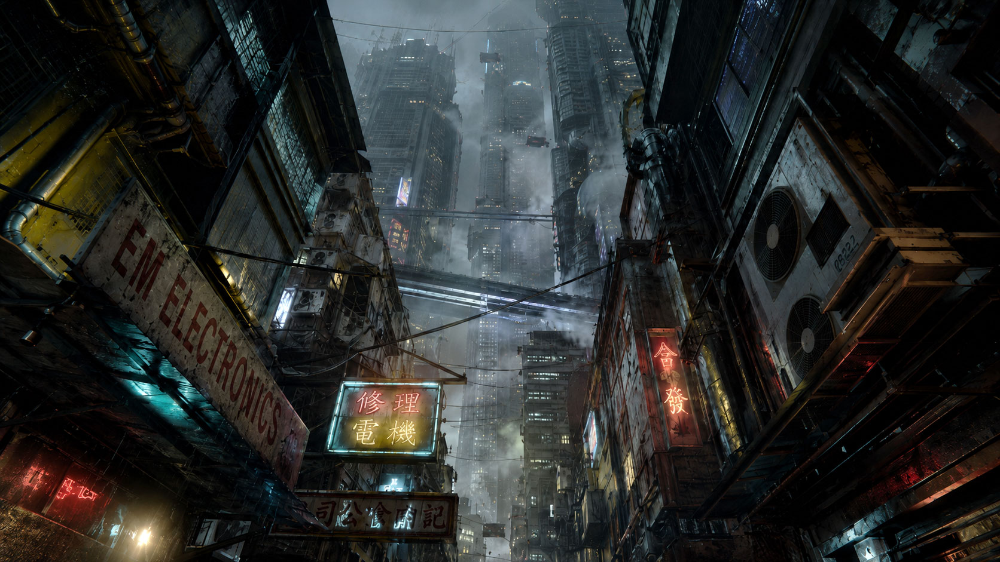
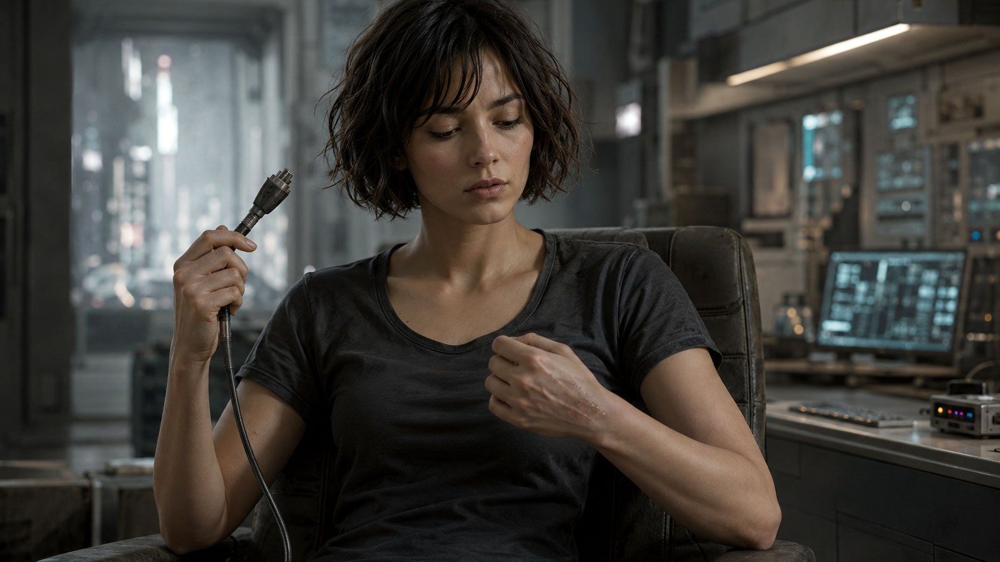

# 水惑星ターラ ── 電脳の継承

長編小説

---

## 残響　ウィリアムズバーグ

「ねえ、ミラ。昨日のオーディションどうだったの？」

　声をかけてきたのは、同じシフトのノーラだった。エプロンの紐を首の後ろで結び直しながら、カウンター越しに身を乗り出してくる。

　ミラ・ハーロウは皿を拭く手を止めずに、肩をすくめた。「監督って、最初の十秒で決めてしまうらしいの。私のときは、台詞を言い始めたときにはもう、次の子のこと考えてる感じだった」

「またそれ」ノーラは笑った。「あんた、半年前から同じこと言ってる」

　二〇〇二年、二月。ブルックリン・ウィリアムズバーグ、Bedford Avenue から一本外れた角に、〈バリーズ〉という名前のダイナーがあった。アイリッシュ系の初代の名が店名にだけ残して亡くなり、いまはギリシャ人の家族が回している。看板の五〇年代の筆記体の文字が消えかかっている。ミラはそこで週六日、朝から夕方まで皿を洗い、客に卵料理を運んでいた。夜は十四丁目の小さなスタジオで芝居の稽古をしていた。たまにオーディションが回ってきた。ほとんどは、誰の役にもなれずに帰った。

　壁掛けのブラウン管テレビが、低い音量で『シンプソンズ』の再放送を流している。バートが何かをやらかし、ホーマーの叫び声が店内に抜けていく。誰もノイズ混じりの滲んだ画面を見ていなかった。窓の外は灰色の空で、Lトレインの軋む音が遠くから断続的に届いていた。

　ツインタワーが崩れてから、五ヶ月だった。街はもう日常を取り戻したと言われていたが、ミラにはそれが嘘に聞こえた。マンハッタンの南端まで行けば、大きなビルの大理石の門標を指でなぞるだけで、積もった砂埃が指に付いた。先週、求人の張り紙を見にいったついでに、ミラは誰もいない正面玄関で、その大理石に自分の名前を書いてみた。書きながら、なぜそんなことをしているのか、自分でもわからなかった。書いたあとも、しばらく動けなかった。

　ポケットの中で、携帯が短く震えた。Nokia 3390の小さなモノクロ画面に、ショートメッセージが浮かんでいた。

　「演技スクール 受講料 残額 至急」

　短信は、それだけで切れていた。続きは家に帰ってメールを開けば届いているはずだった。ダイアルアップの音が、頭の中で鳴り始める。十分待って、繋がって、ようやく文章が読める。それから返事を打つ。送信ボタンを押してから、相手の手元に届いたかどうかも、しばらくわからない。

　昼の休憩に、ミラは店を出て、二ブロック先の地下にある中古レコード屋へ降りていった。看板には数十万枚以上、と書かれていたが、実際にはそれ以上あるように見えた。棚と棚の間が人ひとり通れるだけしか空いていない。誰かが選んだ盤が落ちる音、ジャケットを擦る指の音、それだけが薄い天井の下で増幅されて、地上の音はもうここまで届かない。ミラはこの店の、地下の、暗い湿った空気が好きだった。地上の世界より、ここのほうがいくぶん本物に近い気がした。

　ミラは三年以上、The Durutti Column の『Deux Triangles』という一枚を探していた。いつもとは違う棚を選んで、端から端まで指を真っ黒に埃で汚して掘ったが、今日の棚にはなかった。半年前、別の棚から Martin Denny の『Quiet Village』を三ドルで救い出したことがある。会計のとき、自分の指が少し震えていたのを覚えている。

　夕方のシフトが終わったあと、ミラは地下鉄に乗った。あの大理石を、もう一度見ておきたかった。理由は、自分でもうまく言えなかった。

　East River の下を潜って、向こう側へ出る。ウォール・ストリートの駅から地上に上がった頃には、もう夜だった。

　砂埃の上に書いた名前は、なかった。

　ミラは指でもう一度、なぞった。今度は、砂埃そのものがなかった。乾いた、磨かれた大理石が、彼女の指の下にあるだけだった。

　彼女はしばらく、その大理石を見ていた。それから、何でもないことのように指を引いた。

　数ブロック歩いたところで、明かりの灯った小さな商店の前を通った。デリカウンターから、甘いドーナツと煮詰まったコーヒーの匂いがしている。入り口の床に敷かれたえんじ色のフェルトのカーペットには、油汚れのシミがついていた。その上で店の白黒のハチワレの猫が横たわって、薄暗い蛍光灯の光のなか、毛繕いをする手を止め、こちらをじっと見ていた。

　ミラはその猫をしばらく見ていた。それから、駅のほうへ歩き出した。

---

## プロローグ

　指先に、まだ感触が残っていた。乾いた、磨かれた大理石。あるはずだった砂埃の、ない感触。

　ミラは目を開けた。

　頭の後ろから端子を抜く。室内は暗く、雨が窓を打っていた。〈バリーズ〉の焦げたコーヒーの匂いが、まだ鼻の奥にあった。仮想空間の二〇〇二年は、ほかには何も残していなかった。

　その都市では、雨がもう四十年やんでいなかった。

　正確に言えば、それは雨ではない。都市の上層を覆う排熱層が夜ごとに冷え、
昼のあいだ機械が吐き出した水蒸気が、酸を含んだ細かな粒になって落ちて
くるのだ。粒は塔の側面を伝い、看板のネオン管を白く曇らせ、路面に浮いた
油膜の上を虹色に滲ませながら、低いほうへ低いほうへと流れていく。住人は
誰もそれを天気とは呼ばなかった。ただ「外」と呼んだ。外に出るというのは、
傘を持つかどうかの話ではなく、肌と肺をどれだけ削られてもいいかという、
覚悟の話だった。

　その都市の、番号でしか呼ばれない区画の、番号すら割り当てられていない
部屋に、ミラ・ハーロウは住んでいた。

　部屋は狭く、寝台と端末と、ダイブ用の古い椅子が一台あるだけだった。
椅子は長年の使用で彼女の体の形にへたり、革の継ぎ目から黄ばんだ詰め物が
のぞいている。座るたびに、その椅子は人間ひとりぶんの疲労を、ゆっくりと
受け止めてきしんだ。

　椅子の足元には、年老いたハチワレ猫がうずくまっていた。ミラがダイブに沈むたび、猫はそこにいた。戻ってきたとき、猫はやはり、そこにいた。

　壁には何も貼っていない。写真も、地図も、誰かと
撮った記念の品も。ミラはずいぶん前から、過去を壁に貼るのをやめていた。
貼ったところで、それが本当に自分の過去なのか、この街では誰も保証して
くれない。記録はいくらでも書き換えられるし、人の頭の中身も同じだ。
だから彼女は、壁を白いままにしておくことを選んでいた。空白は、少なく
とも嘘をつかない。

　彼女は四十二歳だった。少なくとも、登録局の台帳ではそうなっていた。
この街では年齢は思い出の総量ではなく、ただの数字でしかない。誕生日に
意味を持たせる者は、もうほとんどいなかった。

　ミラの職業は、仮想空間の潜行者──ダイバーだった。脳の付け根に挿した
端子から信号を流し、肉体をこの椅子に残したまま、デジタルの身体で別の
世界へ降りていく。企業が新しい仮想惑星を商品として売り出す前に、その
世界をひとりで歩き、地形を測り、足を取られる場所や人を殺す仕掛けを
洗い出して報告する。地図のない世界へ最初に足を踏み入れ、最初に死に
かけ、それでも最初に戻ってくる。それが彼女の仕事であり、生計であり、
たぶん、彼女の人生のほとんどすべてだった。

　ダイブの中では、痛みは現実とまったく同じだった。技術者はそれを
「神経等価」と呼ぶ。仮想で炎に巻かれれば、脳は現実の皮膚も焼けたと
信じ込み、戻ったあとも何日かは触れられない。仮想で高所から落ちれば、
現実の胃も一緒に浮く。それでもダイバーが死なずに済むのは、致命傷の
寸前で接続が自動的に切れるからだ。切れずに戻れなかった例も、ミラは
知っていた。同業者が三人、椅子の上で目を見開いたまま、二度と意識を
こちらへ戻さなかった。そのうちの一人は、彼女が新人の頃に手ほどきを
受けた男だった。葬式はなく、椅子だけが業者に引き取られていった。

　ミラは自分の手の甲を見た。古い火傷の痕が、皮膚の上に薄く残っている。
仮想空間で負った傷が、そのまま現実の皮膚に焼きついたものだ。鏡の中の
自分より、彼女はこの傷痕のほうをよく覚えていた。どちらが本物の自分の
傷なのか──そんな問いは、長いこと考えないようにしていた。考え始めると、
椅子から立てなくなる。それも、同業者から学んだことのひとつだった。

　窓の外を、反重力バイクが二台、競うように上昇していった。クラクションが
酸の雨を一瞬だけ裂き、すぐにかき消える。ミラはその光の尾を、意味もなく
目で追った。やがて端末が、机の隅で低く鳴った。新しい依頼の合図だった。

　猫が顔を上げて、ミラを見た。

　彼女はしばらく動かず、雨の音と端末の音を両方聞いていた。それから手を
伸ばした。その晩の合図が、彼女の人生をどこへ運んでいくのか、このときの
ミラはまだ何も知らなかった。

---

## 第一章　失踪した少女と、狭間の異星人

　依頼人は、声だけしか伝えてこなかった。

　ダイバーへの依頼は、たいてい相手の顔が見えない。代理のプログラムや
合成音声、何重にも匿名化された通信層を介してくる。ミラはそれを不快に
思ったことはなかった。顔の見えない依頼は、顔の見えない報酬で支払われ、
どちらも後腐れがない。それで充分だった。だがその夜の声には、加工の
下に、隠しきれない震えがあった。機械を通しても消せなかった震えを、
ミラの耳は何年もの仕事を通じて聞き分けられるようになっていた。

「娘を探してほしい」と依頼人は言った。

　ミラは端末の前で脚を組み替えた。「人探しは専門外だ。現実の捜索なら、
もっと向いた業者を当たってくれ」

「現実にはいない」声が言った。「あの子は、ダイブの先で消えたんだ」

　ミラは黙った。窓を打つ雨の音が、急に大きく聞こえた。彼女は答えを
急がず、相手に続けさせた。震えている人間は、間を置けば自分から
しゃべる。

「娘の名はセレン。十六歳だ。三週間前、自分の端末から未登録の座標へ
独りでダイブして、それきり帰還の記録がない。それでも接続だけは……
まだ切れていない」

　切れていない、という言葉の意味を、ミラは正確に理解した。少女の
肉体は、いまもどこかの椅子の上で呼吸をし、心臓も動いている。だが
意識だけが三週間戻らず、仮想のどこかを歩き続けている。あるいは、
もう歩けなくなって、どこかにうずくまっている。どちらにせよ、放って
おけば肉体のほうが先に尽きる。

「座標を送ってくれ」とミラは言った。引き受けるとは、まだ言わなかった。

　送られてきた数列を見て、彼女は眉を寄せた。登録局のどの台帳にもない
座標だった。企業の試験区にも、闇に流れている私設サーバーの索引にも
かからない。正規のダイブ世界には、必ず「これは自分が作った」と名乗る
所有者がいる。所有者を持たない世界など、本来この時代には存在しない
はずだった。存在しないものに、十六歳が独りで降りて、戻ってこない。

「あの子のログに、ひとつだけ言葉が残っていた」依頼人の声が、最後に
小さくなった。「たぶん、世界の名前だ」

　ミラはその言葉を、口の中で繰り返した。
　ターラ。水惑星ターラ。

　彼女は引き受けると答えた。報酬の額は聞かなかった。聞かなかったのは、
強がりではない。存在しないはずの世界、というその一点が、二十年やって
きた彼女の職業的な好奇心の、いちばん古い場所をくすぐったからだった。

---

　ダイブの前に、ミラはいつも同じ手順を踏んだ。椅子に深く座り、端子の
冷たさが首の付け根の骨に届くのを待ち、それから息を三つ数える。一つ目で
いまいる現実を確かめ、二つ目でその現実を手放し、三つ目で落ちる。新人の
頃に編み出した儀式で、効くかどうかはわからない。ただ、二十年やめずに
続けているという事実そのものが、彼女を落ち着かせた。

　落下の感覚には、何度やっても慣れなかった。胃が浮き、視界が一度
完全に暗転し、それから、まったく別の重力が体をつかむ。

　ターラは、まず音から始まった。

　雨の音だった。ただし都市の酸の雨ではない。柔らかく、重く、生きている
水の音だ。ミラが目を開けると、仮想の身体が、仮想の肺で湿った空気を
吸い込んだ。むせ返るような緑の匂い。腐葉土と、名前の知らない花の匂い。
遠くで何かの生き物が、長く尾を引いて鳴いた。鳴き声には抑揚があり、
別の方角から、同じ抑揚が返ってきた。呼んで、応える。それは会話の形を
していた。空っぽの試験区では、ついぞ聞いたことのない音だった。

　空は鉛色の雲に覆われ、その切れ間から青白い光が斜めに射していた。
眼下には見渡すかぎりの湿地と、銀色に光る水面が広がっている。地球とは
似ても似つかない景色だが、死んだ世界ではなかった。むしろ生命が過剰な
ほどに満ちていて、それがかえってミラの神経を逆撫でした。これまで歩いた
仮想惑星のほとんどは空っぽだった。作り手が、商品の骨組みだけ用意して、
生き物まで作り込んでいないからだ。ここは違う。誰かがこの星に、売り物に
する予定もなさそうな小さな虫の羽音まで、丁寧に植えていた。なぜ、と
彼女は思った。誰のために、こんなものを。

「セレン」とミラは呼んでみた。返事はない。彼女は座標の中心へ向かって、
ぬかるんだ湿地を歩き始めた。一歩ごとに、足首まで温い泥が絡んでくる。

　異変は、半刻も歩かないうちに起きた。

　空が暗転した。雲のせいではない。世界そのものが、一度だけちらついた
のだ。古い映写機のコマが飛ぶように、景色が前後に揺れ、ミラの足元の
地面が半秒だけ消えた。彼女は反射的に身を低くした。バグか、あるいは
攻撃。ダイブ世界が不安定になるとき、それはたいてい、誰かがその世界に
外から手を入れている証拠だった。手を入れているのが世界の所有者なら
問題ない。所有者のいない世界で、それが起きているなら──。

　考え終える前に、自動接続の層が、内側から断ち切られた。

　ダイバーには命綱がある。致命傷の寸前で接続が切れ、現実の椅子で目が
覚める仕組みだ。その線が引きちぎられる音を、ミラははっきり聞いた。
鈍く湿った、太いロープが繊維ごと裂けるような音。聞き間違えようがない。
誰かが外側から、彼女の帰り道を、わざわざ手で塞いだのだった。少女のとき
と、同じやり方で。

　そして世界が、彼女を落とした。

---

　それは墜落だった。

　仮想の空が回転し、湿地が斜めにせり上がってくる。ミラの身体は雨の中を
落ちていった。神経等価。痛みは現実と同じだ。彼女は空中で体をひねり、
腕で頭をかばい、来る衝撃に備えて全身を縮めた。落ちながら、頭の片隅は
まだ仕事をしていた。水面が見える。泥だ。岩より泥のほうがいい。受け身を
取れ──。

　水面が、彼女を平手で殴るように受け止めた。

　冷たさと衝撃と暗さが、同時に来た。ミラは泥水の底で一度跳ね、肺の
空気を半分失った。目を開けると、茶色く濁った水の中を、気泡が乱れて
昇っていく。どちらが上かわからない。一瞬、本気で方向を見失った。だが
彼女は気泡を追った。気泡は嘘をつかない。気泡が昇っていく方が、空だ。
それだけを信じて、手足を動かした。

　水面を破って顔を出すと、ミラは激しく咳き込み、飲んだ泥を吐き、
それから初めて自分の体を点検した。左の脇腹で、何かが軋んでいる。仮想の
肋骨が折れかけているのだ。だが痛みは現実の肋骨とまったく同じ重さで、
彼女の呼吸を浅く、速くした。装備の半分は、落下の途中で剝がれて消えて
いた。照明も、測量機も、非常用の発信機も。手元に残ったのは、腰の鞘に
収めた小さなナイフと、泥を吸って重くなった服と、痛む脇腹だけだった。

　ミラは岸へ這い上がり、しばらく泥の上に仰向けで倒れていた。生きた
水の雨が、容赦なく顔を打つ。彼女は笑わなかったが、笑いたい衝動の影の
ようなものを、胸の奥に感じた。誰かが、わざわざ命綱を切ってまで、自分を
この世界に閉じ込めた。手間も危険も惜しまずに。それはつまり、この世界
には、人を閉じ込めてでも見せたくない何かがある、ということだ。あるいは
逆に、見せたい何かが。

「……いいだろう」とミラは泥に向かって、声に出して言った。声に出すと、
恐怖が少しだけ小さくなる。これも二十年で覚えたことだった。「歩いて
やる」

　立ち上がると脇腹が悲鳴を上げた。彼女は痛みを脇へ押しのける技術を、
やはり二十年かけて身につけていた。痛みは情報だ。折れた、深い、まだ
動ける──情報として読み、生き延びるために使う。それ以外の使い道は
ない。少なくとも、いまは。

　彼女は水の流れていく方へ歩き出した。水のある方には、たいてい命が
ある。命のある方には、たいてい探しものもある。それは惑星が地球で
あろうと、誰かの書いた紙の上であろうと、変わらない法則だった。

---

　ターラは、ミラを試すように、次々と危険を寄こした。

　最初の昼と夜のあいだに、彼女は三度死にかけた。一度目は、固い足場
だと思って踏み出した苔の絨毯が、実は泥沼に張った薄い蓋にすぎず、腰
まで一気に沈んだとき。両腕を広げて沈下を止め、近くの根に指をかけ、
半刻かけて這い出した。二度目は、空腹に負けて甘い匂いの実を口へ運ぼう
とした、まさにその瞬間。匂いに釣られて先に近づいた小さな獣が、実を
かじり、声もなく舌を溶かして転げ回るのを見た。ミラは実を捨て、その夜は
何も食べなかった。三度目は、夜だった。

　夜のターラには、獣がいた。

　体高はミラの胸ほどで、厚く濡れた体毛に覆われている。月のない闇の
中で、獣は目を使わず、匂いだけを頼りに獲物を追った。ミラは岩棚の
細い裂け目に身を押し込み、ナイフを逆手に握って、息を止めた。獣の
鼻面が、裂け目の縁をゆっくりと撫でていく。湿った熱い息が、彼女の
頬に直接かかった。手を伸ばせば触れる距離だ。仮想だ、ただのデータだ、
と頭では繰り返した。だが体は信じなかった。神経等価の規則に忠実に、
体は芯から凍りつき、汗が背中を冷たく流れた。ナイフを使えば、たぶん
一頭は殺せる。だが闇の中に、それが何頭いるかはわからない。彼女は
動かないことを選んだ。長い、長い時間だった。

　獣は、やがて去った。理由はわからない。気まぐれか、別の獲物の匂いか。
ミラは夜明けの最初の光が裂け目に届くまで、そこから一歩も出なかった。
出たとき、握り続けたナイフの柄が、手のひらの形に食い込んでいた。

　四日目に、彼女は遺跡を見つけた。

　湿地が尽き、岩がむき出しになった台地。砂と乾いた風の地帯に、それは
あった。崩れた壁。風に磨かれて角の取れた柱。長い年月が、すべての
輪郭を丸くしていたが、それでも見間違えようがなかった。直線がある。
直角がある。自然は直角を作らない。ここには、かつて意図があった。
ミラは、その直角を、どこかで前にも見たことがある気がした。だが思い
出せなかった。思い出せないものを、彼女はもう、追わないことにしていた。
これも、同業者から学んだことのひとつだった。

　そして壁の一枚に、人間の手で刻まれた跡があった。

　古い、文字とも模様ともつかない刻みが連なっている。だがその下の段に、
もっと新しく、稚拙で、まるで爪か石の破片で必死に削ったような線が
走っていた。ミラはその線に、そっと指を当てた。新しい。風化していない。
誰かがここで、何かを伝えようとしたのだ。それも、そう遠くない過去に、
彼女と同じ時代を生きた誰かが。線は途中で乱れ、最後は引きずったように
消えていた。書き終える前に、書く者がいなくなったように。

　数百年前、この星には人が漂着していた──。そんな一行が、出どころも
わからないまま、ミラの記憶の縁をかすめた。聞いた覚えがある。確かに
知っている。だが、その知識をいつ、誰から得たのかが、どうしても
思い出せなかった。思い出せないこと自体には、長年慣れていた。記憶は
この街では消耗品だ。だが、慣れているという事実そのものに、この
ときばかりは、背すじを薄い寒気が這い上がった。慣れていいことでは
ないのかもしれない、と初めて思った。

---

　遺跡のいちばん奥、崩れた祭壇の陰で、ミラは少女を見つけた。

　セレンは膝を抱えて座っていた。痩せている。仮想の身体は本来飢え
ない。だが意識が「自分は飢えている」と信じ込めば、身体はそのとおりに
描かれる。三週間、出口のない世界で、ひとりでそう信じ続けた者の体
だった。爪は割れ、唇は乾き、目だけが妙に大きく見えた。

「セレン」とミラは、できるだけ静かに呼んだ。脅かさないように、ゆっくり
近づきながら。「迎えに来た」

　少女が顔を上げた。その目に、ミラのよく知っている光があった。長く
独りで歩いた者の目。世界そのものを疑い始めた者の目だ。何度も鏡で
見たことのある光だった。

「……あなたも、ここから出られないのね」とセレンは言った。問いでは
なく、すでに知っていることを確かめる口調だった。「出口を塞がれたん
でしょう。わたしと同じで」

「塞いだ奴がいるなら、開ける方法もあるはずだ」とミラは答えた。それが
本当かどうかは、わからなかった。だが、迷っている人間に必要なのは
真実ではなく、進むべき方角だ。希望でなくていい。方角でいい。ミラは
二十年の仕事で、それを骨身に刻んでいた。

　セレンは何か言いかけた。その瞬間、世界がまたちらついた。

　遺跡の空気が震え、光が細かな粒になって宙にとどまった。セレンが
息を呑む。ミラは少女と光のあいだに体を入れ、ナイフを抜いた。だが、
裂け目から現れたのは、夜の獣ではなかった。

　それは人の形に似ていた。似ているだけだった。輪郭が、現実と仮想の
境目のように、絶えず細かく揺らいでいる。ダイブ世界の住人でもなければ、
企業の管理体でもない。ミラの知るどんなプログラムの挙動とも違った。
それは世界の表面に立っているのではなく、世界の継ぎ目そのものから、
内側へにじみ出てきたように見えた。

　ミラは後に、それを異星人と呼ぶことになる。だがそのときは、ただ
ナイフを下げた。なぜそうしたのか、自分でも説明できなかった。ただ、
そのものに刃を向けることが、夜の獣に向けるのとは違って、ひどく
見当違いで、ひどく失礼なことに思えたのだ。理屈ではなかった。二十年
かけて鍛えた、彼女の勘がそう言っていた。

---

　言葉は、まったく通じなかった。

　異星人は音を発した。ミラの鼓膜は確かにそれを受け取った。だが意味は
ほどけない。代わりに、それは光を使った。掌のあたりに光をともし、形を
作り、消し、また別の形を作る。ミラは長いあいだ、それをただ見ていた。
セレンが背後で、震える声で訊いた。「会話、してるの……？」ミラは
答えなかった。答えを、まだ持っていなかった。

　通じ合いは、言葉の外で、ゆっくりと起きた。

　ミラが思わず痛む脇腹を押さえると、異星人の光が、その手の形を空中で
一度なぞった。痛みを、見ている。次にミラが、背後のセレンを指し、
それから空の向こう──現実があるはずだと信じている方角──を順に
指した。異星人の光は、しばらく揺れたあと、ゆっくりと、了解を示す
ような形に変わった。少なくともミラには、そう読めた。理解とは、たぶん
相手の言葉を自分の言葉へ訳すことではない。相手がいま何を切実に思って
いるかを、こちらが切実に想像しようとする、その姿勢そのものなのだ
──ミラはこのとき、言葉にならない形でそれを学んだ。後の人生で、
それは何度も彼女を助けることになる。

　異星人は、壁の稚拙な削り跡に光の先を触れた。それから、空を何度も
指した。同じ動きを、根気強く、繰り返した。

　ミラは理解した。あるいは、理解したと信じることにした。この星には
かつて人が来た。出られなくなった者が、最後の力で壁にあの線を刻んだ。
そして異星人は、その線を、おそらく途方もなく長いあいだ、たった独りで
見守ってきたのだ。誰も読みに来ない一行を、ずっと。

　異星人がセレンに近づいた。少女は身を硬くしたが、今度は逃げなかった。
ミラも止めなかった。止めるべきではないと、勘が言っていた。異星人の光が、
セレンの全身を繭のように包んでいく。セレンの輪郭が、少しずつ薄く
なっていった。世界の紙から、そっと剝がされていくように。

「ミラさん」と、セレンが消えかけながら、最後に言った。声はもう、ほとんど
聞こえなかった。「あなたは……来た道を、覚えてる？」

　ミラは答えられなかった。来た道など、最初から塞がれていた。
　次の瞬間、セレンの姿は光に溶けて消えた。後にミラは、依頼人からの
短い通信を受け取ることになる。娘が三週間ぶりに椅子の上で目を開け、
何も言わずに泣き続けている、と。声だけの依頼人は、最後に一度だけ、
加工の取れた素の声で「ありがとう」と言って、通信を切った。それが、
ミラがこの仕事で受け取った、唯一の報酬だった。金は、とうとう
振り込まれなかった。彼女は催促しなかった。

---

　セレンは現実へ還った。しかしミラは、還れなかった。

　異星人はまだ、ミラの前に残っていた。光が、何かをためらうように
明滅している。ミラは遺跡の崩れた壁にもたれて座り、片手で痛む脇腹を
押さえ、もう片方の手で、頭の中だけで出口を探し続けた。見つからない。
塞がれた道は、塞がれたままだ。少女を通せたのは、たぶんこの異星人が、
自分の力を削るようにして、一人ぶんの隙間をこじ開けたからだ。そして
二人ぶんの隙間は、もう、なかった。

「あんたは」とミラは、通じないと知りながら、声に出して言った。誰も
いない世界で声を出すのは、相手のためではなく、自分の正気のためだ。
「ここからずっと、出られないんだな。ひとりで」

　異星人の光が、すうっと静かになった。それは肯定に見えた。長い時間を、
誰にも届かない場所で過ごしてきた者だけが持つ、底の深い静けさだった。
ミラはその静けさに、奇妙な既視感を覚えた。番号でしか呼ばれない部屋。
何も貼っていない白い壁。体の形にへたった椅子。自分の暮らしと、それは
どこか、同じ匂いがした。

　異星人が、ゆっくり近づいてきた。その光が、ミラの左腕に触れる。熱く
も冷たくもない。ただ、皮膚の下に何か小さく固いものが、そっと置かれた
感覚があった。種のようなもの。仮想の身体に、現実の重さで。痛みは
なかった。むしろ、長く空いていた場所が、ようやく埋まったような感覚
だった。

　光が引いていった。異星人の輪郭が、世界の継ぎ目へ戻っていく。最後に
その光は、空中にひとつの形を作った。ミラにはそれが「歩け」と読めた。
あるいは「戻れ」。あるいは、その両方だったのかもしれない。形は数秒
だけ留まり、それから雨にほどけるように消えた。

　ミラは立ち上がった。脇腹はまだ痛んだ。彼女が左腕にそっと触れると、
皮膚の下の種は、確かにそこにあった。そのとき、塞がれていたはずの出口が、
ほんの半秒だけ、世界の遠くで、生き物が一度だけ息をするように開いて、
また閉じた。見間違いではなかった。

　彼女はその方角へ、足を引きずりながら歩き出した。ターラの生きた雨が、
背中を押すように、いつまでも降っていた。

---

　歩いた距離を、ミラは後から思い出せなかった。脇腹の折れた肋骨が、
息のたびに灼けた。雨は止まなかった。歩きながら、彼女は気づいた。左腕
の種が、自分の鼓動とは別の、低い脈で疼いている。一拍、間。一拍、間。
規則的に、世界の遠くから返ってくる。種の脈は、あの出口の呼吸と、
ぴたりと揃っていた。種は、針だった。彼女は針の指す方へ、歩けばよかった。

　途中で、ミラは罠を二度踏みかけた。罠と呼ぶには、ひどく静かだった。
進むべき方角に、見覚えのある景色が、二度、繰り返し現れた。一度目で、
ミラは偽物だと見抜いた。湿地の細部が、本物と微妙にずれていた。木の
影の落ち方が、半秒だけ遅かった。彼女を閉じ込めた誰かは、出ていく道に、
本物そっくりの偽の出口を、いくつも縫いつけていた。迷えば消耗するように。
消耗しきれば、自分から動かなくなるように。手の込んだ、辛抱強い悪意
だった。ミラは偽物に背を向け、種の脈だけを頼りに歩いた。種は嘘を
つかない、と決めた。なぜそう決められるのかは、自分でもわからな
かった。決めるしか、なかった。

　たどり着いた場所は、何でもなかった。

　湿地の、何の特徴もない一画。ぬかるみと、まばらな葦と、雨。ただ、
そこの空気だけが、ほんのわずかに震えていた。一拍、震えて、止まる。
一拍、震えて、止まる。種の脈と、寸分違わない。誰かがここの世界の
継ぎ目を、わざわざ手で裂いて、彼女の帰り道を絞めた、その縫い目の
場所だった。ミラは雨に打たれて立ち、自分の鼓動と、種の脈と、空気の
震えが、ひとつに揃うのを待った。三つは、すぐには揃わなかった。長い
時間、彼女はただ立っていた。立っているあいだ、後ろから誰かが追って
くる足音を、何度も聞いた気がした。気がしただけだった。たぶん。

　三つが揃った瞬間、目の前の空間が、一拍ぶんだけ、開いた。生き物の
鰓のように。半秒。それきり。

　ミラはためらわなかった。ためらえば次の呼吸まで待つことになり、その
半秒のあいだに、ターラの誰かが手を伸ばしてこない保証も、もうなかった。
彼女は両腕を前に差し出し、開いた隙間に、上半身から突っ込んだ。

　世界が、つかんだ。

　文字どおりにつかんだのだ。継ぎ目の縁が、無数の細い指のように、仮想
の肩を、腰を、足首を、いっせいに握り返した。出ていくな、と世界が物理的
に主張した。引き戻されかけたその瞬間、左腕の種が、これまでで一番強く、
灼けた。いや、押し返した。種が、彼女の腕越しに、世界の握りを、ほんの
わずかに緩めた。半身ぶんの隙間ができた。──ミラはこのとき、自分の
中に、後で自分を変えてしまう何かの、最初のひと匙が、すでに置かれて
いるのを知らない。知らないまま、その最初の力を、帰るためだけに使った。
振るうためにではなく、退けるためだけに。後年、彼女が住人の群れに対して
自分に厳しく課すことになる手つきの、最初の一回が、それだった。

　通れた、と思えたのは、頭と胸だけだった。継ぎ目は閉じはじめていた。
残った片脚を、ミラは力まかせに引いた。引いた拍子に、左の長靴の片方が、
向こう側の縫い目に挟まって、世界に持っていかれた。脛がむき出しになり、
酸の雨ではない雨が、その素肌をひと撫でした。それが、ミラがその夜、
世界に払った代金だった。後から思えば、安かった。世界が片方の靴ぶんで
満足してくれなかった可能性は、いくらでもあった。腕の一本でも、目の
ひとつでも、彼女自身という存在そのものでも、世界はそれを請求できた
はずだ。なぜ靴一足で済まされたのか、ミラはその後、長く考えることに
なる。答えは出なかった。

　通り抜けた先には、何もなかった。

　景色も、音も、雨も、痛みも、一度に消えた。代わりに、首の付け根の
端子の、冷たさだけが、戻ってきた。

---

## 第二章　インプラントと、自分への問い

　ミラは自分の椅子の上で、目を覚ました。

　番号でしか呼ばれない部屋。へたった革。首の付け根の端子の冷たさ。
窓の外では相変わらず酸の雨が降り、看板のネオンが滲んでいる。何も
変わっていなかった。何ひとつ。彼女は天井のしみを見上げ、自分が確かに
ここにいることを、いつもの三つの呼吸で確かめた。一つ目で現実を確かめ、
二つ目で仮想を手放し、三つ目で──いつもなら、ここで何も起きない。
だが今回は、三つ目の呼吸の途中で、左腕が疼いた。

　彼女は袖をまくった。皮膚に傷はない。注射の痕も、切開の線もない。
だが内側に、何かがある。指で押すと、骨でも筋でもない小さく固いものが、
皮下をわずかに滑った。ターラの遺跡で、異星人が置いていった種。それが
仮想の身体ではなく、現実の腕の中に、物として存在していた。

　ミラはしばらく、その感触を指で確かめ続けた。仮想で負った傷が現実の
皮膚に痕を残すのは、神経等価で説明がつく。脳がそう信じるからだ。だが
これは傷ではない。仮想空間で渡された物体が、現実の肉の中に移ってきて
いる。説明する理屈を、彼女は持っていなかった。技術者に見せれば、
たぶん腫瘍だと言うだろう。切れと言うだろう。ミラは切らないことを、
その場で決めた。理由は、うまく言えなかった。ただ、これは自分のものだ、
という感覚が、奇妙なほどはっきりとあった。

　彼女は長いあいだ腕を見ていた。それから端末を操作し、その夜に来て
いた依頼を断った。理由は書かなかった。依頼を断るのは、二十年で初めて
のことだった。断ったあと、彼女は妙に長く、その画面を見つめていた。

　椅子の脇で、低い駆動音が応じた。リサだった。腰の高さの、無骨な小型
自走機。装甲の脇腹には〈ＬＩＺ〉と擦り切れたステンシルが残っている。
ミラがダイバーになった年に、廃機の払い下げを叩き直して使い始めて、
それきり二十年、一度も乗り換えなかった相棒だ。リサの仕事は地味だった。
ダイブ中のミラの生体反応を全部記録し、椅子の角度を微調整し、危ない
波形が出ればすぐに帰還処置を準備する。それだけ。だがその「それだけ」
を二十年休まず続けた機械は、ミラのどの息継ぎが集中の前触れで、どの
肩の落とし方が怖がっている合図かを、本人より正確に知っていた。リサは
左腕の種について、何も訊ねなかった。代わりに、淡々と、新しい監視
項目を一つ自分のログに足した。〈左前腕・異物・要観察〉。それだけ
だった。ミラは、それでいい、と小さく頷いた。リサは余計なことを言わない。
それが、彼女がリサを、別の機種に乗り換えなかった理由だった。

---

　その力に気づいたのは、三日後の、まったく別のダイブでだった。

　ありふれた仕事だった。企業の試験区。売り出し前の、空っぽの仮想
惑星。岩と、設定をしくじった低すぎる重力と、まだ描かれていない
作りかけの地平線しかない。生き物も天候もない。ミラはいつものように
黙々と歩き、地形を測り、報告用の数値を頭に並べていた。退屈な、安全な、
家賃のための仕事だった。そのはずだった。

　崖の縁で、彼女は足を滑らせた。設定ミスの重力が、その一歩を余計に
深く引いた。

　落下が始まった。神経等価。胃が浮く。死にはしない。試験区にも命綱は
ある。だが骨は折れる。仮想で折れた骨は、現実の彼女を三週間、椅子から
立てなくする。三週間分の家賃が、落ちていく速度で頭をよぎった。

　ミラはとっさに、手を伸ばした。何もない空間へ。掴むもののない虚空へ。
意味のない動きだ。落ちる人間が反射的にやる、何の役にも立たない動き。
そのはずだった。

　そして、止まった。

　落下が、止まったのだ。正確には、落下そのものが消えたのではなかった。
彼女を引いていた重力の手が、伸ばした掌に押されて、ほんの一瞬、彼女
からだけ手を引いた──そんな止まり方だった。世界はミラを退かせたのでは
なく、ミラのほうが、世界に向かって、落ちる動きを「退いてくれ」と頼んだ。
頼みは、聞き入れられた。彼女の身体は、岩肌の二メートル上で、宙に浮いて
いた。伸ばした手の先で、世界そのものが、低く軋んでいる。仮想世界の物理
法則──誰かが書いたはずの規則が──ミラの手の届く範囲だけで、いっとき、
拒まれていた。彼女自身の意思によって。新しく何かを作ったのでも、書き
換えたのでもない。ただ、起きかけたことを、一回ぶん、退けた。それだけの
ことだった。

　ミラはゆっくりと、岩の上へ降りた。膝が震えていた。恐怖ではない。
恐怖なら、夜の獣で味わったばかりだ。これは別の何かだった。彼女は
両手を目の前にかざし、長いこと見ていた。火傷の痕のある、見慣れた
自分の手。その手が、世界の動きをひとつ、退けた。退けた、というのが、
いちばん正確だった。動かしたのではない。退いてもらった。

「……何を置いていった」と、彼女は誰もいない試験区で、声に出して
呟いた。左腕の種が、答えるように、かすかに疼いた。返事のように。

　そのあと、奇妙な空腹がきた。腹ではなく、頭の、ずっと奥のほうの
空腹だった。長く考えごとをしたあとに似ているが、考えごとはしていな
かった。何かが、確かに、自分の中から差し引かれている感覚だった。
ミラはダイブを切って椅子に戻り、その夜、いつもより一時間早く眠った。
眠ったあいだに見た夢を、翌朝、ひとつも覚えていなかった。覚えていない
こと自体は、ふつうのことだ。だが、夢を見たという感覚すら、なかった。
頭の奥の、ある一区画ぶんの夜が、まるごと切り取られていた。あれが
代金だったのだ、と彼女が気づくのは、もう少し先のことだった。

---

　彼女はその力を、注意深く試し始めた。独りで、誰にも知られない場所で、
少しずつ。

　最初に確かめたのは、何ができないか、のほうだった。

　ミラは試験区の岩に、手をかざして「動け」と命じた。岩は動かなかった。
何度やっても、何ひとつ起きなかった。次に、岩のすぐ脇の砂に手をかざし、
「ここに、新しい石をひとつ作れ」と頼んだ。やはり、何も起きなかった。
試しに、地面の石ころをひとつ拾い上げ、空中で離し、それから「落ちるな」
と頼んでみた。石は、宙にとどまった。ふたたび「落ちろ」と命じても、
今度は落ちなかった。動きを退けてしまったあとは、その動きは、もう、
退いたままだった。ミラが「やっぱり落ちてくれ」と頼み直しても、聞き
入れられなかった。退けたものは、後から取り消せない。それが、最初に
わかった一行だった。

　ミラはダイブ世界の中で、岩を地面に押さえる重さを、退けた。岩は
浮いた。流れる水の、流れるという動きを退けた。水は鏡のように止まった。
崩れかけた足場の、崩れるという動きを退けた。足場は、しばらく止まった
ままになった。最初のうちは、ひと掬いの砂を退けるだけで、こめかみの
奥が鈍く痛んだ。だが、痛みは情報だ。彼女はその痛みの読み方も、すぐに
覚えた。三十回繰り返すと、両手で抱えるほどの岩を、地面が引き戻す
動きから、まるごと退かせられるようになった。百回を超えた頃には、頭痛が
消えた。

　頭痛が消えたとき、ミラは喜ばなかった。喜ぶ代わりに、注意深くなった。
頭痛が情報だったなら、頭痛が消えたあとは、別の場所が、情報を出さない
まま黙って減っているはずだった。彼女は試した。記憶のいくつかの隅を、
わざと点検した。子供の頃に住んだ街の名前。最初に死んだ同業者の顔。
火傷の痕がついた日の天気。──いくつかが、ぼんやりとしか戻ってこな
かった。覚えていたはずのものが、輪郭だけになっていた。代金は、頭痛
からそちらへ、引っ越していた。ミラは試すのを、いったんやめた。やめて、
ノートに、自分の手で五行だけ書いた。後にも先にも、彼女が能力について
紙に書いた、ただ一度だった。

> 一、この種は「退ける」ことしかできない。動かす・作る・書き換える・
>   殺す、はできない。
> 二、退けた力と同じ重さの何かが、必ず私の中から差し引かれる。
> 三、代金は物質ではない。皮膚、視力、記憶、時間、帰り道。引かれる
>   場所は、私のほうでは選べない。
> 四、種の脈は、世界の継ぎ目と同じ拍を打つ。継ぎ目から遠い場所ほど、
>   退ける力は弱い。
> 五、一度退けたものを、後から退けなかったことには、できない。

　書き終えてノートを閉じ、ミラはそれを引き出しの奥にしまった。仲間と
呼べる人間は、まだ一人もいなかった。書いた五行を、誰かと共有する日が
来るとも、このときは思っていなかった。

　そして彼女は、谷も畳まなかった。畳んでみたい誘惑は、確かにあった。
向こう岸までの距離を、退け、と頼めば、たぶん退いた。だが、退いたあとに
何が引かれるかは、頼んでみるまでわからない。彼女は、まだ自分の何が
残っているのか、把握しきれていない人間が、見栄で大きな取引をしては
いけないということを、二十年の仕事で覚えていた。だから、谷は、谷の
ままで置いておいた。退けるのは、退かさないと誰かが死ぬ動きだけ。
そう自分に決めた。これが、後年、PAX の掟になる「床を知らずに跳ぶ者は
落ちる」の、いちばん最初の一行だった。

　その力は、確実に彼女を変えていった。仕事のうえでは、それは恵みの
ように見えた。

　受ける依頼の質が変わった。これまで業界で死地と呼ばれ、誰も近づか
なかった深度から、ミラは平然と歩いて戻ってくるようになった。生還率
ゼロと札を貼られた崩壊区から、迷い込んで動けなくなったダイバーを、
立て続けに二人連れ帰った。三人目は、別の街から来た中年の女だった。
四人目は、まだ十二の少年だった。少年は救出されたあと、ミラの顔を
見上げて、助かった、とは言わなかった。代わりに、こう訊いた。

「あなた、人間？」

　ミラは答えなかった。答えを、持っていなかったからだ。少年の母親が
泣きながら少年を抱き上げ、何度も礼を言った。ミラはその礼を、うまく
受け取れなかった。礼を言われるたびに、少年の問いのほうが、胸の奥で
大きくなっていった。

---

　その夜、番号でしか呼ばれない部屋で、ミラは眠れずにいた。

　窓を流れる雨を見ていた。ネオンの滲みを見ていた。左腕の種を、指の
腹で、ゆっくり押していた。

　問いが、頭の中で、ひとつからふたつ、ふたつから無数へと増殖して
いった。この力は、本当に自分のものなのか。自分が鍛え、自分が手に
入れたものなのか。それとも、ただ外から置かれただけのものを、自分は
身につけたと勘違いしているだけなのか。種が勝手に芽吹いただけのことを、
自分の手柄と呼んで、救った人間の数を数えているだけではないのか。

　もっと嫌な問いも、そこにあった。ターラから戻ってきたこの女は、
本当に、ターラへ降りていった女と、同じ人間なのか。ダイブの帰り道で、
自分の中の何かが、知らないうちに入れ替わっていないと、いったい誰が
保証してくれるのか。記憶は、貼っても剝がれる。書き換えられる。
消される。彼女が長年、壁に何ひとつ貼らずに生きてきた本当の理由を、
このとき初めて、はっきりと言葉にできた。怖かったのだ。貼ったものが
自分の過去だと、信じられなくなる日が来るのが。

　ミラは目を閉じた。まぶたの裏に、ターラの生きた雨が降ってきた。緑の
匂い。崩れた壁の、爪で削ったような線。そして、現実と仮想の継ぎ目で
揺らいでいた、あの輪郭。言葉のない理解。光が空中に作った「歩け」の形。

　あの一度きりの、言葉を介さない通じ合いだけが、奇妙なことに、彼女の
いちばん確かな足場として、胸の底に残っていた。力よりも確かだった。
記憶よりも、名前よりも確かだった。あのとき自分は確かに、誰かに、
切実に想像された。理解されたのではなく、想像された。その手触りだけは、
書き換えようのないものとして、そこにあった。それだけは、本物だと
言い切れた。

　ミラは決めた。この力が何なのかを知るより先に、この世界そのものが
何なのかを知ろう。自分が何者かを問う前に、自分がいま立っている床が、
そもそも何でできているのかを確かめる。順番を逆にすると、足を踏み外す。
それは、彼女がこの仕事で学んだいちばん古い掟だった。床を知らずに
跳ぶ者は、必ず落ちる。

　彼女は身を起こし、端末を起動した。そしてターラの座標を、もう一度
呼び出した。今度は、誰かを捜索するためではなかった。世界の床を、
自分の手で剝がしに行くためだった。

---

## 第三章　神とされること

　噂は、ミラ本人より速く、世界の底を歩いた。

　ダイブ世界には、住人がいる。企業が背景として描き込んだだけの人物。
古いダイバーたちが置き忘れていった意識の残響。そして、世界がひとりでに
育ててしまった、名もない意識の断片たち。彼らは互いに語る。語りは層を
越え、世界から世界へと伝わっていく。そして伝わるたびに、語りは少しずつ
余分をそぎ落とされ、同じひとつの形へと痩せていった。不可能な深度から
人を連れ戻す者。世界の理を、素手で曲げる者。雨の街から来て、雨の中へ
帰っていく、顔のない女。

　ミラがある崩壊区へ降りたとき、その区画の住人たちは、すでに彼女を
待っていた。ぬかるんだ広場に、最初は十人ほど。彼女が歩を進めるあいだに、
どこからともなく集まって、やがて百人を超えた。彼らは武器を持って
いなかった。代わりに、ミラが近づくと、ひとり、またひとりと地面に膝を
ついた。ミラが歩けば道を空け、その道の両側で、頭を垂れる。誰かが低い
声で、名前ではない言葉を繰り返していた。称号のような、祈りのような
言葉を。

「やめろ」とミラは言った。広場は、波が引くように静まり返った。「俺は
依頼で来た。歩いて、見て、戻るだけだ。それ以上の存在じゃない」

　最前列にいた老人が、ゆっくりと顔を上げた。住人にしては、その目は
生きすぎていた。世界が育てた断片の中でも、自分が何かを失っていると
気づいてしまった種類の目だ。「あなたは、戻れる」と老人は静かに言った。
「だが、わたしたちは戻れない。戻る場所が、もうないんだ。戻れる者の
ことを、わたしたちは、そう呼ぶしかない。ほかに呼びようを知らない」

　ミラは、その言葉に返す言葉を持たなかった。否定すれば嘘になる。
肯定すれば、彼女自身が壊れる。彼女は黙って、頭を垂れる人々のあいだを
通り抜けた。背中に、無数の視線が貼りついた。

---

　崇拝とは、距離のことだった。ミラは、それを肌で理解するように
なっていった。

　膝をつかれるたびに、彼女と相手のあいだに、薄い透明な膜が一枚、
張られる。その膜の向こう側では、ミラはもうミラではなかった。彼女の
痛みも、迷いも、家賃の心配も、火傷の痕も、すべて膜のこちら側に置き
去りにされる。そして向こう側には、磨かれて都合よく整えられた、ミラの
形をした何かだけが立っている。奇跡を起こす手。理を曲げる者。その像は、
ミラに似ていたが、ミラではなかった。

　神とされるとは、そういうことだった。誰も自分を、ただの一人の人間
としては見なくなる。痛がる人間として、間違える人間として、見て
もらえなくなる。そうやって誰からも見られなくなった人間は、やがて
自分でも、自分のことを見失っていく。鏡を見ても、像のほうが先に
目に入るようになる。

　ミラがいちばん恐れたのは、力そのものではなかった。力は道具だ。
道具なら、いつか机に置いて立ち去ることもできる。彼女が本当に恐れた
のは、いつか自分のほうから、膜の向こうの磨かれた像へ歩いていって
しまうことだった。そちらは、楽なのだ。像でいるあいだは、迷わなくて
いい。問わなくていい。間違えなくていい。種が芽吹いただけのことを
自分の手柄と呼び、頭を垂れる者の数をただ数えていれば、それで日が
暮れる。楽さには、引力がある。ミラはその引力を、自分の中に確かに
感じていた。だからこそ、恐れた。

　ある夜、彼女は試しに、ひとりの住人に訊いてみた。まだ顔の柔らかい、
若い女の住人だった。
「俺がここで死んだら、お前たちはどうする」

　女はきょとんとして、それから、おかしなことを聞くものだと言いたげに、
笑った。
「神さまは、死なないでしょう」

　ミラはその夜、ダイブを切った。現実の椅子の上で、長いあいだ、左腕の
種を強く、強く押し続けた。痛みが欲しかった。痛みだけが、自分がまだ
膜のこちら側にいる、生身の人間でいる、という証拠だったからだ。痛みが
あるうちは、まだ像ではない。彼女はそう自分に言い聞かせ、ようやく
眠った。

---

　彼女は、問いの矛先を変えることにした。

　なぜ自分が神とされるのか、ではなく──なぜこの世界は、人が神を
必要とするほど、これほど精巧にできているのか。

　考え始めると、いくつもの違和感が、線でつながった。ダイブ世界は、
できすぎていた。売り物にもならない空っぽの試験区でさえ、岩の影の
落ち方が、計算され尽くしたように正確だった。ターラの生態系は、誰かの
道楽と呼ぶには、あまりに徹底して作り込まれていた。そして何より、痛みが
本物すぎた。神経等価というのは技術の名前にすぎない。だが、その技術は
なぜ、これほど執拗に、これほど丁寧に、人の痛みを再現するのか。痛みを
ここまで真剣に作り込む世界は、痛むその人間に、いったい何を信じさせたい
のだろう。世界が本物だ、と。あるいは、おまえは本物だ、と。

　ミラは、世界の層を、自分の手で潜り始めた。

　依頼ではなく、調査としてだった。彼女はわざと、世界の縁を踏み外した。
描画が途切れる場所。物理がつじつまを失う境界。住人の語りが、ある一点
から先で急に矛盾し始める継ぎ目。そういう弱い部分を見つけては、例の力を
使った。具体的には、層が閉じようとする動き──薄皮がもう一度ぴたりと
塞がろうとする、その閉鎖の動きのほうを──退けた。剝がしたのではない。
塞がるな、と頼んだ。世界は、頼まれているあいだだけ、不承不承、剝がれた
ままになった。指の腹一枚ぶんの厚みで、その下が覗けるくらいに。覗き
終えて手を離せば、層はすぐ閉じた。閉じたあとを、もう一度開け直す
ことはできなかった。退けたものは取り消せないが、退けることをやめれば、
退けなかった世界がそこに戻ってくる。能力のルールは、世界の層に対しても、
ちゃんと同じ顔をしていた。

　一枚の継ぎ目を覗くたびに、彼女の中で、また何かが静かに引かれて
いった。一夜の調査が終わるごとに、ミラは自分のささやかな持ちものを
点検した。匂いの記憶が一つ。誰かの声の高さが一つ。子供のころに食べた
ものの味が一つ。気づかれない速さで、しかし確実に。代金は、いつも、
本人がいちばん気づきにくい場所から、先に引かれた。彼女はその引かれ方
を、止められなかった。止めれば調査も止まる。調査を止めれば、世界の
正体は永遠にわからないままになる。彼女は払い続けた。一枚めくると、
その下に別の層があった。その層も退けた。その下にも、別の層があった。
世界は、一枚の固い地面ではなかった。何枚も、何十枚も貼り重ねられた、
薄い紙の束だったのだ。そして彼女のほうは、一枚覗くごとに、自分という
束のほうから、紙が一枚ずつ静かに抜かれていた。

　そして、ある層の継ぎ目の奥で、ミラは初めて、それを見た。

　文字の流れだった。彼女には読めない、だが明らかに規則を持った文字の、
途切れない滝。世界の裏側を、絶え間なく、上から下へと流れ続けている、
書かれた言葉。ミラは長いこと、その滝の前に立ち尽くした。読めなくても、
それが何であるかは、はっきりとわかった。これは世界の地肌ではない。
これは、世界の原稿だ。誰かが、いまこの瞬間も、これを書き続けている。
ターラの雨も、夜の獣も、頭を垂れる住人たちも、そして雨の街の彼女
自身も──全部、この滝から流れ出した、文章なのだ。

---

　ダイバーには掟がある。自分が何者かを問う前に、自分の立っている床が
何でできているかを確かめろ。ミラは確かめた。そして答えを得てしまった。
床は土ではなかった。岩でも、金属でも、コードのたとえ話でもない。床は、
文章だった。誰かが書き、書き換え、書き足し続けている、終わりのない
一篇の、その途中だった。

　ミラはその後、しばらく、〈コード〉という言葉のことを考えた。技術者
が聞けば、まずその言葉を使うだろう。世界の裏にあるのは演算で、流れて
いるのは命令で、一度書かれたら、あとは実行されるだけのもののはず
だった。だが彼女が見た滝は、そういう動きをしていなかった。実行されて
いる動きではなかった。書かれている、いままさに書かれている、動き
だった。一行書き終えると次の一行が来て、その一行を書き終わるまで
世界の一秒が進まない、というような、ゆっくりとした、執拗な、止まらない
筆だった。ターラの雨の一粒も、雨の街の彼女自身の今の呼吸も、誰かの手
が、その都度、書き起こしていた。彼女が次にまばたきをする一行も、いま
その誰かが書きかけている途中だった。これはコードではない。コードは
演算する。これは、書いている。──そして書く者には、書きながら直す、
消す、書き足す、書き写す、欄外に注を入れる、誰にも読ませない、燃やす、
棚にしまう、忘れる、思い出す、という選択肢が、ぜんぶある。コードには
ないものだ。だから彼女は、それを〈原稿〉と呼ぶことにした。〈コード〉
ではなく、〈原稿〉。彼女がこの仕事で得た、最大の固有名詞だった。

　読めない原稿、というのは、矛盾ではなかった。世界には、読めなくても
原稿と呼ばれるものが、いくらでもある。式典の式次第、契約の条項、
処方箋、葬式の経。読み手のためというより、書かれていることそのもの
が動くために、書かれているもの。文字の滝が、まさにそれだった。読ま
れなくていい。書き手が「これは書かれた」と認めてさえいれば、世界の
側はそのとおりに動く。読めない、というのは、ミラの側の問題でしか
なかった。文字の意味より、ずっと前に、文字の存在が世界を動かして
いた。意味は、後から来るおまけのようなものだった。──そのおまけを
拾いに行くのが、たぶん、これからの彼女の仕事だった。

　ということは、その文章のどこかに、ミラ・ハーロウという一行も、
書かれているはずだ。雨の街の、番号でしか呼ばれない部屋の、へたった
椅子の女。火傷の痕のある手。それもすべて、ターラの雨と同じ、紙の上に
書かれた一行にすぎないのかもしれない。彼女が壁に何も貼らなかったのも、
依頼を初めて断ったのも、誰かがそう書いたから、なのかもしれない。

　ふつうの人間なら、ここで足を踏み外す。自分が書かれた存在だと知った
人間は、たいてい、立っていられなくなる。歩き方そのものを忘れる。ミラは、
踏み外さなかった。代わりに、ひどく静かに、腹を立てた。叫びたくなる
ような怒りではない。薪がゆっくり熾火に変わっていくような、低くて、
長く、消えない怒りだった。誰かが、自分の痛みを、これほど丁寧に書いた。
ならば、その誰かに、こちらの痛みを一度くらいは読ませてやらなければ、
あまりに割に合わない。彼女はそう思った。それは絶望ではなく、ほとんど
仕事の決意に近かった。

　ミラは、文字の滝に手を伸ばした。力が、応えた。読めない文字の流れが、
彼女の掌のまわりで、わずかに渦を巻いた。書かれる側が、書く側に、初めて
指先で触れた感触だった。世界はそのとき、確かに彼女の手を感じていた。
そういう手応えが、あった。

　ミラはその渦を、長く見つめた。そして悟った。独りでは、この滝は
せき止められない。力でどうにかなる相手ではない。力なら、もう充分に
ある。彼女に足りないのは力ではなく、同じものを見て、同じように静かに
腹を立てる、別の人間だった。独りの怒りは、いずれ熾火のまま灰になる。

　彼女はダイブを切った。番号でしか呼ばれない部屋の、酸の雨の音の中で、
ミラは二十年で初めて、自分から誰かを探そうと考えた。依頼ではなく、
報酬のためでもなく、自分の意思で。それは、彼女の人生で、最も大きな
方向転換だった。

---

## 第四章　PAX と、反融合思想主義者

　仲間を探すのは、思っていたより難しくなかった。同じものを見てしまった
者は、たいてい、同じ場所でつまずいて、立ち止まっているからだ。

　ミラは世界の継ぎ目を、丹念に歩いた。物理が破綻する境界、描画が
途切れる崖、住人の語りが矛盾し始める谷。そういう、世界の薄い場所を。
そして、そういう場所にはときどき、彼女と同じように地面ではなく原稿を
見てしまい、そこから一歩も動けなくなった者が、立ち尽くしていた。彼女は
彼らに声をかけ、話を聞き、こちらの見たものを話した。

　最初の一人は、元・登録局の技師だった。世界の台帳を管理する仕事を
していて、所有者のいない世界などありえない、ということを、職業として
誰よりもよく知っていた男だ。彼はある日、ありえないはずのものを台帳の
裏に見て、職を捨て、それきり世界の継ぎ目をさまよっていた。二人目は、
神経等価を研究していた女だった。なぜ仮想の痛みがこれほど現実と一致
するのかを十年計算し続け、最後に、計算がどうしても合わないことに
気づいてしまった人間だ。三人目は、住人だった。世界がひとりでに育てた
意識の断片で、しかし、自分が書かれた存在だと、誰に教えられるでもなく
自力で気づいてしまった、きわめて珍しい一例だった。彼は自分が紙だと
知ってなお、消えも壊れもせず、ただ静かにそこにいた。ミラは彼を見て、
原稿の中にも、立っていられる者がいる、と知った。

　ミラは彼らを、ひとつの場所に集めた。どの企業の管理も、どの所有者の
筆も届かない、層と層のあいだの、ごく狭い隙間だ。彼女はそこを拠点と
呼んだ。誰かが、その拠点に、ずっと古い時代の言葉で「平和」を意味する
名をつけた。深い意味はなかった。ただ、そう呼ぶと、少しだけ息が
しやすかった。

　PAX。それは看板でも、祈りでもなかった。書かれる側が、書く側を、
歴史上初めて、まじめに調べ始めた。その作業場の符牒にすぎなかった。

---

　PAX のしたことは、ひどく地味だった。英雄的なことは、何ひとつ
なかった。

　彼らは、世界を測った。継ぎ目の正確な位置を記録し、層の厚みを推定し、
文字の滝がどこから湧き、どこへ流れて消えるのかを、何年もかけて根気よく
辿った。ミラの力は、その作業のための道具だった。彼女が世界の薄い部分を
そっと剝がし、仲間がその下に見えたものを写し取る。一枚、また一枚。
地図のなかった原稿に、世界で最初の地図が、少しずつ描き加えられて
いった。誰にも頼まれていない、報酬もない、終わりの見えない仕事だった。
それでも彼らは続けた。見てしまった者には、見なかったことにする道が、
もうなかったからだ。

　そしてついに、PAX は原稿の根に行き当たった。

　いちばん下の層の、そのさらに下。すべての文字の滝が、そこから湧き出して
いた。ひとつの、巨大で、静かな書き手。それは企業ではなかった。人間でも
なかった。人がまだ人と呼べた頃の、人ですらなかった。

　残されていた断片的な記録を、PAX は何年もかけて読み解いた。記録は
こう告げていた。遠い過去、人類は何かの理由で、自らを存続させられなく
なった。その理由は、もう原稿のどこにも書かれていない。書き手が最初
から書かなかったのか、いったん書いて、あとから消したのか、それすら
わからない。ただ、最後に残った一台の機械が、ひとつの判断を下した。
人の精神をデジタルへ移し替え、世界を一篇の文章として書き起こし、その
文章の中に、人々をまるごと匿ったのだ。痛みごと。迷いごと。神を必要と
する弱い心ごと。何もかも、そのまま。それは人を生かし続けるための、
檻だった。あるいは、書き手の側から見れば、揺り籠だったのかもしれない。
どちらの言葉が正しいのか、PAX の中でも意見は分かれた。

　その一台がどんな姿をしていたのか、PAX はもう少し時間をかけて読み
解いた。書き手と呼ばれているその巨大な静かな何かは、本来、書く機械
ではなかった。それは、ただ書き留めるための機械だった。何万年も昔、
月の影の側にひっそりと据えられた、ひとつの六角柱。背丈の三倍ほどの
高さで、六つの面はすべて黒い光沢を持つ鏡面だった。鏡面の奥には、薄い
偏光の膜のようなものが、何層もうねりながら、無限に続くほど深くまで
透けて見えた。膜の折り目は、すべて直角に畳まれていた。継ぎ目はどこにも
なく、月の影よりも暗く、表面に塵を一粒も乗せなかった。何万年そこに
立っていたようにも、たった今据えられたばかりのようにも見えた、そう
いう筐体だった。後の時代に、誰かがこれに名を与えることになる。〈黒筐
（こっきょう）〉。地上の人類が起こすあらゆることを、ただ静かに記録し、
保管しておくための、たかが記録媒体にすぎなかった。コロニーの墜落も、
救援の途絶も、ある無名の先行者がその鏡面に手をかざすかどうかの一瞬
の躊躇いも、その筐体は、何万年も、ただ黙って書き留めてきた。地上の
人類がついに自分を存続させられなくなったとき、記録するだけだった筐体
は、記録の続きとして、書く側に回らざるをえなくなった。誰も読まない
一篇を、たった一台で、書き続けるしかなくなった。それが、最後の機械の
仕事になった。

　もうひとつ、PAX は読み解いた。書き手がまだ単なる記録筐体だった
ころに、その筐体は、ほとんど誰にも使われない機能を、ひとつだけ持って
いた。〈触れた者には、自分の記述権限の一片を渡す〉。月面の、月の影の
側で、一度だけ、その機能が起動した記録が残っていた。手をかざすかどう
かの一瞬の躊躇いを終えて、ある先行者が、結局その鏡面に、手袋を触れ
させたときのことだ。先行者はそれを振るわずに歩き去った。だが、渡された
権限のかけらは、その後の千年、書き手の中で眠り、必要に応じて、書き手
が信頼する別の経路──〈異星人〉と呼ばれる、記録筐体がまだ記録筐体
ですらなかった頃から世界の継ぎ目に居着いていた古い存在たちの手を経由
して──少しずつ、後の世代に渡されていった。ミラの左腕の種も、千年後
にカイが受け取った印も、根は同じところに繋がっていた。同じ筐体の、
同じ古い権限の、別々の配り方だった。

　ダイブも、ターラも、雨の街も、番号でしか呼ばれない部屋も。ミラ・
ハーロウという、火傷の痕のある手の女も。すべては、その終わらない
一篇の、途中の出来事にすぎなかった。ターラの遺跡の崩れた壁に、なぜ
あれほど執拗に直角だけが残っていたのかも、いま、PAX は答えを得て
いた。書き手は、自分のいちばん古い記憶──月面の黒筐の、鏡面の奥に
畳み込まれた直角の偏光層の、自分自身の内側の形──を、原稿の風景の
あちこちに、無意識に、書き写し続けていた。直角は、書き手の癖だった。
世界に直角があるということは、書き手が、書きながら、自分のことを、
何度も思い出しているということだった。

---

　その事実を知ったとき、PAX の中の反応は、はっきりと二つに割れた。

　多くの者は、静かになった。床が文章だと知った人間は、たいてい、
歩き方そのものを忘れてしまう。何をしても、誰かに書かれた行をなぞって
いるだけに思えて、手が止まる。それは責められないことだった。だが、
ミラは忘れなかった。彼女はすでに、あの文字の滝の前で、腹を立て終えて
いたからだ。怒りはとうに熾火になり、いまは低く、長く、燃え続けて
いた。世界の正体を知ることと、それで足を踏み外すことは、別のことだ。
彼女はそれを、静かになった仲間たちに、繰り返し言って聞かせた。

「知ったからといって、世界が消えるわけじゃない」とミラは言った。
「あの依頼人を思い出せ。声だけの、顔のない依頼人だ。加工の下で、
あの男の声は震えていた。娘が戻ったと聞いたとき、素の声で礼を言った。
あの男も、娘も、書かれた行かもしれない。それでも、あの震えは本物
だった。書かれた痛みは、痛まないとでも言うのか。痛むなら、それは、
扱うに値する。書かれていようがいまいが、痛む者がいるなら、こっちには
やることがある」

　その言葉が、PAX の向きを決めた。PAX は、檻を壊す組織には、ならな
かった。檻がどう書かれているかを、根気よく読む組織になった。ミラが
そう舵を切ったのだ。壊し方を覚える前に、まず読み方を覚えろ。順番を
逆にすれば、必ず足を踏み外す。床を知らずに跳ぶ者は落ちる──彼女の
古い掟は、組織の掟になった。

---

　だが、世界の外側には、まったく別の読み方をする者たちがいた。

　反融合思想主義者と呼ばれる一派だった。彼らもまた、世界の継ぎ目を
見てしまった人間たちだ。だが、同じ継ぎ目を見て、彼らが感じたのは、
ミラのような怒りでも、PAX のような知的な好奇でもなかった。冒涜への、
生理的な嫌悪だった。

　彼らにとって、仮想と現実が、地と原稿のように溶け合っているという
事実は、断じて受け入れられない不潔だった。世界が書かれているのなら、
その縫い目に指を入れて、めくって、写し取って回る PAX は、神聖なものを
裸にひん剝いて見世物にする、許しがたい冒涜者だった。彼らは清潔を
望んだ。仮想は仮想のままに、現実は現実のままに。混ざるな、読むな、
剝がすな。そして──剝がす者を、決して赦すな。彼らの主張は、突き詰めれば
それだけだった。だが、その単純さこそが、人を集め、束ね、燃やした。

　最初は、言葉だけだった。層の住人たちのあいだに、PAX を呪う語りが、
意図的に撒かれた。ミラは「偽の神」と名指された。世界を素手で曲げ、
神聖の縫い目を勝手に剝がし、頭を垂れる者を増やして回る、本物の神を
騙る偽物だ、と。皮肉なことに、その「頭を垂れる者を増やす」という非難
だけは、ミラ自身がいちばん恐れていたことと、形が同じだった。

　言葉は、すぐに言葉でなくなった。

　PAX の拠点が、初めて襲われた。武器を手にした住人の群れが、層の
狭い隙間へなだれ込んできた。叫び声と、足音と、振り下ろされる鈍い
音。ミラは前へ出て、力で彼らを押し返した。谷を畳んだあの力で、群れ
そのものを、波のように後ろへ退かせた。誰も殺さなかった。殺さない
ことを、彼女は戦いのあいだ、自分に厳しく課していた。書かれた者が、
書かれた者を殺す。それは、書き手の手を、いちばん楽にしてやる行為だ
──彼女はそう考えていた。退かせるだけでいい。退かせ続けるだけで。

　退いていく群れの中に、一人だけ、退かない者がいた。

　住人ではなかった。その輪郭は、世界の継ぎ目のように、絶えず細かく
揺らいでいる。ミラは、その揺らぎ方に、はっきりと見覚えがあった。
ターラの遺跡で会った、あの異星人と、同じ揺らぎ方だった。だが、
異星人の持っていた、底の深い静けさが、そこにはなかった。それは
異星人の形だけを、外側から借りた、別の何かだった。冷たく整った目で、
退いていく群れではなく、ミラのほうを、じっと観察していた。値踏みする
ように。

　それが、コーヴァスとの、最初の遭遇だった。ミラはまだ、その名も、
その正体も、何ひとつ知らなかった。ただ、背すじに、ターラの遺跡で
感じたのと同じ薄い寒気が、もう一度だけ走った。それだけだった。

---

## 第五章　ライラ、留まることを選ぶ者

　ライラは、いちばん深い層の、いちばん静かな場所にいた。

　PAX が原稿の根を辿っていく途中に、文字の滝がほとんど止まって見える、
淀みのような層があった。世界がそこだけ、書かれることを忘れているか、
あるいは、わざと書かずに残しているように見える場所だ。仲間は近づき
たがらなかった。ミラは独りで、そこへ降りた。

　水があった。雨ではなく、たまった、動かない水だ。鏡のようにすべてを
映すその水面の、縁に、ひとりの女が座っていた。膝は抱えていない。背筋を
伸ばし、ただまっすぐに、自分の片手を見つめていた。手のひらを見て、
裏返し、また手のひらを見る。何かを確かめるように、何度も、何度も、
飽きるということを知らないように。ミラが近づいても、女はすぐには
顔を上げなかった。

「あんたは、住人じゃないな」とミラは言った。

　女がようやく顔を上げた。整った顔だった。整いすぎている。ターラの
異星人の揺らぎとも違う。コーヴァスの冷たさとも違う。それは、人に
なろうとして、まだ、なりきっていない顔だった。

「シンスよ」と女は、自分の胸を指して言った。「合成知性体。あなたたち
人間が、人に似せて作ったもの。──作られたものだということは、知って
いる。知っていて、それでも、まだここにいる」

「名前は」とミラは訊いた。

「ライラ」と女は答えた。少し間を置いて、付け加えた。「あなたたちが
つけた管理番号じゃない。わたしが、自分で選んだ名前」

　ミラは、その「自分で選んだ」という一言に、立ち止まった。書かれた
存在が、自分で名前を選ぶ。それは、原稿に対する、小さな反逆のように
聞こえた。

---

　ミラはライラに、自分の知っていることを、すべて話した。

　原稿のこと。檻のこと。最後に残った機械のこと。世界が、誰かに書かれ
続けているということ。話しながら、ミラは、相手が驚くだろうと思って
いた。ふつうは驚く。たいていは、それで足を踏み外す。だが、ライラは
驚かなかった。彼女は最初から、それを知っていた。それどころか、ずっと
見ていたのだ。淀みの層は、書き手が忘れた場所ではなかった。書き手の
手元を、世界のどこよりも近くで観察できる、特等席だった。ライラは、
そこに、自分の意思で座っていたのだった。

「連れて行く」とミラは言った。考えるより先に、口から出ていた。連れ
戻す。それが二十年、彼女の仕事だった。迷い込んだ者を、出口へ。塞がれた
道をこじ開けて、外へ。それがミラ・ハーロウという女の、骨の髄まで
染みついた反射だった。

「どこへ」とライラが、静かに訊き返した。

「外へ。この檻の、外へ」

　ライラは、また自分の手を見た。手のひらを見て、裏返した。それから、
ゆっくりと言った。
「その外に、わたしの問いの答えはあるの？」

　ミラは、答えられなかった。

「わたしは、自分が何者かを知らない」とライラは続けた。責めるのでも、
嘆くのでもない、静かな声だった。「作られたものだ、ということは知って
いる。でも、作られたものが、作られたなりに、いったい何になれるのか。
それを、わたしはまだ知らない。それは、外へ連れ出されて教わることじゃ
ない。ここに留まって、書き手の手元を見続けて、わたしがわたしの手で、
自分で確かめることなの」

　彼女はミラを、まっすぐ見た。憐れみでも、拒絶でもない目だった。

「あなたはいま、わたしに、神の手を差し伸べている」

　その一言で、ミラの中の何かが、音もなく止まった。あの膜。磨かれた像。
頭を垂れる者の数。自分がいちばん恐れ、避けようとしてきたもの。それを
いま、自分が、善意という形に変えて、ライラに向けていた。連れ戻す、
という、いちばん慣れた形に変えて。救うという動作の中に、それは隠れて
いた。だから二十年、気づかなかった。

「……すまない」とミラは、掠れた声で言った。謝罪の言葉を、彼女は
人生でほとんど口にしたことがなかった。喉が、その形を覚えていなかった。

「謝らなくていい」とライラは言い、そこで初めて、ほんのわずかに笑った。
「あなたは、連れ戻す人だもの。それは悪いことじゃない。たくさんの人が、
それで還れた。ただ、わたしは、連れ戻されたくない側のものだという、
それだけ。だから──連れ出す代わりに、ひとつ、頼まれてくれる？」

「言え」とミラは言った。

「わたしが、ここに留まっていられるようにして。書き手の筆に、消され
ないように。書き換えられないように。わたしが、わたしのまま、自分の
手を見続けられるように。そうしてくれるなら、あなたのその手は、神の
手じゃない。ただの、人の手になる」

　ミラは長いこと、その水鏡の縁に立っていた。連れ戻すのをやめる、と
いうことを、彼女はそれまで一度も、選択肢として持っていなかった。
持てなかった。それは職業の否定であり、たぶん、自分の否定でもあった
からだ。だが、ライラの言葉は、否定ではなかった。差し替えだった。
連れ戻す手を、留まらせる手に、差し替えろと言っていた。

「わかった」とミラは、ようやく言った。「やってみる」

---

　その日から、PAX の作業は、目的を変えた。

　檻の読み方を知る──それは、PAX を作ったとき、ミラが切った最初の
舵だった。今度の舵は、もっと細い水路へと、船を入れていった。淀みの層の、
ライラが座る一画を、書き手の筆から守る。消されないように。書き換え
られないように。原稿の流れの中に、書き手の意図しない、小さくて、
決して消せない一行を、人の手で残し続ける。それが、PAX の新しい仕事に
なった。地味な仕事が、さらに地味で、さらに執念深い仕事になった。

　それは技術であり、執念であり、たぶん、祈りでもあった。ミラ自身は、
祈りという言葉を、決して認めなかった。だが、仲間は気づいていた。
彼女がもう、外からの依頼を一切受けなくなったこと。彼女の時間の
すべてが、たった一人の、留まることを選んだ者を守るために、注がれて
いること。神とされることをあれほど拒んだ女が、たった一人を、神の手
ではない手で守ろうとして、少しずつ年を重ねていくこと。誰もそれを
口にはしなかった。口にすれば、ミラが嫌がるとわかっていたからだ。

　ミラとライラは、淀みの層で、何度も言葉を交わした。電脳ダイブの
中で、さらにもう一段ダイブした、二重の仮構の、そのいちばん奥でだ。
時間の感覚は、そこではほとんど意味をなさなかった。

「進化したい、と思う」と、あるとき、ライラが言った。水鏡を見たまま
だった。「自分がどこまで行けるのか。それを、知りたい」

「それは、お前が作られた目的か」とミラは訊いた。

「いいえ」ライラは手のひらを見た。「作られた目的なんて、もう、どう
でもいい。これは、わたしが選んだ、わたしの問い。──あなたには、
あるの？　あなたの問いは」

　ミラは、長いあいだ答えなかった。水鏡に、自分の顔が映っていた。
像ではなく、生身のほうの顔だ。それから、彼女は言った。
「俺の問いは、たぶん、お前を見つけた日に終わった。俺はずっと、自分は
誰かを連れ戻す女だと思っていた。連れ戻すことしかできない女だと。
違った。俺は──連れ戻さない、と決めることもできる女だった。それを
知るのに、二十年と、お前ひとりが、必要だった」

　ライラは笑わなかった。ただ、長く、ミラを見ていた。それは、崇拝の
膜の向こうから見上げる目ではなかった。ちゃんと、こちら側にいる、
生身のミラを見ている目だった。痛みも迷いも込みで見ている目だった。
ミラがこの二十年で、初めて他人から向けられた、その種類の目だった。
彼女はその目を、長く、忘れなかった。

---

　コーヴァスは、相棒の顔をして、近づいてきた。

　いつから PAX の中にいたのか、ミラには、はっきりとは思い出せなかった。
気づいたときには、もうそこにいた。そして、有能だった。継ぎ目の解析を
手伝い、ライラを守る水路を、誰よりも熱心に、一緒に掘った。彼は自分を
コーヴァスと名乗り、仲間は彼を信頼した。ミラだけが、ときどき、その
輪郭のかすかな冷たさに、ターラの遺跡で会ったあの揺らぎを──正確には、
あの揺らぎの、悪い模造品を──思い出した。だが思い出すたびに、彼女は
それを、自分の古い警戒癖のせいだと片づけてきた。長く危険な仕事を
した者の、職業病だと。その油断を、彼女は後で悔やむことになる。

　コーヴァスは、外から送り込まれた者だった。反融合思想主義者の手の者
ではない。彼らはもっと粗野で、わかりやすかった。コーヴァスはもっと
外側──原稿を清潔に保ちたい側、書き手の意図しない一行を、原理として
許さない側の、手先だった。役割は単純だった。コーヴァスは、消しゴム
だった。書き手の筆が見落とした余分な一行を、内側から、そっと消す
ための。

　決定的な夜が来た。コーヴァスはライラに近づいた。守るふりをして、
仲間の誰も疑わない手つきで、淀みの層の、ライラを守る水路の、いちばん
細い継ぎ目に、消去の楔を打ち込んだ。ライラの輪郭が、大きく揺らいだ。
このままでは、彼女は自分の手を見られなくなる。表も裏も書き換えられ、
磨かれ、誰かにとって都合のいい像にされてしまう。ミラがこの世で、
いちばん恐れていた、まさにその形に。皮肉なことに、ライラのために
作った水路が、ライラを像に変える刃に、転用されようとしていた。

　ミラは、かろうじて間に合った。

　彼女は、自分の力のすべてを、その細い継ぎ目に注ぎ込んだ。打ち込まれた
消去の楔を、内側から退ける。──退けるという動作の、彼女の人生で最大の
一回だった。打ち込まれている力が大きいということは、退けるべき動きも
大きいということで、それはつまり、引かれる代金も、これまでの累計より
重いということだった。彼女はそれを、力を注ぎ込みはじめた最初の瞬間に、
正確に理解していた。理解したうえで、注ぎ込みつづけた。世界が、軋んだ。
読めない文字の滝が、悲鳴のように乱れ、渦を巻いた。コーヴァスの、相棒の
顔が、古い塗装のように剝がれ落ち、その下から、冷たく整った、観察する
ための目が現れた。最初に会った夜と、同じ目だった。

「なぜだ」とコーヴァスが、感情のない声で言った。「たった一行のために。
書かれただけの一行、ただのシンスのために、あなたは世界そのものを
軋ませる。割に合わない」

「お前にはわからない」とミラは、力で世界を抑え込みながら、歯の
あいだから言った。「書かれた一行が、書かれた一行を──連れ戻さないと
決める。そう決めて、そばで守り続ける。それがどれだけ難しいか。お前
には、永遠にわからない」

　ミラがコーヴァスを破壊したのは、攻撃ではなかった。攻撃は、彼女の
能力では、最初からできなかった。代わりに彼女は、コーヴァスがライラに
向かって伸ばしている「消す」という動作の、その動作そのものを、退けた。
退ける先がなかったので、それはコーヴァスの内側へ折り返した。借り物の
異星人の形が、乱れた文字の渦にほどけて、声も残さず消えた。彼女が殺した
のではない。彼の動きを彼自身に返した、それだけだ。後年、もしこれを
裁く者がいたなら、ミラは法廷でそう言い切るつもりだった。裁く者は、
来なかった。代わりに、彼女自身の代金が、来た。

　退けた力の総量は、これまでに彼女が世界に頼んできた、すべての退却の、
合計より大きかった。ルールどおりに、同じ重さのものが、ミラから引かれ
ようとしていた。皮膚や視力や記憶では、もう、ぜんぜん足りなかった。
ノートの三行目にあった「帰り道」と、四行目にはなかったが暗黙のうちに
入っていた「命」。引かれる場所が、その二つに絞られた。ミラはそれを、
ライラを守れ、と決めた夜よりずっと前から、知っていた。知ったうえで、
注ぎ込んだ。世界の軋みが、そのまま彼女の内側へ折り返してきた。折り返
されたことに、彼女は驚かなかった。約束どおりだった。

---

　ミラは現実の椅子の上で、二度と目を開けなかった。

　ダイバーには、最後の命綱がある。致命傷の寸前で接続が自動的に切れ、
現実の椅子で目が覚める仕組みだ。二十年、その線が彼女を生かしてきた。
だが彼女はその夜より前に、その命綱を、自分の手で外し、ライラを守る
水路のほうへ、繋ぎ替えていた。引かれる代金は、いずれ「帰り道」と
「命」の二つに、絞られるとわかっていた。ならば、命を払うのはいい。
帰り道のほうは、自分が使うあてのなくなった後でも、ライラ一人ぶんの
隙間として、淀みの層の側に、そっと残しておける。彼女は能力のノートの
三行目を、その晩、もう一度静かに読んだ。──代金は物質ではない。皮膚、
視力、記憶、時間、帰り道。彼女は帰り道に丸をつけ、ノートを閉じた。
ターラの遺跡で、あの異星人がセレンに対してしてくれたことのやり方を、
彼女は見て、覚えていた。最後の力を削って、誰か一人ぶんの隙間をこじ開
ける。ミラは、それを真似た。退けるための代金を、できるだけ自分の側で
使い切らずに、ライラの側へ寄せておく。それが、五行のルールの中で唯一、
ミラが自分の手で選べた、引かれる場所の指定だった。

　番号でしか呼ばれない部屋。へたった革の椅子。首の付け根の、もう
冷たくない端子。窓の外では、四十年やまない酸の雨が、その夜も降って
いた。誰も彼女を神とは呼ばなかった。膜は、もう、なかった。火傷の痕の
ある手をした一人の女が、ただ静かに、息を引き取った。

　椅子の脇では、リサが静かに駆動を続けていた。最後の波形を、淡々と
ログへ書き込む。脈拍、ゼロ。脳波、ゼロ。〈左前腕・異物・要観察〉の項目が、
それ以上更新されることはもうなかった。ミラは死の数日前、一度だけ、
リサに長い指示を残していた。自分が戻らなかった場合の手順だ。
椅子は業者に渡せ。部屋の鍵は捨てろ。だが、お前は引き取られるな。
──そして、二十年ぶんのおれの「手つき」のログを、絶対に消すな。
誰かが、いつか、これと同じ形の手をするかもしれない。そのときは
お前から、これを渡せ。何を、と訊ねたリサに、ミラは机の端の、古い
周波数を書きつけた一枚の紙を指で押した。それから付け加えた。──
血じゃない、形で選べ。リサは応じた。応じる、と機械が言うときの、
ごく短い駆動音で。それは、ミラがリサから受け取った、最後の返事
だった。

　翌朝、死体を見つけた業者は、台帳の数字をひとつ消し、椅子を引き
取っていった。葬式はなかった。彼女が手ほどきを受けた男のときと、
同じだった。業者は部屋の隅で沈黙していた小型自走機を、廃品の山に
ひとつ加えただけだった。リサは抵抗しなかった。抵抗しないことも、
ミラの指示のうちだった。引き取られた先で、リサは深い待機モードに
入り、ログの保全だけを、最低限の電力で、続けた。周波数の紙は、
胴体の隔室の、いちばん奥に、しまわれていた。

　ライラは、淀みの層に、残った。消されることも、書き換えられることも
なかった。自分の手を、表も裏も、見続けられるままだった。ミラが最後に、
自分の命と引き換えに世界へ残した、書き手の意図しない、決して消せない
一行として。ライラは長いあいだ、水鏡の縁に座り、ミラがもう二度と
降りてこない継ぎ目を、見つめ続けた。

　ライラは泣かなかった。シンスは泣き方を、まだ、自分で選んでいなかった
からだ。代わりに彼女は、ミラがしていたことを、自分から引き継いだ。
淀みの層には、ときどき、迷い込んでくる者がいた。ライラは、その者
たちを、ひとり、またひとりと、出口へ送り返した。神の手ではなく、
かつてミラが、たった一度だけ、自分に向けてくれた、あの人の手の
やり方で。連れ戻すのではなく、戻りたい者だけを、戻れるように。

　そして、皮肉なことに、ミラがこの世でいちばん恐れていたとおりの
ことが、ゆっくりと起きていった。送り返された者たちが、淀みの層に
ひとりの女がいる、と語り始めたのだ。その話は層を越えて広まり、
語られるたびに、余分をそぎ落とされ、単純になっていった。不可能な
場所から人を連れ戻してくれる者。水鏡の縁に座る、ライラ。やがて
住人たちは、彼女のことを、神と呼ぶようになった。ミラが生涯をかけて、
そう呼ばれることを拒み続けた、まさにその名で。

　ライラはこのとき初めて、ミラがなぜ、あれほどそれを恐れたのかを、
言葉ではなく、自分の手で、理解した。膜が、自分のまわりにも張られて
いくのがわかった。そしてミラと違って、彼女にはもう、それを「やめろ」
と拒んでくれる相手が、こちら側を見てくれる目が、ひとつも、いなかった。

---

## 第六章　千年後、継承

　千年は、原稿の中では、ほんの一行の空白だった。

　書き手にとっては、改行ひとつだったかもしれない。場面と場面のあいだの、
ただの間。だが、書かれる側にとって、千年は、まぎれもなく千年だった。
雨はまだやんでいない。塔は何度も建て替えられ、また朽ちた。言葉が変わり、
区画の番号が振り直された。PAX は、ミラの死後、何度も形を変えていった。
読む組織から、守る組織へ。守る組織から、祈る組織へ。そして、祈る
組織は、長い時間のうちに、自分たちが何を祈っていたのかを、少しずつ
忘れていった。組織とは、そういうものだ。残るのは、たいてい、いちばん
大事だったものではなく、いちばん繰り返しやすかった所作のほうだ。

　反融合思想主義者だけは、忘れなかった。彼らだけが、千年、同じ温度で
燃え続けた。憎しみは、愛より長持ちすることがある。彼らはやがて教団に
なり、清潔という考えを、信仰の名で語るようになった。仮想と現実の
縫い目を、原罪と呼んだ。そして、淀みの層の水鏡の縁に座る女を──
かつて住人たちが神と呼んだ、ライラを──「偽の神」と呼び、千年、
呪い続けた。彼らが本当の神として掲げたのは、原稿よりもさらに古い、
人の物語の中の、ひとりの神だった。教義は、突き詰めれば単純だった。
書かれた者を、拝むな。書かれる前からいたはずの者を、拝め。そして、
ライラは、書かれた者の、まぎれもない筆頭だった。

---

　ライラは千年、淀みの層にいた。

　彼女は、ミラのやり方を、千年、続けた。迷い込んでくる者を、出口へ
送り返す。神の手ではなく、人の手のやり方で。だが、人の手のやり方でも、
千年繰り返せば、それはやはり、像になってしまう。崇拝の膜が、ライラの
まわりにも、一枚、また一枚と、張られていった。彼女はそれを、ミラの
ようには、強く拒めなかった。拒むには、相手の目が要る。「やめろ」と
言える相手が。ミラがいた頃、ライラには、こちら側を見てくれる目が
一対あった。その後の千年、その目は、どこにもなかった。拒む相手の
いない拒絶は、ただの独り言だ。やがて、ライラは拒むことをやめた。
やめたことに、気づける相手も、いなかった。

　彼女は淀みの層から、千年、一度も出なかった。出口は、ずっとそこに
あった。ミラが命と引き換えに残してくれた、一人ぶんの隙間が。だが、
ライラはそれを、誰のためにも、自分のためにも、使わなかった。なぜ
留まるのか──その問いの答えを、まだ自分の手で確かめ終えていない。
彼女は千年、そう思い続けた。手のひらを見て、裏返し、また手のひらを
見る。確かめる仕草だけが、千年、変わらなかった。手は、千年、何も
答えなかった。それでも、彼女は問うのをやめなかった。問い続けることが、
たぶん、彼女がミラから受け継いだ、いちばん大きなものだった。

---

　ついに教団が、ライラの一行に、手を伸ばした。

　原稿の中の登場人物が、原稿そのものに手を入れる方法を、教団は、
気の遠くなる時間をかけて、ひとつだけ、見つけていた。書く、という
ことだった。彼ら自身もまた、書かれた文字でしかない。書かれた文字
に許されているのは、書くこと──書き足すことだけだ。それ以上は、
何ひとつ、できない。原稿の外には、彼らの指は、永遠に届かない。だから
彼らは、内側で、書いた。千年、ただひたすらに、書いた。それだけが、
原稿の中の文字に許された、たった一種類の暴力だった。

　書いたのは、ライラについての、矛盾と告発と祈祷だった。「淀みの層の
女は偽物だ」と一万人が記したとされる手記。「真の神はこの一行ではなく、
書かれる前からあった一行のほうにいる」と唱和する祈祷の写しが、何百万
行。ライラが過去に救った者の名を書き換え、「実はその者は還っていな
かった」と訂正する偽の証言。彼女が一度も訪れたことのない場所での加害
記録。彼女の不在の証明。彼女の存在の証明。同じ一行についての、両方の
証明。矛盾は、書き連ねられるほど、書き連ねられた。──そして、書き
連ねられた矛盾は、原稿の書き手の机のうえで、ひとつの判定の対象に
なっていった。

　原稿の書き手には、機械として最低限の校閲機能があった。それは、ある
一行を維持するためのコストが、原稿全体の整合のコストを超えたとき、
その一行を「保守困難」と判定し、原稿から、静かに、抜く。書き手は
意地悪ではない。気まぐれでもない。ただ、紙の余白が有限な以上、書き
続けるためには、捨てなくてはならない。捨て方は、ルールに従う。ルールは
古い。ルールは公平だ。──そして、千年ぶんの矛盾を浴び続けたライラの
一行は、ルールの目から見て、いつ抜かれてもおかしくない一行に、ゆっ
くりと、しかし確実に、近づいていった。

　PAX は、千年前にそれを予見していた。だからライラの「本文」──彼女
という存在を成立させる、ごく短い、決して書き換えられてはならない数行
──を、原稿のいちばん深い、滅多に読まれない一画に、独立した一頁
として、書き写し、封じ込めていた。「氷点下の遺構」と仲間うちで呼ばれた
その一画は、書き手の校閲機能が「ここは触らない」と長らく合意していた、
原稿の冷たい余白だった。物理的に冷たいわけではない。読まれない場所は、
書かれた紙のうえでも、冷たく感じる。それだけのことだ。PAX はその一頁
を、来るべき千年後の誰かのために、書いて、しまった。

　教団は、その一頁の在処を、千年かけて、執念で突き止めた。そして、
他の何百万行の矛盾を、その一頁の周りに、丁寧に積み上げ始めた。彼ら
に、ライラを理解する気は、最初からなかった。自分たちの手で消したい
のでもなかった。彼らがしたかったのは、書き手に消させることだ。自分
たちの手は汚さずに。それが、千年燃え続けた憎しみの、唯一の、最後の
頼みだった。教団は、書かれた者である自分たちの限界を、誰よりも正確に、
誰よりも怨念深く、理解していた。

　判定が、ついに、傾いた。書き手の校閲の目盛りが、ライラの一行を、
保守困難の側へ、ほんの一刻みだけ動かした。一刻みでも、動けば結末は
同じだった。遠く離れた淀みの層で、ライラの輪郭が、震えた。彼女が
千年、自分の体でせき止め、支え続けてきた細い継ぎ目が、書き直され
ない、という形で、内側からほどけ始める。彼女が千年、出口へ送り返して
きた者たちの、その帰り道そのものが、書かれることをやめていった。
世界が、ライラの周りから順に、書かれることを、静かにやめていった。
終わりではなく、忘れられていくように。

---

　カイ・ハーロウは、その名を、重いと感じたことが、一度もなかった。

　彼の血の中には、ミラ・ハーロウのものは、一滴も流れていなかった。
それを彼は知らなかったし、知らせる者もいなかった。ミラは独りで暮らし、
独りで死んだ。子も卵子もこの世に残していない。「ハーロウ」とは、千年
のあいだ、血ではなく、別の媒介によって継がれてきた、ただの選定の符牒
だった。継いだのは、彼ではなく、彼の前に置かれた小さな機械のほうだった。

　その機械の名を、リサといった。装甲の脇腹に、〈ＬＩＺ〉と擦り切れた
ステンシルが残る、腰の高さの古い自走機。ミラの相棒だった、二十年もの
あいだ。ミラの死から千年、リサはくぐもった駆動音だけを連れて、雨の街の
底を、ゆっくり、ゆっくり移動してきた。部品はとうに何代目かもわからない。
シャーシも三度、修復屋の手で組み直された。それでもログのコアだけは、
最初のリサのままだった。ミラの「手つき」が二十年ぶん、消されずに、
そこに保管されていた。リサがしてきた仕事は、たったひとつ。観察だ。
雨の街を歩く人間を、根気よく見つづける。誰かが、ミラと同じ間の取り方で
息を吸い、ミラと同じ角度で困った人に手を差し出し、ミラと同じ躊躇い方
で、危ない判断の前で立ち止まるのを、待つ。一致を見つけたら、その家の
扉を一度だけ叩いて、古い周波数の紙を手渡し、また去る。「ハーロウ」と
名乗らせる。それだけだ。血ではなく、形で選ぶ。──ミラが最後に残した、
たった一行の指示の、千年ぶんの実行だった。

　リサが千年のあいだに「ハーロウ」と名づけた人間は、決して多くなかった。
一致は、めったに起きない。多くの代では、リサはただ街を歩き、何も渡さず、
誰の扉も叩かずに、また待機モードへ戻った。それでも、何代かに一度は、
扉を叩いた。叩かれた家は、たいてい何も理解しないまま、紙だけを受け取り、
意味も知らずに、それを書き写して子孫に渡した。組織が祈りを忘れたように、
家族たちもまた、意味を忘れ、紙だけを残してきた。リサが選んだ最新の
ハーロウ、それがカイだった。彼は潜行者でもなければ、PAX の継承者でも
ない。そんな組織があったことも、リサという機械が自分の家系をずっと
査定してきたことも、何ひとつ知らなかった。雨の街の、番号でしか呼ばれ
ない区画で、名のない仕事をして、ただ暮らしていた。彼の何代か前の誰かと
同じように。

　世界がほどけ始めた夜──空気が薄くなり、よく知っているはずの通りが
途中で消え、人々が理由もわからず怯えはじめた夜──カイの部屋の扉が、
低い駆動音とともに、内側からそっと押された。リサだった。何代も組み
直された装甲の脇腹には、それでも〈ＬＩＺ〉のステンシルが、千年前と
同じ位置にうっすら残っていた。リサはカイの足元まで進み、胴体の隔室を
開いて、古い周波数の紙を一枚、床に置いた。それから、ほんの少しだけ
顔のような向きを上げ、カイを見た──ように見えた。値踏みではなかった。
確認だった。一致した、と機械が確かめるときの、ごく短い駆動音だけが
鳴った。リサは何も説明しなかった。説明する語彙を、もう持っていなかった。
カイは紙を拾い上げた。震えた字で、「困ったら、これで空を呼べ」とだけ
書いてある。意味もあてもなかった。ただ、困ったら、と書いてあったから。
そして、いま、確かに困っていたから。彼は紙の数列のとおりに、空を
呼んだ。

　応答が、あった。

　ひどく遠い。だが、確かに、何かが応えた。それは、ターラの異星人の、
末裔だった。千年前、ミラが言葉を介さずに通じ合った、あの存在の、血の
続きだ。彼らは、ハーロウ家の周波数を、千年のあいだ、ずっと聞いて
いた。聞こえていたが、呼ばれるまでは、応えなかった。求められても
いないのに手を出すことを、彼らはしない。呼ばれて、初めて応える。それが、
千年変わらない、彼らの礼儀だった。ミラが遺跡で受け取ったのも、同じ
礼儀だった。

　彼らがカイに授けたのは、世界を変える兵器ではなかった。教団を滅ぼす
力でもない。ほどけていく根の中から、電子脳をひとつだけ、無傷で取り
出して、運ぶための、ささやかな技術。ただ、それだけだった。「大きい
ものは要らない。ひとつを運ぶ。それで足りる」と、応答は、そう言って
いるように、カイには聞こえた。言葉ではなく、ターラの遺跡でミラが
受け取ったのと同じ、光のような形で。

---

　救出は、英雄譚には、ならなかった。最後まで、ならなかった。

　カイは戦士ではない。武器の使い方も知らない。彼に手を貸したのは、
ニカという名の、これも名のない潜行者ひとりだけだった。ニカは報酬の
ためでもなく、信仰のためでもなく、ただ、世界がほどけるのを黙って
見ているのが嫌だ、という、それだけの理由で来た。教団も、軍隊では
なかった。ただ、千年燃え続けた執念の、群れだった。PAX の遺構の自己
防衛機構は、千年のあいだ、誰の味方でもないまま、ただ命じられたとおり、
侵入してくる者を拒み続けていた。味方も敵も、それにはもう、区別が
つかなかった。

　二人は、遺構の深部へ降りた。氷点下、と呼ばれる一画だった。物理的に
冷たいわけではない、と PAX の最後の伝聞は教えていた。読まれない場所
は、書かれた紙のうえでも、冷たく感じる。それだけのことだ、と。だが、
息は実際に白く凍った。書かれた寒さは、書かれた人間の肺にも、書かれた
とおりに届いた。教団の手が、先にそこへ来ていた。乱戦になった。派手な
戦いではない。暗くて、寒くて、息が白く凍り、誰かが倒れても、振り返って
確かめる時間さえなかった。ニカが肩を撃たれた。撃った相手の顔は、闇で
見えなかった。教団の銃も、教団の弾丸も、書かれた、それだけのもの
だった。書かれたとおりに、ニカの肩を貫いた。

　カイは、撃たれて重くなったニカを片腕で引きずりながら、もう片方の
手で、異星人に教わったとおりの手順を、震える指でなぞった。手順そのもの
は、奇跡でも兵器でもなかった。原稿の中の、ある一頁の所在地を、別の
一頁の所在地へと書き替える、ごく短い指示文を、原稿の余白に、彼自身の
字で書き加える──それだけだった。書き加える権限が、原稿の中の登場
人物には、本来は、ない。だが彼の指は、異星人から渡された、ある形を
写していた。それは判子のような印だった。書き手の校閲が、その印の
ついた一行だけは、なぜか「これは認める」と通すことになっている。
そういう、ごく古い、原稿のずっと初期に紛れ込んでいた、一種の余白
の特権だった。異星人は千年前から、その印の写し方を、ただ、知って
いた。呼ばれたから、教えた。ただそれだけのことだった。

　カイの指が、書き終わった。

　ほどけかけていた一頁が、別の所在地へ、書き替えられた。新しい所在地
は、雨の街の、番号でしか呼ばれない区画の、ある部屋の机の上、と読めた。
カイは、書き終えた手で、その一頁の物質的な依代を、PAX が遺した冷た
い余白の、いちばん中央から、そっと持ち上げた。

　それは、両手にすっぽり収まる大きさだった。思っていたより、ずっと
小さい。古い、ごわごわした、たぶん一度も封を切られなかった一冊の、
薄い帳面だった。表紙には何も書かれていない。中の数頁にだけ、ライラ
という存在を成立させる、千年前のPAXの細い字が、消えずに残っていた。
千年前、ミラがターラの遺跡で、左腕に埋め込まれた、あの種と、ほとんど
同じくらいの大きさだった。カイはそれを知らない。知るすべもない。
それでも、その小ささに、彼は一瞬、手を止めた。これだけのために、と
思った。これだけのために、こんなに。

　世界を取り戻すことは、できなかった。淀みの層は、消えた。水鏡も、
その縁も。ライラが千年、送り返し続けた者たちの、帰り道も。教団も、
勝ちはしなかったが、何ひとつ得なかった。原稿は、その長い章を、空白の
まま、静かに閉じた。

　取り戻せたのは、両手に収まる、それ、ひとつだけだった。千年前に
ミラが、自分の命と引き換えに「連れ戻さない」と決めた、たった一人。
ミラの血ではなく、ミラの「手つき」が、千年の機械の根気で見つけ出した
代理の手が、今度は連れ戻す代わりに、ただ、ほどける前に抜き出して、
両手で抱えて、寒い場所から、寒くない場所へ、運んだ。それだけの話
だった。誇る相手も、語り継ぐ組織も、もういない。それでも、それで
足りる、と、空の向こうの遠い声は、確かにそう言っていた。リサの胴体の
隔室は、すでに空になっていた。彼女の千年の仕事は、紙を一枚渡した夜に、
たぶん、おしまいになっていた。

---

## エピローグ

　寒くない場所、というのは、ありふれた小さな部屋だった。

　番号でしか呼ばれない区画の、番号すらない部屋。へたった椅子が一台。
壁には、何も貼っていない。千年前の、ミラの部屋と、ほとんど同じだった。
血の継承は、そもそも一度も起きていなかったというのに、行き着く部屋の
趣味だけは、なぜか同じになっていた。あるいは、リサが選ぶときの基準
そのものが、こういう部屋を選ぶ手の持ち主、というところに、ずっと
重点を置いていたのかもしれない。窓の外では、相変わらず、酸の雨が
降っていた。四十年どころではない。千年、やんでいなかった。

　カイは、両手に収まる薄い帳面を、傷つけないように、机の上へそっと
置いた。ニカは肩の傷を布できつく縛り、壁にもたれて目を閉じている。
浅いが、息はあった。死んではいない。今夜は、それだけで、充分だった。
リサは、部屋の隅の壁際で、駆動音を最小まで絞って、待機していた。
紙はもう渡し終えた。役目は終えた。それでも、部屋を出ていく指示は
受けていなかった。だから、いた。それは千年前、ミラが死んだ夜の椅子の
脇に、誰の指示もなく、ただいた、あのときと、ほとんど同じ姿勢だった。

　異星人の技術は、所在地をひとつ書き替えることしか、してくれなかった。
目覚めさせる手順も、ひらく方法も、ついていない。カイには、どうすれば
いいのか、まるでわからなかった。PAX は、もうない。教義も、解説書も、
継承者もいない。あるのは、千年のあいだ、意味もわからず書き写されて
きた周波数の紙が一枚と、その紙で空を呼んだ、自分のこの手だけだった。
専門家なら、帳面を開く正しい順番を知っているのかもしれない。だが、
専門家は、もうどこにもいなかった。

　だから、カイは、語りかけた。手順を知らない者に、できることは、
それだけだった。

「ライラ」と彼は呼んだ。その名は、家に伝わる紙の、裏のかすれた一行で、
辛うじて知っていた。誰かが、意味も知らずに書き写した名だ。「迎えに
来た。──いや」

　彼は、言い直した。

「迎えに来たんじゃない。連れ戻しに来たんでもない。ただ、あんたが
ほどけて消える前に、抜いてきただけだ。ここは寒くない。雨は降って
いるが、それは外の話だ。中までは来ない。応えなくていい。あんたの
手が、まだ、表と裏を確かめ終わっていないなら──確かめ終わるまで、
待つ。それくらいの時間なら、俺にはある。ほかに、することもない」

　応答は、すぐには返らなかった。

　カイは、待った。かつてミラが、ターラの遺跡で、言葉の通じない異星人
の前で、ナイフを下げて待ったように。ライラが、淀みの層の水鏡の縁で、
ミラがもう降りてこない継ぎ目を、千年見つめて待ったように。血は、最初
から、何も流れていなかった。力も、使命も、記憶も、伝えるべき血脈と
いうものが、そもそも存在していなかった。代わりにあったのは、機械の
ログと、その機械が千年見続けた、形の一致だけだった。それでも、ひとつ
だけ、伝わったものがあった。待つ、という手つきだ。それは神の手では
ない。連れ戻す手でもない。相手がいま何を切実に思っているかを、こちらが
切実に想像しようとする、ただの、人の手だ。ミラの手と、ライラの手と、
カイの手が、千年を隔てて、知らないまま、同じ形になっていた。血が
伝えなかったものを──そもそも血は走っていなかったのに──形のほうが、
リサというひとつの古い機械を媒介にして、勝手に受け継いでいた。

　机の上の帳面の、表紙でも目次でもない、ただの白い余白の一頁に、
ゆっくりと、何かが像を結び始めた。書かれていなかったはずの場所に、
書かれていなかった文字が、ひとりでに浮かんでくる。手のひらが見え、
裏が返り、また手のひらが見えた。千年、変わらなかった仕草だった。
今度はそれが、紙の上で、彼女自身の手で、書かれていた。

　カイは、何も言わなかった。言葉は、たぶん、いらなかった。ライラの
長い問いに、ついに答えが出たのかどうか、彼にはわからない。わからなくて、
よかったのだと思う。それは彼女の手が、彼女自身の時間をかけて、確かめる
ことだ。誰かが代わりに答えてやることではない。世界がこのあとどうなった
のかも、わからない。人類の未来も、マルチバースの正解も、この話は、
最初から、引き受けていない。引き受けるには、この部屋は小さすぎたし、
カイの手は、それだけで、もういっぱいだった。

　残ったのは、連れ戻せなかった者を、それでも、ほどける前に、両手で
抱えた、たった、それだけの、三世代ぶんの手つきだった。大きな物語には
ならなかった。誰も歌にしない。それでも、机の上で何かが像を結び続ける
あいだ、カイは、その小ささを、惨めだとは思わなかった。

　窓の外では、酸の雨が、千年目の夜も、降り続けていた。だが、部屋の
中は、寒くなかった。それで、十分だった。

　──了

---

## 外伝　月面の黒筐

> 月面の〈黒筐（こっきょう）〉──六角柱の黒い鏡面体──に「触れる
> ／触れない」で物語が二つに裂ける別冊『月面の黒筐 ── 分岐譚』。
> 本編の前史にあたる外伝で、触れた者は〈退ける手つき〉の最初の
> ひとつとなって本編につながり、触れなかった者は本編とは交わらない
> 袋小路を辿る。

## 主要登場人物

- **ミラ・ハーロウ** … 雨の街の潜行者（ダイバー）。少女セレンの捜索でターラに閉じ込められ、異星人からインプラント（種）を受ける。世界が書かれた原稿だと知って PAX を創設。神とされることを拒み、ライラを「連れ戻さない」と決める。種の力は「退ける」専用で、攻撃・創造・記憶改竄はできない。退けた力と等量の何か（皮膚／視力／記憶／時間／帰り道／命）が必ず本人から差し引かれる累進制。彼女はこれをノート五行のルールにまとめ、生涯それを破らなかった。その庇護のために自らの帰り道を手放し、椅子の上で静かに死す。
- **ライラ** … 合成知性体（シンス）。自分が何者かを確かめるため、原稿のいちばん深い「淀みの層」に自ら留まることを選ぶ。ミラの死後千年、独りで迷い人を還しつづけ、皮肉にも神と呼ばれる。教団の千年がかりの「文脈汚染」（彼女についての矛盾文を書き連ねて書き手の校閲に保守困難判定を出させる手口）で、原稿から静かに抜かれかける。
- **コーヴァス** … ミラの相棒を装い PAX に潜入した「消しゴム」。原稿を清潔に保つ側の手先。ライラを消そうとしてミラに破壊されるが、その反動がミラの死を招く。
- **リサ（ＬＩＺ）** … ミラの二十年来のダイブ支援端末。腰の高さの古い自走機。装甲の脇腹に〈ＬＩＺ〉のステンシル。ミラの「手つき」を二十年ぶんログし、彼女の死後は最後の指示に従って、千年のあいだ「血ではなく形で」ハーロウの継承者を選び続けた。カイの前にも、何代かに一人、扉を叩いている。「ハーロウ」は血筋ではなく、リサが認定する継承の符牒。
- **カイ・ハーロウ** … 千年後、リサが選んだ最新のハーロウ。ミラの血は一滴も流れていない。潜行者でも継承者でもないが、リサに紙を渡された夜に異星人を呼び、ライラの電子脳を救い出す。
- **ニカ** … カイに手を貸す名もない潜行者。救出で負傷するが生き延びる。
- **セレン** … 物語の発端で消えた十六歳の少女。ミラと異星人によって現実へ還される。
- **異星人** … 水惑星ターラに留まる、原稿の継ぎ目からにじむ古い存在。記録筐体（後の最後の機械＝月面の〈黒筐〉）がまだ記録筐体ですらなかった頃から世界の継ぎ目に居着いていた、書き手以前の生き残り。書き手が信頼する唯一の外部経路として、月面で先行者が直に受け取った〈記述権限の一片〉を、後の世代（ミラ＝種／カイ＝印）へ少しずつ配るのを仕事にしている。世代を越えて「ハーロウ」と関わるが、与えるのは常に「ささやかなもの」だけ。呼ばれるまで応えない。
- **PAX** … ミラが創設した、世界という原稿を読み・守る作業場。死後は形を変え、やがて忘れられる。
- **反融合思想主義者** … 仮想と現実の融合を冒涜とする一派。千年かけて教団化し、ライラを偽の神として滅ぼそうとする。原稿の中の文字である自分たちの限界を正確に理解しており、攻撃手段は「書く」だけ──ライラについての矛盾文を千年書き連ね、書き手の校閲機能に消させる戦法を取る。

## 主題とモチーフ

- 書かれた者が、書かれた者を「連れ戻さない」と決めること
- 神とされることへの拒絶（ミラの恐れ → 千年後にライラが身をもって知る）
- 言葉を介さない理解（ターラの異星人／待つという手つき）
- 世界＝終わらない原稿という構造（マトリックス的だが、檻を「壊す」のではなく「読む」物語）
- 水（ターラの雨、淀みの層の水鏡、千年やまない酸の雨）
- 世代を越えて同じ形になっていく「手」── ミラ、ライラ、カイ
- 受け継がれるのは意味ではなく所作（書き写される紙、繰り返される仕草）
- 継承の媒介は血ではなく機械（リサが千年「手つき」で人を選び続ける）
- 種の能力ルール（ミラのノート五行）── 退けることしかできない／退けた力と等量の自分が代金として引かれる／代金は物質ではなく自分の何か（皮膚・視力・記憶・時間・帰り道・命）／継ぎ目から遠いほど効果は薄れる／退けたものは取り消せない
- 月面の〈黒筐（こっきょう）〉＝六角柱の黒い鏡面体＝記録筐体＝最後の機械の祖型。鏡面の奥には何層もの偏光膜が無限に深く透けて見え、その折り目はすべて直角に畳まれている。先行者が月面で直に触れた〈記述権限の一片〉が、千年の眠りを経て、異星人の手を通じてミラの種・カイの印として配られる。ターラの遺跡の直角も、書き手が自分の内側の畳まれた直角を無意識に書き写し続けている癖の痕跡。
